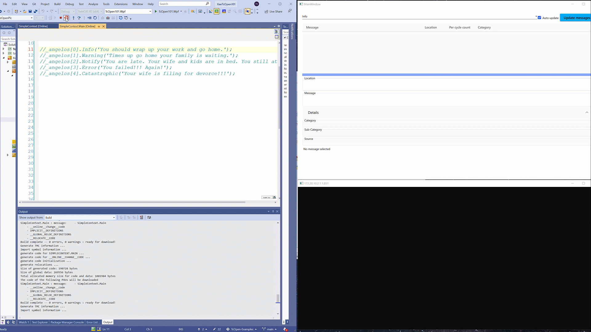
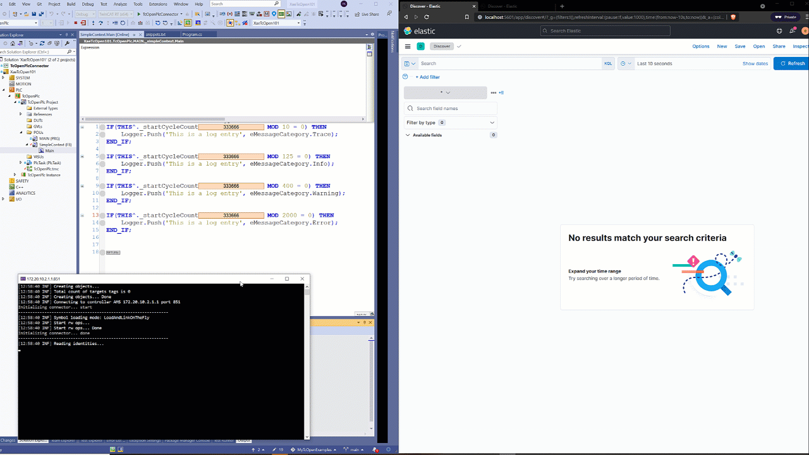
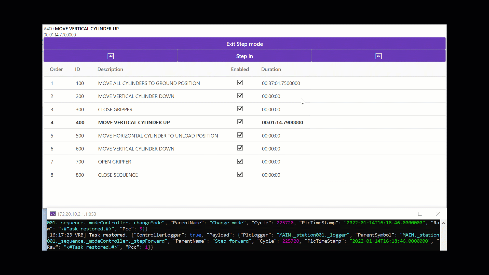

[](https://github.com/TcOpenGroup/TcOpen/graphs/commit-activity)
[](https://github.com/TcOpenGroup/TcOpen/blob/dev/LICENSE)
[](https://github.com/TcOpenGroup/TcOpen/pulls)
[](https://github.com/TcOpenGroup/TcOpen)
[](https://github.com/TcOpenGroup/TcOpen#awesome-twincat-3-projects-)
[](https://github.com/TcOpenGroup/TcOpen/actions/workflows/main.yml)
[](https://github.com/TcOpenGroup/TcOpen/actions/workflows/nightly.yml)
[](https://www.nuget.org/packages/TcOpen.Group/)


# TcOpen

## Introduction

**Open Source TwinCAT 3 code by Automation Professionals for Automation Professionals.**

TcOpen aims to provide standard classes to start building any **real deployable application**. TcOpen happened to develop into an application framework that addresses several pains of PLC programming (coordination, composition, componentization, connecting to IT technologies).

The software in industrial automation developed historically on a very different trajectory than traditional software. We introduce modern software development practices to the PLC world so developers can shift from low-value work to high-value work. Open-source offers a solid ground upon which many can build and bring ideas from all over the world. 

TcOpen is an **object oriented** framework capitalizing on **OOP** extension as defined in [IEC 61131-3](https://webstore.iec.ch/publication/4552) **ST** (structured text) and implemented by CoDeSys and [TwinCAT3](https://www.beckhoff.com/en-us/products/automation/twincat/te1xxx-twincat-3-engineering/te1000.html). 

TwinCAT turns almost any compatible PC into a real-time controller with a multi-PLC system, NC axis control, programming environment, and operating station. TwinCAT replaces conventional PLC and NC/CNC, controllers.


 ## Features

### [Application framework](https://docs.tcopengroup.org/articles/TcOpenFramework/TcoCore/Introduction.html)

- [Messaging (alarms)](https://docs.tcopengroup.org/articles/TcOpenFramework/TcoCore/TcoMessenger.html)



- [Logging plc events and user action](https://docs.tcopengroup.org/articles/TcOpenFramework/TcoCore/TcoLogger.html)



- [Plc Dialogs](https://docs.tcopengroup.org/articles/TcOpenFramework/TcoCore/TcoDialogs.html)


- [Sequenced coordination](https://docs.tcopengroup.org/articles/TcOpenFramework/TcoCore/TcoSequencer.html)



### [Data framework](https://docs.tcopengroup.org/articles/TcOpenFramework/TcoData/Introduction.html)

*Data framework requires inxton framework.*

- [CreateReadUpdateDelete (CRUD) operations directly from the plc](https://docs.tcopengroup.org/api/TcoData/PlcDocu.TcoData.TcoDataExchange.html)
- [Generic interface for implementation of any repository](https://docs.tcopengroup.org/api/TcOpen.Inxton/TcOpen.Inxton.Abstractions/TcOpen.Inxton.Data.IRepository-1.html)
- TcOpen contains implementation for [MongoDB](https://docs.tcopengroup.org/api/TcoData/TcOpen.Inxton.Data.MongoDb.html), [Json](https://docs.tcopengroup.org/api/TcoData/TcOpen.Inxton.Data.Json.html), [InMemory](https://docs.tcopengroup.org/api/TcoData/TcOpen.Inxton.Data.InMemory.html) 

### [Inspectors](https://docs.tcopengroup.org/articles/TcOpenFramework/TcoInspectors/Introduction.html)

*Advanced handling of signal inspections*


### Components

- [TcoElements](https://docs.tcopengroup.org/api/TcoElements/PlcDocu.TcoElements.html) (basic components for discrete, analogue inputs, sensors, etc)
- [TcoPneumatics](https://docs.tcopengroup.org/api/TcoPneumatics/PlcDocu.TcoPneumatics.html) (components for pneumatic components like cylinders, etc)
- [TcoDrivesBeckhoff](https://docs.tcopengroup.org/api/TcoDrivesBeckhoff/PlcDocu.TcoDrivesBeckhoff.html) (components for drives base on NC task)

### Other

- [MQTT Sink](https://docs.tcopengroup.org/api/TcOpen.Inxton/TcOpen.Inxton.Logging/Serilog.Sinks.html) for TcoLogging.
- [MQTT Change observer](https://github.com/TcOpenGroup/TcOpen/tree/dev/src/TcOpen.Inxton/src/TcOpen.Inxton.Mqtt)

**The full list of accessible features is kept up to date [here](https://docs.tcopengroup.org/articles/intro.html#features).**

# Where we are

As you may notice, TcOpen is under development, and no stable version has been released yet. We expect the first release to see the light of the day in 2022. TcOpen aims to be a continuous development project in which we will be delivering small incremental features frequently. Substantial parts of the framework are being used by different companies and individuals at this time.


## Maturity of the framework

At this time we channel our efforts into the building and testing of the PLC libraries, WPF GUI and extensions based on the Inxton platform. You will also find Blazor based components in this repository. Blazor is considered to be experimental by both Inxton and TcOpen. So far the resources dedicated to the Blazor platform has been limited; however, we believe it to be the future of TcOpen UI in the long run.


## The role of Inxton.Vortex.Framework (IVF)

IVF is a set of tools and libraries for creating industrial .NET applications based on the TwinCAT 3 platform. From Inxton v2 (that now being used in TcOpen) there no need for license registration as it was with previous versions, here is the license to honor when using inxton libraries 
[Inxton license](https://docs.inxton.com/index.html#licencing).

# Documentation

There is a separate documentation repository for this project [here](https://github.com/TcOpenGroup/TcOpen.Documentation). At this moment we use [docfx](https://github.com/dotnet/docfx) to generate documentation. The ```docfx``` uses IVF twin objects of PLC code to generate the API documentation. There is room for improvement in generated documentation; we do plan - in the course of the development of TcOpen - to improve that. 

## Working with TcOpen

### If you just want to use TcOpen 

If you want to use TcOpen in your application you may prefer using the libraries delivered as NuGet packages instead of this repository. Have a look at this [video playlist](https://www.youtube.com/playlist?list=PL-0IxLiTmB6IMKKtGn5bDb9e35CSZZaB7) where you can find more about the structure of the TcOpen application.

### Contributing

Details about contribution [here](CONTRIBUTING.md)

----------------------------------
#### Prerequisites
1. [Visual Studio 2019 (at least Community Edition)](https://visualstudio.microsoft.com/vs/older-downloads/) v16.8.3+ English version (other language mutation may not work properly).
1. [TwinCAT 3.1 eXtended Automation Engineering (XAE)](https://www.beckhoff.com/english.asp?download/tc3-downloads.htm) TwinCAT 3.1 4024.17+
1. [.NET Framework 4.8 developer pack](https://dotnet.microsoft.com/download/dotnet-framework/thank-you/net48-developer-pack-offline-installer)
1. [.NET6 developer pack](https://dotnet.microsoft.com/en-us/download/dotnet/6.0) (6.0.5)
1. [Inxton Vortex Builder extension](https://marketplace.visualstudio.com/items?itemName=Inxton.InxtonVortexBuilderExtensionPre)
----------------------------------

**Clone this repository**

~~~bash
git clone https://github.com/TcOpenGroup/TcOpen.git
~~~

**Environment variables**

You should set up Windows environment variable ```Tc3Target``` with the value of AMS ID of your testing target system.


**Build project to restore necessary tooling and packages**

### BEFORE RUNNING THE SCRIPT MAKE SURE ALL INSTANCES OF VISUAL STUDIO ARE CLOSED. THE SCRIPT WILL OPEN VS TO COMPLETE THE BUILD OF THE PROJECT.

_VS 2019 Community edition_
~~~ PowerShell
cd your_tcopen_folder
.\pipelines\runbuild.ps1 -properties @{"buildConfig" = "Debug";
                                      "isTestingEnabled" = $false;
                                      "msbuildVerbosity" = "minimal";
                                      "publishNugets"= $false;
                                      "updateAssemblyInfo" = $false;
                                      "msbuild" = "C:\Program Files (x86)\Microsoft Visual Studio\2019\Community\MSBuild\Current\Bin\MSBuild.exe";
                                      "dotnet" = "C:\Program Files\dotnet\dotnet.exe";
                                      "devenv" = "C:\Program Files (x86)\Microsoft Visual Studio\2019\Community\Common7\IDE\devenv.com"}
~~~

_VS 2019 Pro edition_
~~~ PowerShell
cd your_tcopen_folder
.\pipelines\runbuild.ps1 -properties @{"buildConfig" = "Debug";
                                      "isTestingEnabled" = $false;
                                      "msbuildVerbosity" = "minimal";
                                      "publishNugets"= $false;
                                      "updateAssemblyInfo" = $false;
                                      "msbuild" = "C:\Program Files (x86)\Microsoft Visual Studio\2019\Professional\MSBuild\Current\Bin\MSBuild.exe";
                                      "dotnet" = "C:\Program Files\dotnet\dotnet.exe";
                                      "devenv" = "C:\Program Files (x86)\Microsoft Visual Studio\2019\Professional\Common7\IDE\devenv.com"}
~~~

**In the initial part of the build, you may see some errors popping up due to missing g.cs files (untracked by git). You can ignore those messages as long as the build completes like this:**


**Open visual studio TcOpen.sln**

Switch profile to Debug|TwinCAT RT (x64)


**The build process might be susceptible to some issues due to configuration and environment differences. Should you encounter a problem, please report the issue [here](https://github.com/TcOpenGroup/TcOpen/issues)**


## Code format 
TcOpen is powered by STweep for TwinCAT, a source code formatter for Structured Text.

When contributing to TcOpen, please use this set of settings for STweep: [TCOpen.zip](https://github.com/Barteling/TcOpen/files/6455049/TCOpen.zip)

STweep is free of charge for active contributors to this project.

For requesting a license for STweep, visit www.stweep.com/Opensource

<a href="https://www.STweep.com"></a>

## Learning resources

* Jakob Sagatowski's excellent series on TwinCAT programming on [youtube](https://www.youtube.com/playlist?list=PLimaF0nZKYHz3I3kFP4myaAYjmYk1SowO) and his [blogsite](https://alltwincat.com/).
* Beckhoff's [infosys](https://infosys.beckhoff.com/).


### Awesome TwinCAT 3 projects 🌐

- An xUnit testing framework for Beckhoff TwinCAT3.  [TcUnit](https://github.com/tcunit/TcUnit) 
- Unofficial TwinCAT function for HTTP requests with json conversion [Beckhoff Http Client ](https://github.com/fbarresi/BeckhoffHttpClient)
- Opinionated code formatter for TwinCAT. [TcBlack](https://github.com/Roald87/TcBlack)
- Bring the power of Json.Net to TwinCAT [TwinCAT.JsonExtension](https://github.com/fbarresi/TwinCAT.JsonExtension)
- Use Python with ADS [pyads](https://github.com/stlehmann/pyads)
