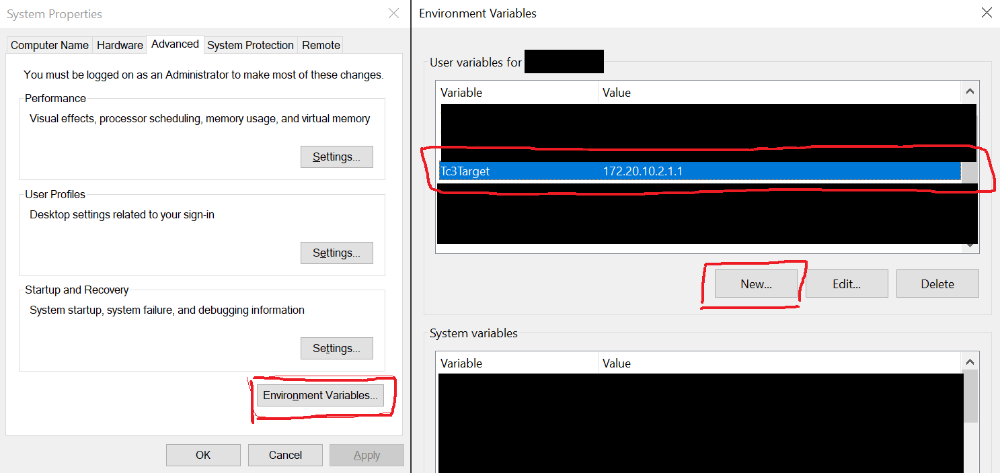
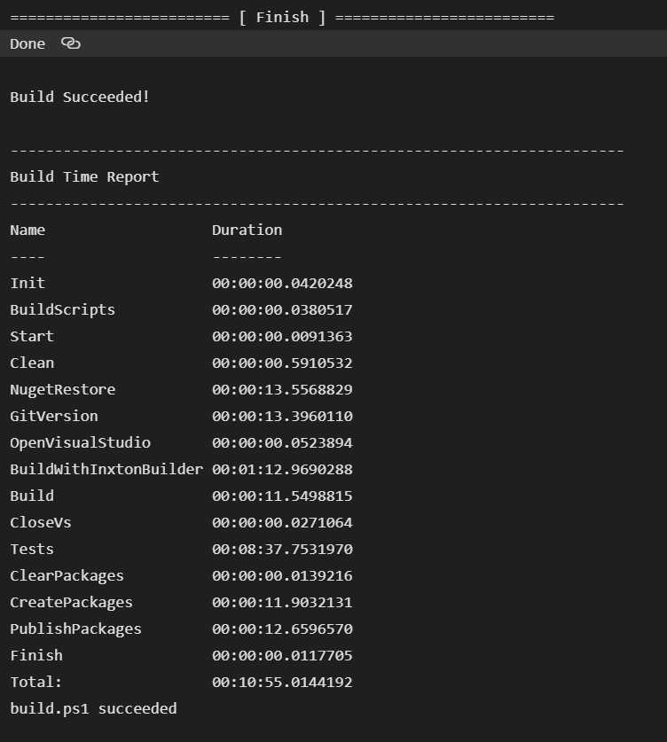

[](https://github.com/TcOpenGroup/TcOpen/graphs/commit-activity)
[](https://github.com/TcOpenGroup/TcOpen/blob/dev/LICENSE)
[](https://github.com/TcOpenGroup/TcOpen/pulls)
[](https://github.com/TcOpenGroup/TcOpen)
[](https://tcopendevelopment.slack.com/)
[](https://gitter.im/TcOpenGroup/community?utm_source=badge&utm_medium=badge&utm_campaign=pr-badge&utm_content=badge)
[](https://github.com/TcOpenGroup/TcOpen#awesome-twincat-3-projects-)
[](https://github.com/TcOpenGroup/TcOpen/actions/workflows/main.yml)
[](https://github.com/TcOpenGroup/TcOpen/actions/workflows/nightly.yml)
[](https://www.nuget.org/packages/TcOpen.Group/)


# TcOpen

**Open Source TwinCAT 3 code by Automation Professionals for Automation Professionals.**

TcOpen aims to provide standard classes to start building any **real deployable application**. TcOpen will help you by providing well-tested components you can use in your project free of charge.  

## Why?

We want to introduce modern software development practices to the PLC world so developers can shift from low-value work to high-value work. Open-source offers a solid ground upon which many can build and bring ideas from all over the world.

## Goals

- Introduce software engineering patterns to PLC development.
- Modular, extensible, and observable code and applications.
- Bring the TwinCAT community together.
- Basic libraries and components for every project.
- Cultivate a place for sharing knowledge.

## What is TwinCAT?

TwinCAT software system turns almost any compatible PC into a real-time controller with a multi-PLC system, NC axis control, programming environment, and operating station. TwinCAT replaces conventional PLC and NC/CNC controllers. It runs in Visual Studio with CodeSys.

# Where are we - Development process 

The initial momentum of ```TcOpen``` project was powerful; however, we have seen a slow decline in activity over the past months. [Inxton](https://inxton.com/),  [MTS](https://www.mts.sk/en/) team and some other heroic knights decided to keep the lights on and to carry on this initiative.

We understand that many of you guys have hard times at work, a lot of late hours, endless traveling. Life in industrial automation is very demanding. We see this as one of the reasons for the declined activity. Also, many automation engineers are not that familiar with modern software development tooling and workflows. It may scare some people off. Unfamiliarity should not be the reason not to participate. We want this place to be welcoming to everyone that sees it as a meaningful path to industrial automation. The community is going to learn along the path. There are not that many open-source projects for industrial automation; we got to start somewhere and somehow.

## Recent developments merging to TcOpenGroup

There has been much activity without visible tracking in recent times. We are developing a set of base classes to help us craft components and projects in industrial automation. Most of the discussions were in pair-programming and online/in-person meetings. We did it this way to speed up initial development when transferring legacy libraries and concepts to TcOpen.

[Here](https://docs.tcopengroup.org/articles/TcOpenFramework/application.html) is a conceptual description of the work done so far.

[Here](https://docs.tcopengroup.org/articles/Conventions/Conventions.html) is the document describing conventions to adhere to.

## Workflow (modified GitHub flow)

We adopt a modified version of [**GitHub flow**](https://guides.github.com/introduction/flow/) with proper tracking and discussions under PRs. It is a very simple workflow; we would like to work in a continuous integration/deployment fashion. However, we have to consider the need for the LTS versions for stable and long time support. How do we exactly do it is open to discussion. At this point, we work with the following modification of *GitHub flow*: our default branch is ```dev```, and all PRs must be directed there instead of ```main``` (previously ``` master```). We release in the ```main``` branch once we see the version is stable and battle-tested in production by early adopters.

## Versioning

We adopt [semantic versioning](https://semver.org/). The pipeline uses [GitVersion tool](https://gitversion.net/docs/) for the version calculation. 

At this point, we keep the major version at ```0``` (0.x.x) since we do expect changes to the public interfaces, and time is needed before the public contracts are stable. 

## Monorepo

We have also decided to work in a [monorepo](https://en.wikipedia.org/wiki/Monorepo) at this point. About the structure later down. Each unit (TcoCore, TcoPneumatics, TcoDrives, etc.) has its filtered solution (*.slnf) for that unit for faster IDE opening and manipulation. Monorepo makes it easier to work with the dependencies and prevent possible dependency hell scenarios, which is a genuine risk at this early stage of the project. Once the framework is stable, we may move to a poly-repository solution with separate maintainers.

## The role of Inxton.Vortex.Framework (IVF)

IVF is a set of tools and libraries for creating industrial .NET applications based on the TwinCAT 3 platform. Some libraries of IVF are commercial. However, there is no need for TcOpen developers to purchase any license for this project. The contributors can acquire the free developer license [here](https://inxton.com/register) or drop an email to team@inxton.com.

All PLC libraries developed in TcOpen are under MIT license. [MIT](https://tldrlegal.com/license/mit-license) gives you the freedom to use, modify, sublicense, redistribute the libraries freely for private and commercial use.

IVF will aid in the development of this project. It provides the infrastructure for testing, debugging, and tooling for the delivery pipeline (library compilation, version number updates, etc.).

Inxton and MTS teams will contribute to the development of PLC libraries. There will also be a transfer of some existing codebases from MTS and Inxton internal repositories (WPF/Blazor UI components, data acquisition libraries); some may require Inxton commercial license when deployed in production. 

## Repository structure

Some of the information here might be self-evident for traditional users of GitHub and open source in general. We provide here more details to aid people that are not familiar with similar structures.

### Root

| FOLDER             | DESCRIPTION                                                                                                    |
|--------------------|----------------------------------------------------------------------------------------------------------------|
| .github            | GitHub related files, templates, ...                                                                           |
| _Vortex            | Inxton tools, builder, CLIs, config files, output files, and folders, ...                                      |
| assets             | misc files, logo, pictures                                                                                     |
| docs               | temporary folder for documentation, notes, etc (about documentain repo later in this document).                                                                |
| pipelines          | delivery pipeline scripts and configurations                                                                   |
| src                | all sources, tests, UI controls                                                                                |
| GitVersion.yml     | GitVersion configuration file                                                                                  |
| README.md          | This file                                                                                                      |
| TcoOpen.build.slnf | Filtered solution contains all other projects except for TwinCAT project (NuGet restore/build in the pipeline) |
| TcoOpen.plc.send   | Filtered solution, contains only TwinCAT projects (bulk library compilation)                                   |
| TcoOpen.sln        | Full solution file                                                                                             |
| notices.MD         | Licenses of other open-source projects used in this repository                                                 |

### src

| FOLDER                 | DESCRIPTION                                                    |
|------------------------|----------------------------------------------------------------|
| Tc.Prober              | Unit testing libraries                                         |
| TcoApplicationExamples | Contains application examples that use TcOpen libraries        |
| TcoCore                | Core libraries of TcOpen framework (task, coordinations, etc.) |
| TcoIoBeckhoff          | Beckhoff hardware (I/O) library                                |
| TcoPeumatics           | Pneumatic components library                                   |
| Others.....            | _each group of components will have its separate folder_       |


### Typical structure of library folder

| FOLDER          | DESCRIPTION                                               |
|-----------------|-----------------------------------------------------------|
| src             | library source files                                      |
| src/..Wpf       | Inxton WPF components                                     |
| src/..Connector | Inxton compiler connector                                 |
| src/Xae..       | Plc project/sources                                       |
| tests           | unit, and integration tests and sandbox project(s) folder |


## Testing

Testing is vital to this project. We will be using two unit testing frameworks [**TcUnit**](https://github.com/tcunit/TcUnit) and **TcProber**, which is part of this repository. [Here is an article](https://alltwincat.com/2021/02/16/unit-testing-in-the-world-of-industrial-automation/) that briefly explains what those frameworks are and how they differ.

## Documentation

There is a separate documentation repository for this project [here](https://github.com/TcOpenGroup/TcOpen.Documentation). In this moment we use [docfx](https://github.com/dotnet/docfx) to generate documentation. The ```docfx``` uses IVF twin objects of PLC code to generate the API documentation. There is room for improvement in generated documentation; we do plan - in the course of the development of TcOpen - to improve that. 

## How to get started with TcOpen

### Prerequisites

1. [Visual Studio 2019 (at least Community Edition)](https://visualstudio.microsoft.com/vs/older-downloads/) v16.8.3+
1. [TwinCAT 3.1 eXtended Automation Engineering (XAE)](https://www.beckhoff.com/english.asp?download/tc3-downloads.htm) TwinCAT 3.1 4024.15+
1. [.NET Framework 4.8 developer pack](https://dotnet.microsoft.com/download/dotnet-framework/thank-you/net48-developer-pack-offline-installer)
1. [.NET5 developer pack](https://dotnet.microsoft.com/download/dotnet/5.0) 
1. [Get free inxton developer licence](https://inxton.com/register)
1. [Inxton Vortex Builder extension](https://marketplace.visualstudio.com/items?itemName=Inxton.InxtonVortexBuilderExtensionPre)

**Clone this repository**

~~~bash
git clone https://github.com/TcOpenGroup/TcOpen.git
~~~

**Environment variables**

You should setup Windows environment variable ```Tc3Target``` with the value of AMS ID of you testing target system.



**Build project to restore necessary tooling and packages**

### BEFORE RUNNING THE SCRIPT MAKE SURE ALL INSTANCES OF VISUAL STUDIO ARE CLOSED. THE SCRIPT WILL OPEN VS TO COMPLETE THE BUILD OF THE PROJECT.

_VS 2019 Community edition_
~~~ PowerShell
cd your_tcopen_folder
.\pipelines\runbuild.ps1 -properties @{"buildConfig" = "Debug";
                                      "isTestingEnabled" = $false;
                                      "msbuildVerbosity" = "minimal";
                                      "publishNugets"= $false;
                                      "updateAssemblyInfo" = $false;
                                      "msbuild" = "C:\Program Files (x86)\Microsoft Visual Studio\2019\Community\MSBuild\Current\Bin\MSBuild.exe";
                                      "dotnet" = "C:\Program Files\dotnet\dotnet.exe";
                                      "devenv" = "C:\Program Files (x86)\Microsoft Visual Studio\2019\Community\Common7\IDE\devenv.com"}
~~~

_VS 2019 Pro edition_
~~~ PowerShell
cd your_tcopen_folder
.\pipelines\runbuild.ps1 -properties @{"buildConfig" = "Debug";
                                      "isTestingEnabled" = $false;
                                      "msbuildVerbosity" = "minimal";
                                      "publishNugets"= $false;
                                      "updateAssemblyInfo" = $false;
                                      "msbuild" = "C:\Program Files (x86)\Microsoft Visual Studio\2019\Professional\MSBuild\Current\Bin\MSBuild.exe";
                                      "dotnet" = "C:\Program Files\dotnet\dotnet.exe";
                                      "devenv" = "C:\Program Files (x86)\Microsoft Visual Studio\2019\Professional\Common7\IDE\devenv.com"}
~~~

**In the initial part of the build, you may see some errors popping up due to missing g.cs files (untracked by git). You can ignore those messages as long as the build completes like this:**




**Open visual studio TcOpen.sln**

Switch profile to Debug|TwinCAT RT (x64)


**The build process might be susceptible to some issues due to configuration and evnironment differences. Should you encounter a problem please report the issue [here](https://github.com/TcOpenGroup/TcOpen/issues)**

## Communication channels

Some of you complained you were unable to join the Slack Channel for various reasons. After a discussion with @dhullett08 we are opening a new gitter channel:

[](https://gitter.im/TcOpenGroup/community?utm_source=badge&utm_medium=badge&utm_campaign=pr-badge&utm_content=badge)

## Code of Conduct

We do not adopt any document describing conduct at this point. However, there are few straightforward rules to observe:

1. Treat others as you would like others to treat you
1. Everyone is free to express his/her ideas.
1. Truth is more important than kindness, but be kind.
1. Your contributions are under MIT license. 


## Contributions

Go through [conventions](https://docs.tcopengroup.org/articles/Conventions/Conventions.html).

Meet the [framework](https://docs.tcopengroup.org/articles/TcOpenFramework/application.html).

Submit your ideas as [PullRequests](https://github.com/TcOpenGroup/TcOpen/pulls).

Submit questions, suggestions, bug reports [here](https://github.com/TcOpenGroup/TcOpen/issues).

Discuss [here](https://github.com/TcOpenGroup/TcOpen/discussions).

## Code format 
TcOpen is powered by STweep for TwinCAT a source code formatter for Structured Text.

When contributing to TcOpen please use this set of settings for STweep: [TCOpen.zip](https://github.com/Barteling/TcOpen/files/6455049/TCOpen.zip)

STweep is free of charge for active contributers to this project.

For requesting a license for STweep visit www.stweep.com/Opensource

<a href="https://www.STweep.com"></a>

## Learning resources

* Jakob Sagatowski's excellent series on TwinCAT programming on [youtube](https://www.youtube.com/playlist?list=PLimaF0nZKYHz3I3kFP4myaAYjmYk1SowO) and his [blogsite](https://alltwincat.com/).
* Beckhoff's [infosys](https://infosys.beckhoff.com/).


### Awesome TwinCAT 3 projects 🌐

- An xUnit testing framework for Beckhoff TwinCAT3.  [TcUnit](https://github.com/tcunit/TcUnit) 
- Unofficial TwinCAT function for HTTP requests with json conversion [Beckhoff Http Client ](https://github.com/fbarresi/BeckhoffHttpClient)
- Opinionated code formatter for TwinCAT. [TcBlack](https://github.com/Roald87/TcBlack)
- Bring the power of Json.Net to TwinCAT [TwinCAT.JsonExtension](https://github.com/fbarresi/TwinCAT.JsonExtension)
