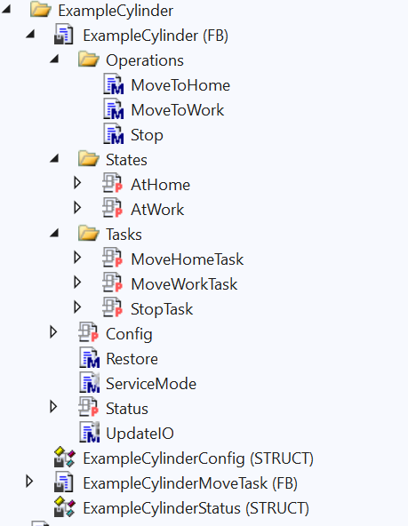

# Components

This document describes the format and practices for writing components in TcOpen. These are universal rules to observe. Each rule knows exception when there is a reasonable argument behind it. 

## General rules

### I/O variables

- Components must not contain I/O (%I*, %Q*) variables directly.
- Components accept I/O variables via `FB_body` parameter transfer (`INPUT`, `OUTPUT`, `VAR_IN_OUT`).
- All `VAR_IN_OUT` or `REFERENCE TO` parameters, whenever used in methods or properties, must be checked for the valid reference with `__ISVALIDREFENCE`.
- The `FB_body` must be called before any other call that uses the component.

#### I/O variables naming

The TcOpen does not use Hungarian prefixes, with few exceptions. FB_body parameters are one of those exceptions where it is required to use prefixes to indicate the directionality of the variable. For the naming consult [Conventions](https://docs.tcopengroup.org/articles/Conventions/Conventions.html#naming).

### Structure

#### Config

- Config structure can contain arbitrary data relative to the configuration of the component (timeouts, parameters, etc.).
- Config type must be STRUCT.
- Config data structure must be named in the following format `{ComponentName}Config` (e.g. `TcoCylinderConfig`)
- Config structure must be accessible via `Config` property that returns `REFERENCE TO {ComponentName}Config`.  - The backing field of the Config property must be named `_config` (for easy identification in the higher-level applications).
- Config structure can contain multiple nested and complex structures when it is necessary to organize better the information. Nested structures must be STRUCTs and must be named in the following format `{ComponentName}Config{Specifier}`.
- Wherever possible the data must be initialized to default values (e.g., timeouts, speeds etc.). The default settings should not prevent the component from functioning unless there is a specific requirement to provide parameters relative to the component model or a particular hardware configuration (drive model, gearing ratio, etc.).  
- Each data member of the Config structure must be documented in the code, with an example. Whenever possible, a link to more detailed documentation must also be provided in the in-code documentation.
- Property `Config` can be mutable (can have setter) when it is expected an external provision of configuration at runtime.

### Status

- Status structure can contain arbitrary data relative to the state of the component.
- Status type must be STRUCT.
- Status data structure must be named in the following format `{ComponentName}Status` (e.g. `TcoCylinderStatus`)
- Config structure must be accessible via `Status` property that returns `REFERENCE TO {ComponentName}Status`.  - The backing field of the Status property must be named `_status` (for easy identification in the higher-level applications).
- Status structure can contain multiple nested and complex structures when it is necessary to organize the information. Nested structures must be STRUCTs and must be named in the following format `{ComponentName}State{Specifier}`.  
- Each data member of the Config structure must be documented in the code, with an example. Whenever possible, a link to more detailed documentation must also be provided in the in-code documentation.
- Property `Status` must be immutable (cannot have setter).

### Operations

Operations are methods that execute tasks of the component. All operations must be placed  into `Operations` folder of the component. Each operation method must return `ITcoTaskStatus` that is typically an `ITcoTask` implementation. Operation name typically starts with a descriptive verb that explains the operation (e.g., MoveHome, MoveRelative, etc.).

### Tasks

Operations are run by tasks (`TcoTask`).

- Member variable of the task must have the following format `_{operationName}Task`.
- Each task must be exposed via a property in the following format `{OperationName}Task`.
- Executing logic of a task is run from the `FB_body` of components block.

### States

States are properties or methods that retrieve information about arbitrary states that do not require multiple cycles to return the result (sensor's signal state).
All state-related members must be placed into `States` folder of the component.

### Component requirements

Each component must inherit from `TcoCore.TcoComponent`, which is an abstract block that requires concrete implementation of following memebers: `Restore()` method and `ServiceMode()` method.

- `Restore()` must contain logic that will bring the component's internal states into the initial state. Restore method does not mean getting the component into physical ground position/state; it serves purely the purpose of having the component ready for operations from the programatic perspective.

- `ServiceMode()` method is required to be implemented. It can contain arbitrary logic that will be executed while the component is in a serviceable state.

## Example implementation

### Pneumatic cyclinder

~~~iecst
// Each component must be extended by TcoCore.TcoComponent.
~~~iecst
FUNCTION_BLOCK ExampleCylinder EXTENDS TcoCore.TcoComponent
// Declaration of I/O
VAR_IN_OUT
	(*~
		<docu>
			

				Home position sensor.
			

		</docu>
	~*)
	{attribute addProperty Name "<#Home position sensor#>"}
	inoAtHomePos : BOOL;
	(*~
		<docu>
			

				Working position sensor.
			

		</docu>
	~*)
	{attribute addProperty Name "<#Work position sensor#>"}
	inoAtWorkPos : BOOL;
END_VAR
VAR_IN_OUT
	(*~
		<docu>
			

				Move to home position signal.
			

		</docu>
	~*)
	{attribute addProperty Name "<#Move to home position actuator#>"}
	inoToHomePos : BOOL;
	(*~
		<docu>
			

				Move to working position signal.
			
	
		</docu>
	~*)
	{attribute addProperty Name "<#Move to work position actuator#>"}
	inoToWorkPos : BOOL;
END_VAR
~~~

~~~iecst
// Declatation of `Signal interceptors`
VAR    
	_atHomePosSignalInfo : TcoCore.TcoSignalInfo;
    _atWorkPosSignalInfo : TcoCore.TcoSignalInfo;
    _toHomePosSignalInfo : TcoCore.TcoSignalInfo;
    _toWorkPosSignalInfo : TcoCore.TcoSignalInfo;
END_VAR

// Declaration of tasks
VAR
    {attribute addProperty Name "<#Move Home#>"}
    _moveHomeDefault : ExampleCylinderMoveTask(THIS^);
    {attribute addProperty Name "<#Move to Work#>"}
    _moveWorkDefault : ExampleCylinderMoveTask(THIS^);
    {attribute addProperty Name "<#Stop#>"}
    _stopDefault : TcoCore.TcoTask(THIS^);
END_VAR

//Declaration of config and status members
VAR
    _config : TcoCylinderConfig;
	_status : TcoCylinderStatus;
END_VAR
~~~

~~~iecst
// Updates I/O
UpdateIO();

(*
    What follows are two ways you can implement a task. Frist two implementations
    are an extension of TcoTask and the logic is nested into those extended blocks.
    Since we have the identical logic for moving the cylinder it made sense to not repeat
    the same code twice but encapsulate it into derived task.

    Second implmentation of `Stop` task is simplified use of TcoTask, where we just enclose the logic
    of the task into `IF` statement. When Execute() method returns `true` we run the logic in the 
    statement. Execute() method is fired by Invoke() method of the same task.

    Additionaly you can disable a taks when there are mutually exclusive action that cannot be performed at the same time.
*)

// Disables mutually exclusive actions
_moveWorkDefault.Enabled := NOT _moveHomeDefault.Busy;

_moveHomeDefault(PositionSensor := _atHomePos,
    MoveToPositionSignal := _toHomePos,
    InverseSignal := _toWorkPos,
    MaxTimeToReachPosition := _config.TimeToReachHomePosition, // This value comes from _config structue
    PositionName := '<#Home#>');

// Disables mutually exclusive actions
_moveHomeDefault.Enabled := NOT _moveWorkDefault.Busy;
	
_moveWorkDefault(PositionSensor := _atWorkPos,
    MoveToPositionSignal := _toWorkPos,
    InverseSignal := _toHomePos,
    MaxTimeToReachPosition := _config.TimeToReachWorkPosition,
    PositionName := '<#Work#>');

// Simplified use of TcoTask
IF (_stopDefault.Execute()) THEN
	_toHomePos := FALSE;
	_toWorkPos := FALSE;
    _moveHomeDefault.Abort();
    _moveWorkDefault.Abort();
    _stopDefault.Abort();
    _moveHomeDefault.Restore();
    _moveWorkDefault.Restore();
    _stopDefault.Restore();
    _stopDefault.DoneWhen(TRUE);
END_IF

// This is just an example of using status structure
IF(_moveHomeDefault.Busy) THEN
	_status.ActionDescription := 'Moving to home position';
ELSIF(_moveWorkDefault.Busy) THEN
	_status.ActionDescription := 'Moving to work position';
ELSIF(_stopDefault.Busy) THEN
	_status.ActionDescription := 'Stopping pressure';
ELSE	
	_status.ActionDescription := 'Idle';
END_IF

UpdateIO();
~~~

// Method that expose the execution of a task. Task can be executed in fire-and-forget way or we can wait for `TcoCore.ITcoTaskStatus.Done` for the task to end.
~~~iecst
(*~
	<docu>
		

			Starts movement into home position. 		
		
			
	</docu>	
~*)
METHOD MoveToHome : TcoCore.ITcoTaskStatus
//---------------------------------------------
IF(MoveHomeTask <> 0) THEN 
	MoveToHome := MoveHomeTask.Invoke();
END_IF;	
~~~

You may notice that the I/O variables are passed as an IN_OUT, in this example. In order to avoid the need to check the validity of the references in various places in the component we have a backing variable. This variable is used inside the component and it is always valid since it is the 'value variable' and not a reference. In the following method we do two things. First we update backing variables when the IN_OUT variable is valid; we also intercept what I/O varible is being passed into the component. Although intercepting finds its use in more advanced scenarios, it can be used in the most basic setup, when the I/O varibles copy the structure/topology of physical hardware, the specific I/O terminal-pin can identified from the HMI or other higher level programs.

~~~iecst
METHOD PRIVATE UpdateIO
//----------------------------------------------------------------------------------------------------------------
IF(__ISVALIDREF(inoAtHomePos)) THEN _atHomePos := inoAtHomePos; _atHomePosSignalInfo := THIS^.GetSignalInfo(SIZEOF(inoAtHomePos), ADR(inoAtHomePos)); END_IF;
IF(__ISVALIDREF(inoAtWorkPos)) THEN _atWorkPos := inoAtWorkPos; _atWorkPosSignalInfo := THIS^.GetSignalInfo(SIZEOF(inoAtWorkPos), ADR(inoAtWorkPos)); END_IF;
IF(__ISVALIDREF(inoToHomePos)) THEN inoToHomePos := _toHomePos; _toHomePosSignalInfo := THIS^.GetSignalInfo(SIZEOF(inoToHomePos), ADR(inoToHomePos)); END_IF;
IF(__ISVALIDREF(inoToWorkPos)) THEN inoToWorkPos := _toWorkPos; _toWorkPosSignalInfo := THIS^.GetSignalInfo(SIZEOF(inoToWorkPos), ADR(inoToWorkPos)); END_IF;
~~~

~~~iecst
FUNCTION_BLOCK ExampleCylinderContext EXTENDS TcoCore.TcoContext
VAR
	_exampleCylinder : ExampleCylinder(THIS^);
	_atHome : BOOL;
	_atWork : BOOL;
	_toHome : BOOL;
	_toWork : BOOL;
END_VAR
//-------------------------------------------------------------------
(*~
	<docu>
		

			Main method of the TcoContext. This is the entry point of any control logic that belongs to this context. 
			The call of this method is ensured by calling the <c>InstanceName.Run()</c> method, and it must not be called explicitly.
			This method is abstract, and it must be overridden in derived block.
		

	</docu>
~*)
METHOD PROTECTED  Main

VAR_INST
	_state : INT;
END_VAR
//------------------------------------------------------------------
_exampleCylinder(
	inoAtHomePos:= _atHome, 
	inoAtWorkPos:= _atWork, 
	inoToHomePos:= _toHome, 
	inoToWorkPos:= _toWork);
	
	
CASE _state OF
	0:
		IF(_exampleCylinder.MoveToHome().Done) THEN
			_state := 10;
		END_IF
	10:
		IF(_exampleCylinder.MoveToWork().Done) THEN
			_state := 0;
		END_IF
END_CASE
~~~		