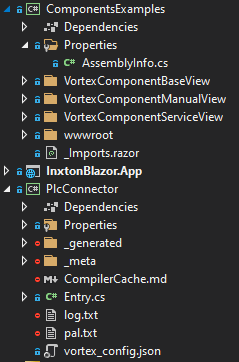
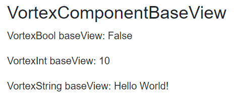

# Custom libraries

To create a custom components library, you have to create two projects:
- **Connector project** - which will contain PLC compiled classes from Inxton Builder.
- **Razor components project** - Razor class library, which will contain the implementation of corresponding views. Also, there must be a dependency on the Connector project.

It's important to note that the generated classes in the Connector project and created Razor views must be in **same namespace** to correctly locate views.

See the example below:

We have three projects:
- *ComponentsExamples* - custom components library 
- *InxtonBlazor.App* - Blazor Server application
- *PlcConnector* - class library containing generated files from Inxton Builder

Files in the *ComponentsExample* and the *PlcConnector* are in the same namespace. *InxtonBlazor.App* has a reference to the *ComponentsExample* project.



*ComponentsExamples* library must contain `RenderableBlazorAssemblyAttribute()`. Thanks to this attribute RenderableContentControl is able to load its assembly and find all created custom view. 

You can add this attribute to `AssemblyInfo.cs` class located in `Properties` folder. If there is no `Properties` folder, just create it with `AssemblyInfo.cs` class and paste there following code:

```C#
using Vortex.Presentation.Blazor.Attributes;

[assembly: RenderableBlazorAssemblyAttribute()]
```

If your PLC defined type has a C# counterpart in a `PlcConnector` project and `ComponentsExamples` contains a corresponding Razor view, it will be rendered by the RenderableContentControl.

There are two ways how to implement custom component:
- Custom component with **code-behind**
- Custom component with **ViewModel** support

## Component with code-behind
This is simple approach, where your Blazor view inherits from `RenderableComplexComponentBase<T>` base class, where `T` is your custom component PLC type. However logic of your component must be specified in code-behind of view class. Important is, that both view and code-behind must be in same namespace as your `PlcConnector`. 

Look at the example below:


Blazor view `VortexComponentServiceView.razor`:

```C#
@namespace Plc
@inherits RenderableComplexComponentBase<VortexComponent>

<h3>VortexComponentServiceView</h3>

<p>VortexBool serviceView: @Component.vortex_bool.Cyclic</p>
<p>VortexInt serviceView: @Component.vortex_int.Cyclic</p>
<p>VortexString serviceView: @Component.vortex_string.Cyclic</p>

```
`VortexComponentServiceView.razor` view inherits from `RenderableComplexComponentBase<VortexComponent>`. Thanks to this, framework will inject instance of *VortexComponent* type into *Component* variable. After that, you can access values of *Component* variable and define logic of your custom component in code-behind. Code-behind must be partial class with the same name as view.

Code-behind `VortexComponentServiceView.cs`:
```C#
namespace Plc
{
    public partial class VortexComponentServiceView
    {
        protected override void OnInitialized()
        {
            UpdateValuesOnChange(Component);
        }
    }
}

```

If you want your UI to be updated everytime, when PLC values change, you must call `UpdateValuesOnChange(Component)` method in `OnInitialized()` method in code-behind.

## Component with ViewModel
With this approach you can create component using MVVM design pattern. With MVVM, implementation of view and logic of your component is separated. Therefore your code is loosely coupled, more testable and reusable. 

First, you need to create your ViewModel, which will inherits from abstract class `RenderableViewModelBase`:

ViewModel `VortexComponentBaseViewModel.cs`
```C#
namespace Plc
{
    public class VortexComponentBaseViewModel : RenderableViewModelBase
    {
        public VortexComponentBaseViewModel()
        {
        }
        public VortexComponent Component { get;  set; }
        public override object Model { get => this.Component; set { this.Component = value as VortexComponent; } }
    }
}
```
After that, you can create your Blazor view `VortexComponentBaseView.razor`:

```C#
@namespace Plc
@inherits RenderableViewModelComponentBase<VortexComponentBaseViewModel>

<h3>VortexComponentBaseView</h3>

<p>VortexBool baseView: @ViewModel.Component.vortex_bool.Cyclic</p>
<p>VortexInt baseView: @ViewModel.Component.vortex_int.Cyclic</p>
<p>VortexString baseView: @ViewModel.Component.vortex_string.Cyclic</p>

@code
{
    protected override void OnInitialized()
    {
        UpdateValuesOnChange(ViewModel.Component);
    }
}

```
Your view must inherits from `RenderableViewModelComponentBase<T>` base class, where `T` is type of your ViewModel. Thanks to this, ViewModel instance is created and initialized with PLC type instance acquired within `RenderableContentControl`. After that, you are able to access your ViewModel within Blazor view.

If you want your UI update everytime, when PLC values change, you can add `UpdatesValuesOnChange(ViewModel.Component)` directly to code section in view, or you can create partial class same as in previous example.

When you call RenderableContentControl component like this:

```
<RenderableContentControl Presentation="Base"
                          Context="@Entry.Plc.MAIN.instanceOfVortexComponent">

</RenderableContentControl>
```

You will get generated UI, which you specified in your custom view:



View contains real-time values from PLC.