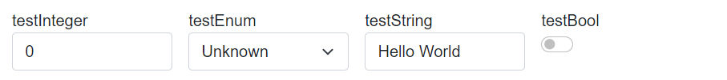
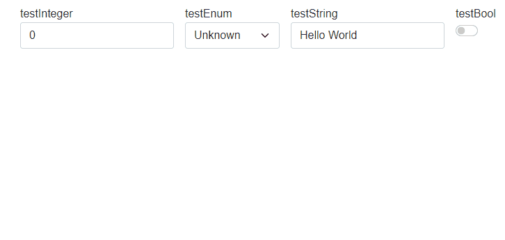
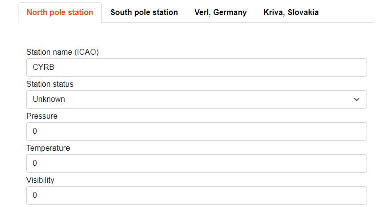
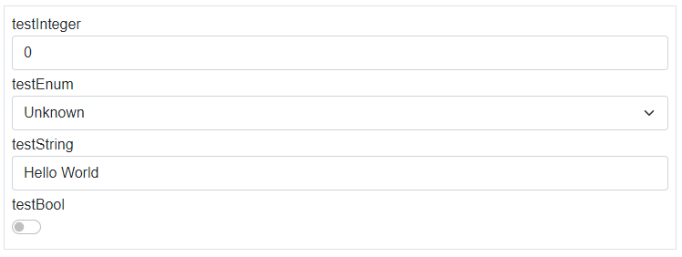
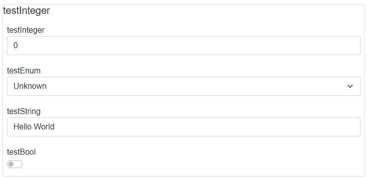
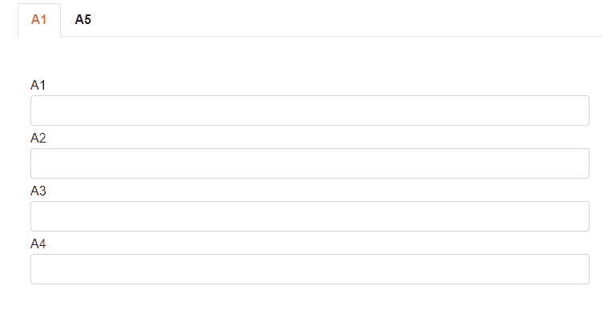

# Layouts

This file describes layouts, which are supported by Vortex.Presentation.Blazor framework. You will see examples and usage of supported layouts and how they can be nested.

Following layouts are supported within the framework:

- Stack
- UniformGrid
- Wrap
- Tabs
- Border
- GroupBox

You can specify a layout in PLC code with the following attribute:
```
{attribute wpf [Container(Layout.Name)]}
```
Where *Name* is replaced with the name of one of the supported layouts.

---

## Stack
Stack is the default layout, where UI elements are placed into the stack container - they are rendered one element at a row. Stack is the default layout when a layout isn't specified.

---
## UniformGrid
UniformGrid will place elements in a row, where each element is of uniform width - so width of all elements is the same. 

Let's have the following PLC code with a container attribute:
```
{attribute wpf [Container(Layout.UniformGrid)]}
TYPE stExample :
STRUCT
	testInteger : INT;
	testEnum : stTestEnum;
	testString : STRING := 'Hello World';
	testBool : BOOL;
END_STRUCT
END_TYPE
```
And this is the result:



---
## Wrap
Wrap layout will create a wrapper around the elements. It will place the elements in a row. However width of all elements isn't same and when window is resized, elements will be placed below each other. So wrap layout is responsive layout.

This is the example behavior of wrap panel:



---
## Tabs
Tabs layout will place each element in its own tab. You are able to switch between tabs to see corresponding UI. In example below, you can see PLC code with Layout.Tabs container attribute and corresponding auto-generated UI.
```
{attribute wpf [Container(Layout.Tabs)]}
FUNCTION_BLOCK fbWorldWeatherWatch
VAR	
	{attribute addProperty Name "<#North pole station#>"}
	NorthPole : structWeatherStation := (StationICAO := 'CYRB');

	{attribute addProperty Name "<#South pole station#>"}
	SouthPole : structWeatherStation := (StationICAO := 'NZSP');

	{attribute addProperty Name "<#Verl, Germany#>"}
	Verl : structWeatherStation := (StationICAO := 'EDLP');

	{attribute addProperty Name "<#Kriva, Slovakia#>"}
	Kriva : structWeatherStation := (StationICAO := 'LZIB');	
END_VAR
 
```


---
## Border
Border layout will create border around auto-generated elements. 



---
## GroupBox
GroupBox layout will create border with name of first element around auto-generated elements. 



---
## Nested and multiple layouts
You can combine multiple container attributes in PLC code to create a complex layout of your elements.
Consider following the plc code:
```
{attribute wpf [Container(Layout.Tabs)]}
TYPE stMultipleLayouts :
STRUCT
	{attribute wpf [Container(Layout.Stack)]}
	{attribute addProperty Name "A1"}
	Piston_A1 : STRING;
	{attribute addProperty Name "A2"}
	Piston_A2 : STRING;
	{attribute addProperty Name "A3"}
	Piston_A3 : STRING;
	{attribute addProperty Name "A4"}
	Piston_A4 : STRING;
	
	{attribute wpf [Container(Layout.Wrap)]}
	{attribute addProperty Name "A5"}
	Piston_A21 : INT;
	{attribute addProperty Name "A6"}
	Piston_A22 : INT;
	{attribute addProperty Name "A7"}
	Piston_A23 : INT;
	{attribute addProperty Name "A8"}
	Piston_A24 : INT;
END_STRUCT
END_TYPE

```
You will get the following auto-generated UI:



---
Developed with 💗 at [MTS](https://www.mts.sk/en) - putting the heart into manufacturing.