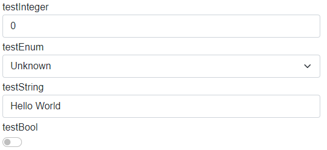
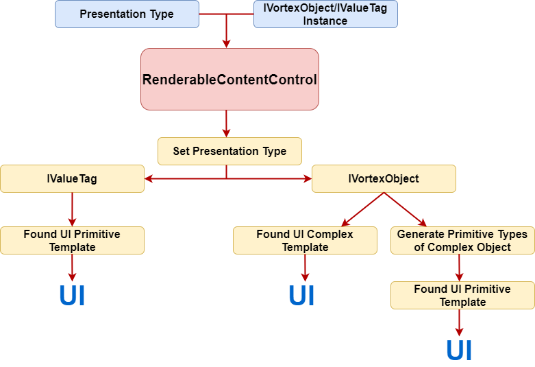
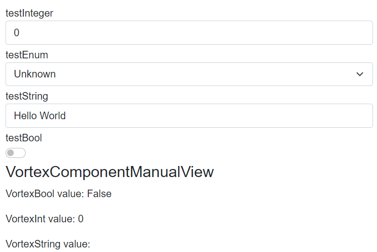
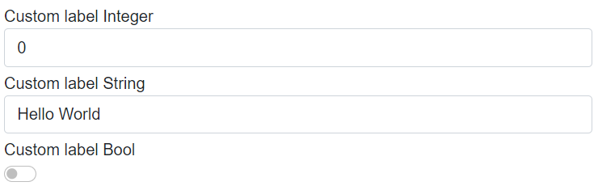

# RenderableContentControl

This file describes the purpose, features and usage of the **RenderableContentControl** component. After reading this documentation, you will grasp the idea behind this component, see its purpose, features and how it can be used in real applications.

## Table of Contents
1. [What is RenderableContentControl?](#id-RenderableContentControl)
2. [Basic Example](#id-bacisexample)
3. [How it works](#id-howitworks)
4. [Features](#id-features)
    - [Presentation Type and Presentation pipeline](#id-presentation)
    - [RenderIgnore and custom labels](#id-renderingore)
    - [Layouts](#id-layouts)
    - [Styling](#id-styling)
    
 ---   
<!-- ----------------------------------------------------------------------------------- -->
<div id='id-RenderableContentControl'/>

## What is RenderableContentControl?
RenderableContentControl is a Blazor component, which is able to automatically generate UI from C# objects acquired within Inxton Framework. Inxton compiler will create twin C# objects of PLC objects, which instances can be pass to RenderableContentControl to generate corresponding views. It's able to generate both complex objects (*IVortexObject* type) and primitive objects containing values (*IValueTag* type).

 ---   

<!-- ----------------------------------------------------------------------------------- -->
<div id='id-bacisexample'/>

## Basic example
Let's have following PLC structure *stExample*:
```T
TYPE stExample :
STRUCT
	testInteger : INT;
	testEnum : stTestEnum;
	testString : STRING := 'Hello World';
	testBool : BOOL;
END_STRUCT
END_TYPE
```
We can create an instance of stExample struct and run Inxton build. After that, we can access instance of this struct and pass it as a parameter to the *RenderableContentControl* component like this:
```C#
<RenderableContentControl Presentation="Control"
                          Context="@Entry.Plc.MAIN.instanceOfstExample"/>
```
We will get the following auto-generated UI:



As you can see, the parameter *Presentation* is set to *Control*. Because of the presentation type *Control* we can modify PLC values within Blazor application. We'll get to *Presentation types* later on.

 ---   
<!-- ----------------------------------------------------------------------------------- -->
<div id='id-howitworks'/>

## How it works
Vortex.Presentation.Blazor framework contains two libraries: 
- **Vortex.Presentation.Blazor**
    - Base classes
    - Services 
    - Interfaces 
- **Vortex.Presentation.Controls.Blazor** 
    - Styles
    - Layouts
    - UI templates of primitive types
    - RenderableContentControl component

The diagram below represent fundamental logic of UI generation:



- When we use *RenderableContentControl* component it accepts context in form of **IVortexObject/IValueTag** instance and presentation type.
- *RenderableContentControl* will parse the input and set presentation type for objects. 
- It will determine, whether input instance is of type **IValueTag** or **IVortexObject**:
    - **IValueTag:** The framework will find a corresponding UI primitive template and then render the UI.
    - **IVortexObject:** The framework will try to find a corresponding UI complex template. If the complex template is found, UI will be rendered. Otherwise, **IVortexObject** will be iterated down to primitive types, which then will be rendered with primitive UI templates.

There is a lot of magic under the hood, but the main idea should be clear from the diagram above. This approach can save a lot of time when doing repetitive work.
<!-- ----------------------------------------------------------------------------------- -->

---
<div id='id-features'/>

## Features
This section describes features, which RenderableContentControl currently posses.
<div id='id-presentation'/>

### **Presentation types and Presentation pipeline**

**Presentation types** serve for specifying mode in which UI will be rendered. Within *Vortex.Presentation.Blazor* framework following presentation types are supported.
- Display
- Control
- ShadowDisplay
- ShadowControl

In the **Control** presentation type, you can modify the values of objects. On the other hand, the **Display** presentation type serves for displaying values only -> they are read-only. If no presentation type is specified, Display presentation type will be used.

> You can create components with your own presentation types, in which you wish to generate UI. 

**Presentation pipeline** is represented by a string, where we can combine different presentation types in which UI will be rendered. 
Each presentation type is separated by a dash '-'. RenderableContentControl will parse this string and will look for UI templates specified by presentation types in the pipeline. If the first presentation type is not found, it'll look for other one in the pipeline and so on... See the example below:

Let's add `testVortexComponent: VortexComponent` to the `stExample` structure. `VortexComponent` is a component from an external library whose UI implementation is of **Manual** presentation type.

```
TYPE stExample :
STRUCT
	testInteger : INT;
	testEnum : stTestEnum;
	testString : STRING := 'Hello World';
	testBool : BOOL;
	testVortexComponent: VortexComponent;  //added property
END_STRUCT
END_TYPE

```
Let's have the following code, where we specify the presentation pipeline:
```C#
<RenderableContentControl Presentation="Manual-Control"
                          Context="@Entry.Plc.MAIN.instanceOfstExample"/>
```
You will get the following auto-generated UI:



You can see, primitive types are generated in **Control** presentation type whereas VortexComponent is generated in **Manual** presentation type.

<div id='id-renderingore'/>

### **RenderIgnore and custom labels**


Thanks to the support of custom attributes in the PLC code you can specify, which elements you want to exclude from rendering. You can also set custom names for each element. See the example below.

Let's have the following PLC code with attributes:
```
TYPE stExample :
STRUCT
	{attribute addProperty Name "<#Custom label Integer#>"}
	testInteger : INT;

	{attribute clr [RenderIgnore()]}
	testEnum : stTestEnum;

	{attribute addProperty Name "<#Custom label String#>"}
	testString : STRING := 'Hello World';

	{attribute addProperty Name "<#Custom label Bool#>"}
	testBool : BOOL;

	{attribute clr [RenderIgnore()]}
	testVortexComponent: VortexComponent;
END_STRUCT
END_TYPE
```

After rendering with RenderableContentControl you will get the following UI:



You can see, *testEnum* and *testVortexComponent* are ignored and the rest of the elements have custom labels.

You can also specify `RenderIgnore` on an element, which will be ignored in the specific presentation types. For example, you can do it like this:

```
{attribute clr [RenderIgnore("Display","ShadowDisplay")]}
testVortexComponent: VortexComponent;
```

<div id='id-layouts'/>

### **Layouts**
In the PLC code, you can use layouts attributes to customize auto-generated UI. 
For more info about layouts and for examples look into **[Layouts](Layouts.md)** file.
<div id='id-styling'/>

### **Styling**
Vortex.Presentation.Blazor contains in-built styles. Styling is provided by [Bootstrap library](https://getbootstrap.com/). In-built styles can be customized with Sass technology, which will produce SCSS files. SCSS files can be compiled into one CSS file which can be used as application-wide style.

Currently, the framework contains a default style that can be added as a reference in the Blazor application file *_Host.cshtml* in the following way:

```
 <link rel="stylesheet" href="/_content/Inxton.Vortex.Presentation.Controls.Blazor-experimental/css/inxton-bootstrap.min.css">
```

> It supports a generic Bootstrap library too

### **Custom components libraries**

You can create a custom library of your components with corresponding views. When you reference the library from your Blazor project, the framework will automatically load its views, which then can be auto-generated with the RenderableContentControl component.

For more information about custom libraries and how to create them, look into **[Custom libraries](Custom_Libraries.md)** file.


---
Developed with 💗 at [MTS](https://www.mts.sk/en) - putting the heart into manufacturing.