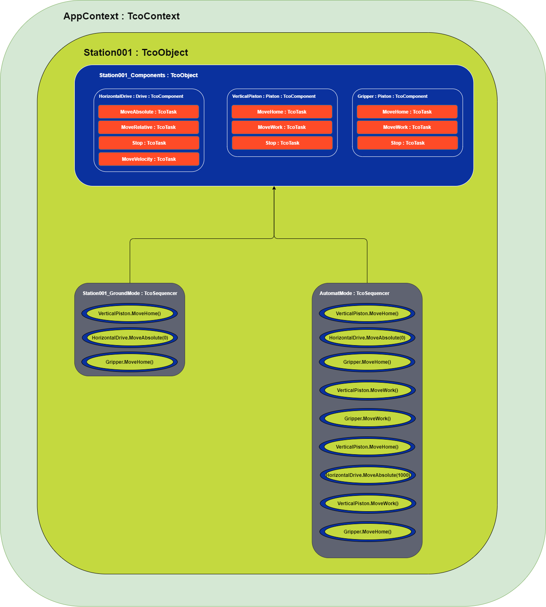

# TcOpen Framework

TcOpen framework provides blocks for building industrial applications and creating reusable software components for various devices like Pistons, Drives, Robots, Vision systems, etc.

Part of the framework is a series of classes/blocks for crafting applications using techniques known from software engineering. TcOpen is created in the OOP paradigm and takes full advantage of object-oriented design allowed by CoDeSys/TwinCAT 3 implementation of IEC-61131-3.

The ultimate goal of this initiative is to provide automation engineers with **well-designed**, **testable**, **scalable**, and **reusable** blocks to facilitate the development, commissioning, and maintainability of the industrial application software.

## TcOpen application dissection

The following diagram shows schematics of a simple TcOpen application. The station contains a manipulator with a single drive for a horizontal axis movement, a pneumatic piston for vertical axis movement, and a pneumatic gripper.



The blocks of an TcOpen application require to be nested into a root block called [Context](TcoContext.md) that derives from ```TcoContext``` or implements ```ITcoContext``` interface. In our case, it is ```AppContext``` block.

The next level is ```Station001``` that derives from [TcoObject](TcoObject.md) (about TcoObject later). It suffices to say the ```TcoObject``` is the base block of each other block in the TcOpen framework.

The [components](TcoComponent.md) (drive, pistons) are encapsulated into a single structure, ```Station001_Components``` (HorizontalDrive, VerticalPiston, Gripper) and it that also derives from ```TcoObject```.

Besides components, the station contains two [Sequences](TcoSequencer.md), ```Station001_GroundMode``` that brings the manipulator to the ground state (home positioning), and ```Station001_AutomatMode``` that performs the manipulator's activities in automatic mode.

The components (Drive, Piston) have a set of tasks (MoveHome, MoveAbsolute, etc.). All tasks are or derive from [TcoTask](TcoTask.md) within which the actions are running. The [TcoTask](TcoTask.md)  work with two methods in tandem: ```Invoke``` fires the execution (in our case, this occurs in the sequences) and ```Execute``` with an implementation in the components block, that run the required action.

# TcoCore library

```TcoCore``` library contains basic classes for building TcOpen applications (components, tasks management, coordination primitives). The default **namespace** for this library is ```TcoCore```. All types in this library have ```Tco``` prefix for classes and ```ITco``` and for interfaces.


- [TcoContext](TcoContext.md)
- [TcoObject](TcoObject.md)
- [TcoTask](TcoTask.md)
- [TcoComponent](TcoComponent.md)
- [TcoState](TcoState.md)
- [TcoSequencer](TcoSequencer.md)
- [TcoMessenger](TcoMessenger.md)
- [TcoLogger](TcoLogger.md)
- [TcoDialogs](TcoDialogs.md)


