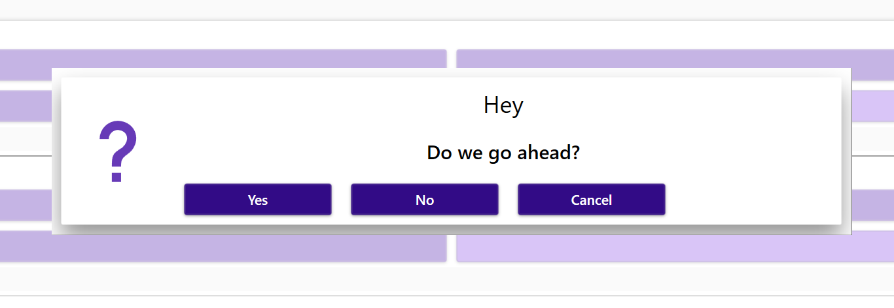

# Dialogs

[API](~/api/TcoCore/PlcDocu.TcoCore.TcoDialog.yml)

Dialogs provide capability to interact with the user rising dialogs directly from the PLC program.

## Jump start

### PLC
~~~iec
VAR   
    _invokeDialog   : BOOL;
    _dialog1        : TcoCore.TcoDialog(THIS^);  
    _answer         : STRING; 
END_VAR
//----------------------------------------------
IF(_invokeDialog) THEN
    _dialog1.Show()
                .WithType(eDialogType.Question)
                .WithYesNoCancel()
                .WithCaption('Hey')
                .WithText('Do we go ahead?');

    IF(_dialog1.Answer = TcoCore.eDialogAnswer.Yes) THEN _answer := 'YES'; END_IF;
    IF(_dialog1.Answer = TcoCore.eDialogAnswer.No) THEN _answer := 'NO'; END_IF;
    IF(_dialog1.Answer = TcoCore.eDialogAnswer.Cancel) THEN _answer := 'CANCEL' END_IF;

    IF(_dialog1.Answer <> TcoCore.eDialogAnswer.NoAnswer) THEN _invokeDialog := FALSE; END_IF;
END_IF;    
~~~

### Listening to dialogs in a WPF application

~~~C#
  TcOpen.Inxton.TcoAppDomain.Current.Builder               
        .SetPlcDialogs(DialogProxyServiceWpf.Create(new[] { PlcConnector.MAIN })); // Will listen to all dialogs contained in MAIN.PRG
~~~

