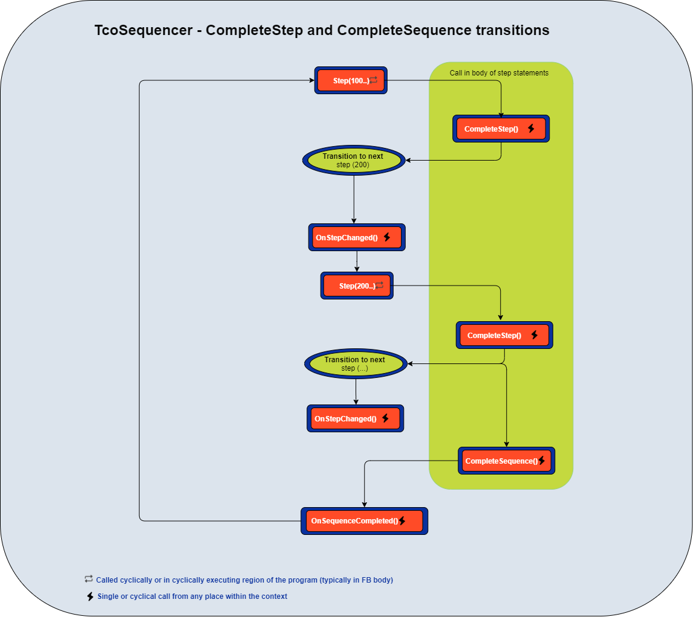

# Sequencer

**(TcoSequencer : ITcoSequencer)**

[API](~/api/TcoCore/PlcDocu.TcoCore.TcoSequencer.yml)


The sequencer provides more advanced coordination of PLC logic. As the name suggests, the logic is organized in sequence. The steps run in the order in which they are written in the program.

The sequencer finds its use in any scenario where sequential control is appropriate (application or component).

```TcoSequncer``` is an abstract class, and it must have a concrete implementation of ```Main``` method. ```Main``` is the entry point for the sequence logic.

In addition to simple sequential coordination, this class permits manual step-by-step execution, moving the pointer backward and forward in the sequence. ```TcoSequencer``` also implements the auto-restorable mechanism analogous to ```TcoState```.

~~~iecst

FUNCTION_BLOCK MySequencer EXTENDS TcoCore.TcoSequencer
VAR
    _lightR_IsOn : BOOL;
    _lightG_IsOn : BOOL;
    _lightB_IsOn : BOOL;

    _lightR_SwitchOn : BOOL;
    _lightG_SwitchOn  : BOOL;
    _lightB_SwitchOn  : BOOL;

    _luminosityMin : REAL;
    _luminosity : REAL;
    _luminosityMax : REAL;    
END_VAR

(******************************************************)
METHOD PROTECTED FINAL Main

(******************************************************)
// Step header
IF Step(100,                                // Step id. Must be unique and must change at runtime.
        TRUE,                               // Indicates that whether the step should execute.
        'Switch all lights off') THEN       // Arbitrary step description (for SCADA/HMI)
//--------------------------------------------    
// Steps logic statements
    _lightR_SwitchOn := FALSE;
    _lightG_SwitchOn := FALSE;
    _lightB_SwitchOn := FALSE;

    IF(NOT _lightR_IsOn 
       AND NOT _lightG_IsOn 
       AND NOT _lightB_IsOn) 
    THEN
        CompleteStep(); // Completes step and moves to step 200
    END_IF;
//--------------------------------------------
END_IF;    

IF Step(200,
        TRUE,
        'Switch on red light') THEN
//--------------------------------------------    
    _lightR_SwitchOn := TRUE;
    IF(_lightR_IsOn) THEN
        CompleteStep();
    END_IF;
//--------------------------------------------
END_IF;

IF Step(300,
        TRUE,
        'Switch on green light') THEN
//--------------------------------------------    
    _lightG_SwitchOn := TRUE;
    IF(_lightG_IsOn) THEN
        CompleteStep();
    END_IF;
//--------------------------------------------
END_IF;

IF Step(400,
        TRUE,
        'Switch on blue light') THEN
//--------------------------------------------    
    _lightB_SwitchOn := TRUE;
    IF(_lightB_IsOn) THEN
        CompleteStep();
    END_IF;
//--------------------------------------------
END_IF;

IF Step(500,
        TRUE,
        'Check that all light are on') THEN
//--------------------------------------------        
    IF(_lightR_IsOn 
    AND _lightG_IsOn 
    AND _lightG_IsOn) 
    THEN
        CompleteStep();
    ELSE
        RequestStep(200); // Some light(s) is(are) not on, try again from 200    
    END_IF;
//--------------------------------------------
END_IF;


IF Step(600,
        TRUE,
        'Measure luminosity') THEN
//--------------------------------------------        
    IF(_luminosity_min =< _luminosity AND _luminosity_max >= _luminosity) THEN
        CompleteStep();
    ELSE
        RequestStep(500); // Luminosity is not where it should be; check again if the lights are on.    
    END_IF    
//--------------------------------------------
END_IF;

IF Step(800,
        TRUE,
        'Complete sequence') THEN
//--------------------------------------------        
        CompleteSequence(); // Returns to the first step (100) in the sequence.    
//--------------------------------------------
END_IF;
~~~



#### Requesting step

```TcoSequener.RequestStep(INT)``` it is similar to ```goto``` or ```JMP``` instructions, except that the jump occurs at the sequencer's level. If the requested step is past the step that made the request, the requested step will execute in the same PLC cycle. If the requested step is prior to the step where the request was issued, the step will execute in the next contexts cycle.

#### Cyclic mode

The ```cyclic mode``` runs the steps until it reaches the step in the sequence that invokes ```CompleteSequence()``` method; this method moves the sequencer's pointer to the first step in the sequence, it also registers the time of the sequence and prepares the sequencer for the next run.

#### Step mode

```Step mode``` allows running step-by-step operations. At the transition from ```Cyclic``` to ```Step``` mode, the running step runs to completion, the sequencer's pointer moves to the next available step but does not run the step logic.

When ```StepIn``` task executes, the step runs its logic to the completion; the pointer moves to the next step but does not execute that step's logic.
Step mode allows moving the pointer of the sequence ```forward``` and ```backward```; at each run of this commands running step's run terminates, and the pointer moves to the respective step.
