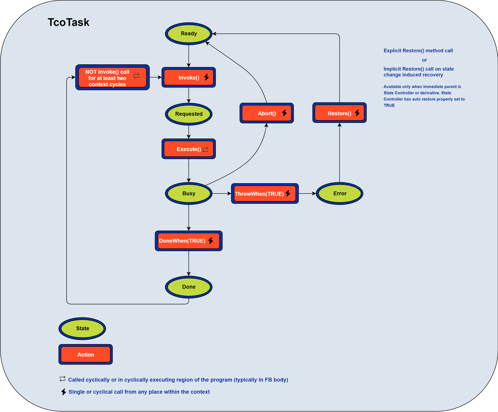

# Task

**(TcoTask : ITcoTask)**

[API](~/api/TcoCore/PlcDocu.TcoCore.TcoTask.yml)


```TcoTask``` is a block for managing chunks of logic in asynchronous execution. Task controls the run of a component's function (servo movement, piston movement, barcode reader trigger, etc.).

There are two key methods for managing the task:

- ```Invoke``` call to fire the execution of the task (can be called fire&forget or cyclically)

- ```Execute``` method must be called cyclically (typically in the body of a FB). The method returns ```TRUE``` when required the execution from a call of  ```Invoke``` method until the task enters ```Done``` state.



~~~ iecst
FUNCTION_BLOCK BlocWithATask EXTENDS TcoCore.TcoObject
VAR
    _counter : INT;
    _myTask  : TcoCore.TcoTask(THIS^);
END_IF

// Body of a FB
IF(_myTask.Exectute()) THEN
    _counter := _counter + 1;
    _myTask.DoneWhen(_counter = 100);
END_IF;
~~~

The task executes upon the ```Invoke``` method call. ```Invoke``` fires the execution of ```Execute``` logic upon the first call, and it does not need cyclical calling.

~~~
_myTask.Invoke();
~~~

```Invoke``` method returns ```ITcoTaskStatus``` with the following members:

- ``` Busy``` indicates the execution started and is running.
- ``` Done``` indicates the execution completed with success.
- ``` Error``` indicates the execution terminated with a failure.
 
~~~iecst
// Wait for the task to complete
IF(_myTask.Invoke().Done) THEN
    ; // Do something
END_IF;

// ALTERNATIVELY

_myTask.Invoke();

IF(_myTask.Done) THEN
    ; // Do something
END_IF;

~~~
~~~iecst
// Make sure that the task is executing
IF(_myTask.Invoke().Busy) THEN
    ; // Do something
END_IF;    
~~~
~~~iecst
// Check for task's error.
IF(_myTask.Invoke().Error) THEN
    ; // Do something
END_IF;    
~~~

**Restore** is a function of ```IRestoreable``` (implemented by TcoTask, TcoComponent...) It provides an **initialization routine** for the object; it recovers the object from any state into ```Ready```.

After task completion, the state of the task will remain in ```Done```, unless:

1. Task's ```Restore``` method is called (task moves to ```Ready``` state).

1. ``` Invoke``` method is **not called** for two or more cycles of its context (that usually means the same as PLC cycle); successive call of ```Invoke``` will switch the task into ```Ready``` and immediately to ```Requested``` state.

1. If the task is part of complex coordination primitive, the transition between states will bring the task into a ```Ready``` state if that primitive (StateController and derivatives) has this option enabled.

The task may finish in an ``` Error``` state. In that case, two recovery scenarios are possible:
1. Task's ```Restore``` method is called (task goes to ```Ready```state).
1. ``` Restore``` from **on transition** methods of a coordination block. 