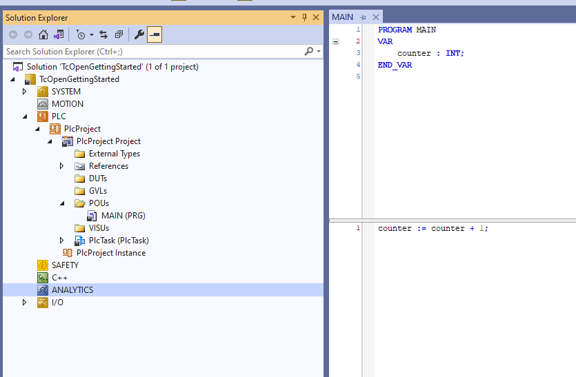
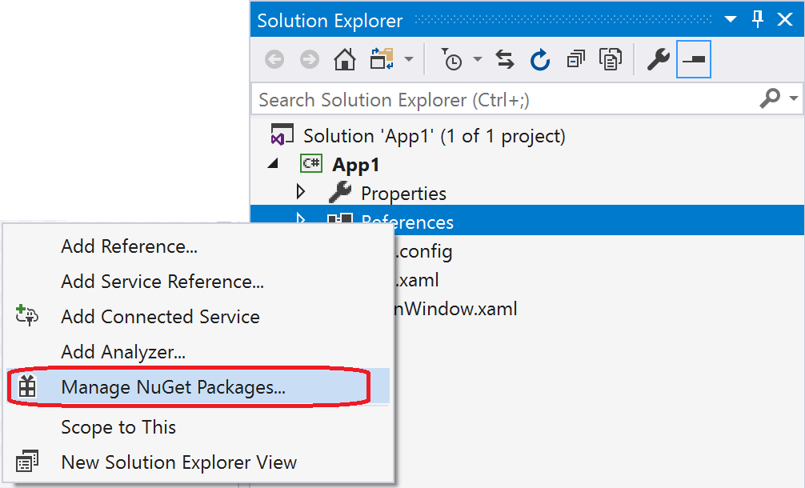
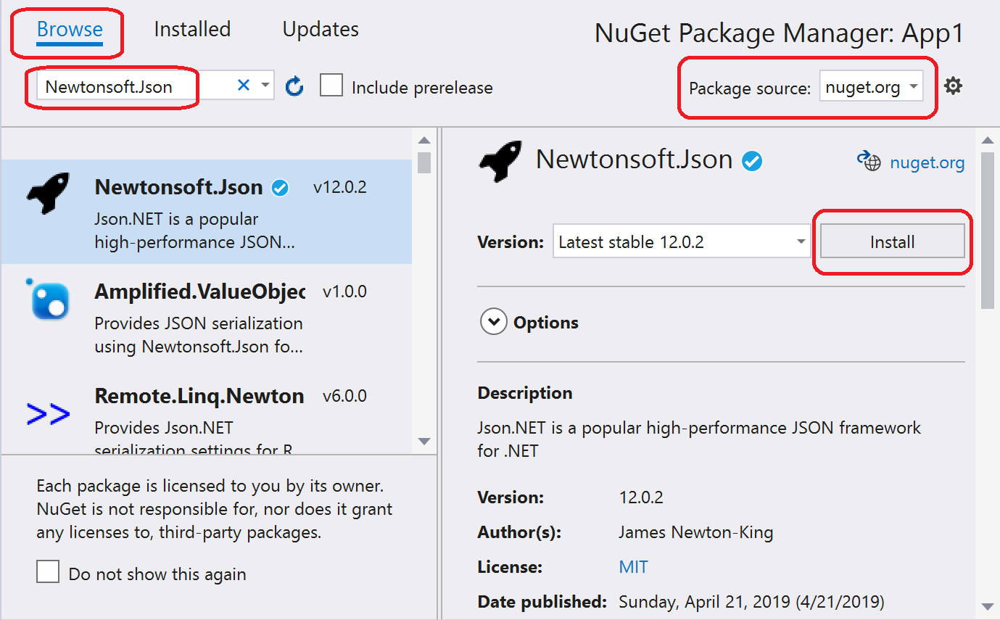
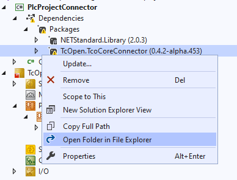

# How to include TcOpen in a project

As a TwinCAT 3 developer, you already have everything you need. 

Your project looks like this. It's probably a bit more complex than this.
.

### 1. Create a new C# **class library** project  (.NET4.8, .NET5, NET6 when supported) in your solution and name it `PlcProjectConnector`

- Right-click on the solution in Solution Explorer and select Add > New Project.

- On the Add a new project page, enter library in the search box. Choose C# from the Language list, and then choose All platforms from the Platform list. Choose the Class Library template, and then choose Next.

- On the Configure your new project page, enter `PlcProjectConnector` in the Project name box, and then choose Next.

- On the Additional information page, select .NET4.8 or .NET5 (or NET6 when supported), and then choose Create.

> [!Video https://www.youtube.com/embed/Y3Y2_4CYFyw]

> Microsoft Create a class library project tutorial => [link](https://docs.microsoft.com/en-us/dotnet/core/tutorials/library-with-visual-studio#create-a-class-library-project)

### 2.Expand your newly created project, right click on `Dependencies` and select `Manage NuGet Packages`.

#### Click on `Browse`, search for `TcOpen.TcoCoreConnector` and click on Install

> Microsoft NuGet Package Manager  tutorial => [link](https://docs.microsoft.com/en-us/nuget/quickstart/install-and-use-a-package-in-visual-studio#nuget-package-manager)

- If you have [Inxton Builder extension](https://marketplace.visualstudio.com/items?itemName=Inxton.InxtonVortexBuilderExtensionPre) just click on the Inxton build icon.
    - If you don't have it expand `Dependencies`-> `Packages` in your Solution Explorer and right click on `TcOpen.TcoCoreConnector` and select `Open folder in File Explorer`. You will get to your NuGet folder (in my case `C:\Users\jozef.chmelar.ml.MTS\.nuget\packages\tcopen.tcocoreconnector\0.4.2-alpha.453` ). There's a directory called `lib` and in it there's TwinCAT library `TcoCore.library` 

### 3. Install this library as you would a regular TwinCAT library

Right click on PLC project:
    - Context menu of the References object in the PLC project tree
    - Button in the Library Manager 
    - Advanced
    - Library repository
    - Click on Install and locate the .library file

>  Tutorial by Beckhoff [here](https://infosys.beckhoff.com/english.php?content=../content/1033/tc3_plc_intro/4189333259.html&id=).

## Done!
Now that you have TcOpen in your project I recommend to read more about it [here](~/articles/TcOpenFramework/TcoCore/Introduction.md).
Or write your first sequence! [here](~/articles/TcOpenFramework/howtos/How_to_write_a_sequence/article.md).

If you prefer a working template check out [TcOpen.Hammer](https://github.com/TcOpenGroup/TcOpen.Hammer)
