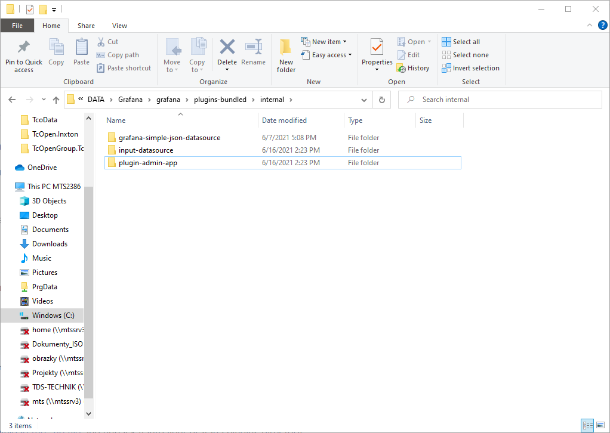
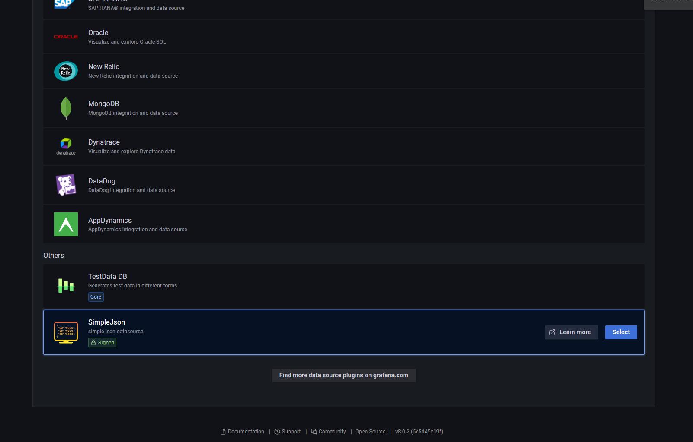
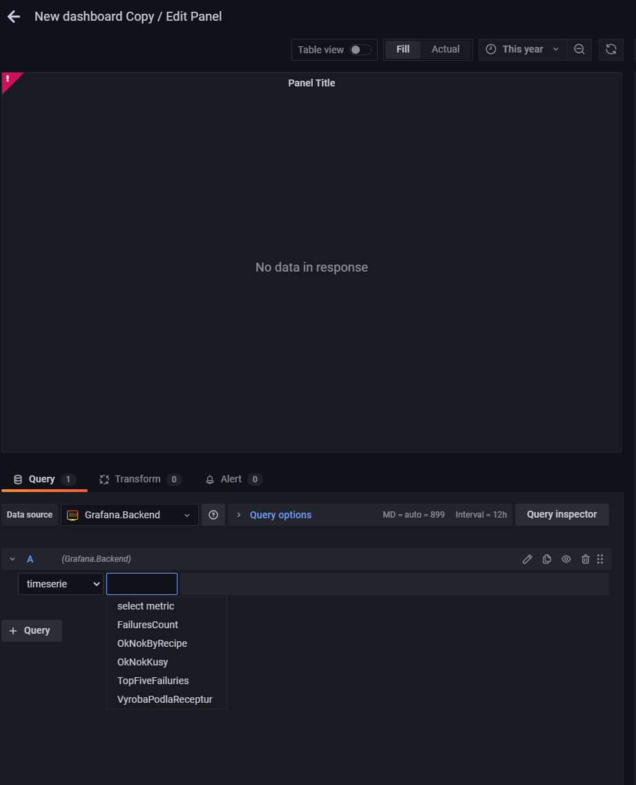

# TcOpenHammer.Grafana.API

This is project is an API between Grafana and MongoDB which uses SimpleJson plugin for Grafana as an interface.

The way it works, is that if you store an object from a PLC `stYourDataObject` to DB, you can generate C# Twin of this object by Inxton (or write your own) and use the structure of the object to access the data in DB via MongoDriver.
It's very easy to query and process the data. Thanks to the strict type system you will always catch errors very soon!

Be aware that when you query huge amounts of data, and call `ToList()` on the result, it may affect the perfomance. Serialization of big list can also take some time. 

## Installation of Grafana and SimpleJson plugin

1. Download and install Grafana - https://dl.grafana.com/oss/release/grafana-8.0.2.windows-amd64.msi
1. Decide wheter  you want to install Grafana as a service or not. I recommend to install Grafana somewhere else than Program Files so it doesn't require Admin rights. (in my case `C\:\DATA\Grafana\`)
1. Download and install SimpleJson plugin, or copy it from the .\assets folder https://grafana.com/api/plugins/grafana-simple-json-datasource/versions/1.4.2/download 
1. Unpack to `C:\DATA\Grafana\grafana\plugins-bundled\internal`



## How to start Grafana

```
cd  C:\DATA\Grafana\grafana\bin
grafana-server.exe
```

In browser, navigate to

`http://localhost:3000/login`

username/password : admin/admin

## How to edit connection string 

Edit connection string in  `src\Grafana.Backend.API\appsettings.json` 

## How to add the API to Grafana

1. Navigate to`http://localhost:3000/datasources/new`
1. At the very bottom SimpleJson should appear

1. Click on select
1. Set the url to `https://localhost:XXXXX/` - you should see the port number when you start the API

## How to add a new Query

Just create a new class like that. It will appear automatically in Grafana.

```csharp
    public class NameOfYourQuery : IQuery<TypeOfYourEntity>
    {
        public ITable Query(IQueryable<TypeOfYourEntity> production, DateTime from, DateTime to) => production
            .Where(x => x._Modified >= from && x._Modified < to)
            .Where(x => x.EntityHeader.Results.Result == 30)
            .Select(x => new { Failure = x.EntityHeader.Results.Failures })
            .GroupBy(x => new { Failure = x.Failure })
            .Select(x => new { Failure = x.Key.Failure, Count = x.Count() })
            .OrderByDescending(x => x.Count)
            .ToList()
            .ToTable();
    }
```
Then you can select it here.




## Queries

Sometimes your write a query like this

| Status 	| Count         |
|--------	|-------------	|
| OK     	| 10          	|
| NOK    	| 1           	|


In cases like this (ie. if you use Pie chart) you need to rotate the result, so it looks like this.

| OK 	| NOK 	|
|----	|-----	|
| 10 	| 1   	|


If you would write SQL the query would have to look like this.


```sql
SELECT COUNT(EntityHeader.Resulst = 20) as OK, COUNT(EntityHeader.Resulst = 30) as NOK from .... group by EntityHeader.Resulst
```


In case you manage to write a query which will result in something like this

| OK 	| NOK 	|   
|----	|-----	|
| 0     | 1     |
| 10 	| 0   	|

Easiest way to solve it is to use transoformation in Grafana - Transofrm > Reduce > Mode = Reduce fieds, Calculation = Total

## How to display a static picture

Copy the image you want to display to .\images in project directory.

HTTP GET to  `localhost:xxxx/images/file_name_of_the_picture_without_extension`  should display the image.

I recommend to use markdown component in Grafana and leverage markdown to display an image.
`

## How to display an image based on a query

In case you want to display the picture of latest produced part.

Install plugin - https://grafana.com/grafana/plugins/dalvany-image-panel/?tab=installation
Or use the CLI
`grafana-cli plugins install dalvany-image-panel`

After you restart Grafana you should see `Dynamic image panel`

- Select dalvany image
- Set base `Base URL` to `http://localhost:xxxx/image/`
- Select a query which will return the name of the image you would like to display
 

## How to normalize time

Data in DB is usually in UTC. Grafana works in your current timezone. You might want to edit the time in Grafana request a bit. 
To do so use method `NormalizeTime` in classe `QueryRequest`.

# Misc

- How to add a panel https://grafana.com/docs/grafana/latest/panels/add-a-panel/
- How to import export dashobard https://grafana.com/docs/grafana/latest/dashboards/export-import/