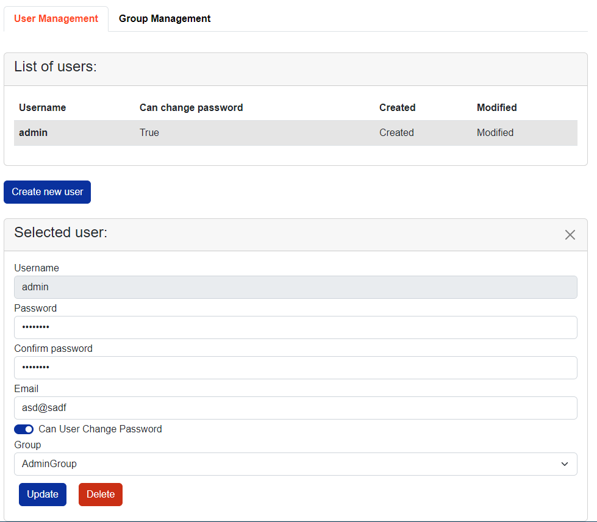
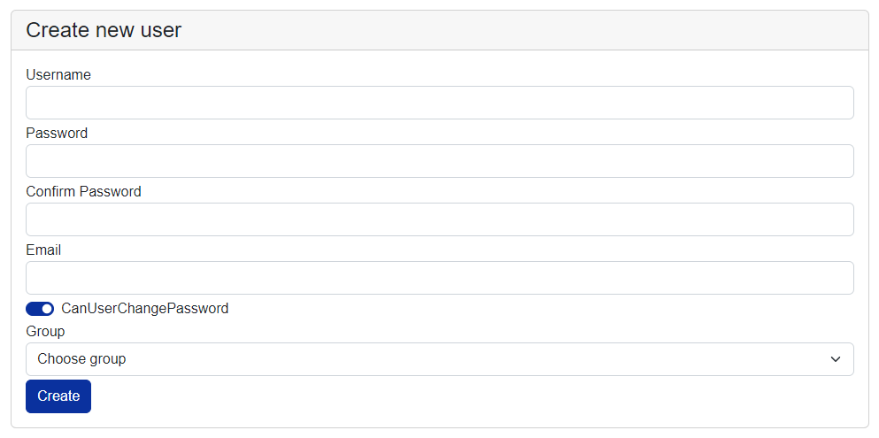
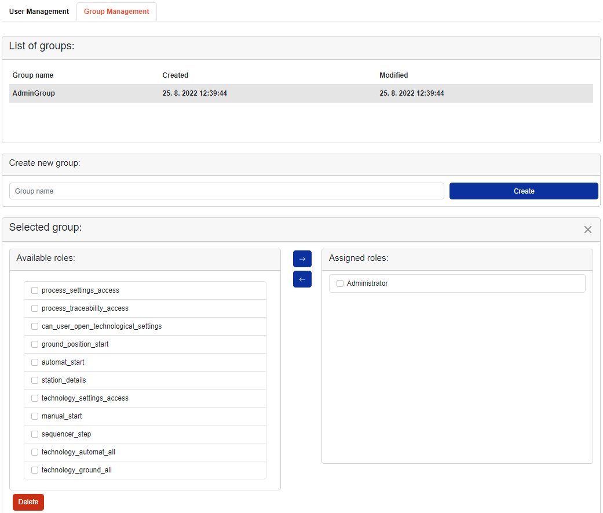

# Blazor Security

## Introduction

Library TcOpen.Inxton.Local.Security.Blazor contains basic implementation of authentication and authorization in Blazor applications within TcOpen framework. This library extends ASP.NET Identity, which now can use implemented repositories within TcOpen framework. Instance of class, which implements IRepository interface can be passed as parameter, therefore is possible to use multiple storage providers (Mongo, Json, SQL).

### Function of TcOpen.Inxton.Local.Security.Blazor

Every user can have only one group. Every group can have assigned roles.
If you remove a role from a group, any user who was in that group will no longer have that role either.

Using this library, you can login, logout, create, delete and manage users and groups.

WARNING: TcOpen.Inxton.Local.Security.Blazor is still in experimental phase. Some features may be missing or buggy.

## Getting started

Install NuGet package TcOpen.Inxton.Local.Security.Blazor or add reference to this project.

Add following lines in Startup.cs, in ConfigureServices() method, where you pass instances of created repositories:

~~~bash
BlazorRoleGroupManager roleGroupManager = new BlazorRoleGroupManager(groupRepo);
services.AddVortexBlazorSecurity(userRepo, roleGroupManager);
~~~

where userRepo is instance of user repository and must be type `IRepository<UserData>`. And groupRepo of group repository and must be type `IRepository<GroupData>`.

To correctly locate login and register views, reference is needed to TcOpen.Inxton.Local.Security. Blazor assembly within app.

Reference can be added in App.razor as parameter AdditionalAssemblies of Router component.

Add following line to Router component:

~~~bash
AdditionalAssemblies="new[] { typeof(BlazorSecurity).Assembly}"
~~~

Also for correct AuthenticationState handling, you must wrap Router component inside CascadingAuthenticationState component.

Resulted code in App.razor should contains something like example below:

~~~bash
<CascadingAuthenticationState>
    <Router AppAssembly="@typeof(Program).Assembly" PreferExactMatches="@true"
            AdditionalAssemblies="new[] { typeof(BlazorSecurity).Assembly}">
    .
    .
    .
    </Router>
</CascadingAuthenticationState>
~~~

After that, following URI's should be accessible within Blazor app:

~~~bash
https://localhost:5001/Identity/Account/Register
https://localhost:5001/Identity/Account/Login
https://localhost:5001/Identity/Account/Manage
~~~

This pages contains basic implementation of register, login and manage views. Now you are able to create, login and manage user.

You can use following URL to log out the current user.

~~~bash
https://localhost:5001/Identity/Account/Logout
~~~

## SecurityManagementView component

SecurityManagementView component serves for managing users. It is available only if user is logged on with administrator rights.

When user is logged in with administrator rights, it is possible to modify all available users and groups. Administrator can delete users or change group.

Add following line to display security management view, where you can managing users and groups.

~~~bash
<SecurityManagementView />
~~~

Your application can look like TcHammer example from TcOpen repo.

## Alert

Library TcOpen.Inxton.Local.Security.Blazor includes alert messaging. It is used by authentication, and it is available for everyone, everywhere in application.

For using them add following line in your main layout of your application.

~~~bash
<AlertDisplay />
~~~

When you want to use them, you must add following injection line.

~~~bash
[Inject]
private BlazorAlertManager _alertManager { get; set; }
~~~

Now you can easily adding new messages. For example following line.

~~~bash
_alertManager.addAlert("success", "Success message.");
~~~

There are available following style option: info, success and warning.

