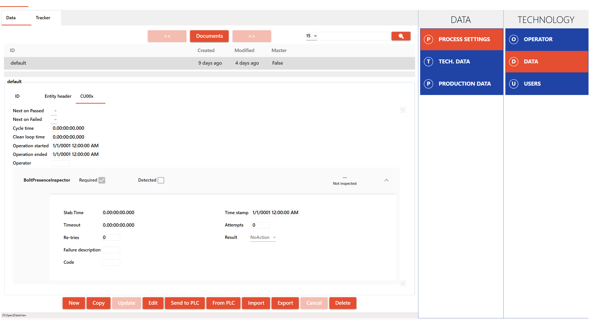
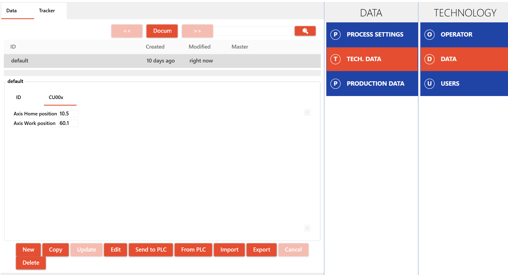
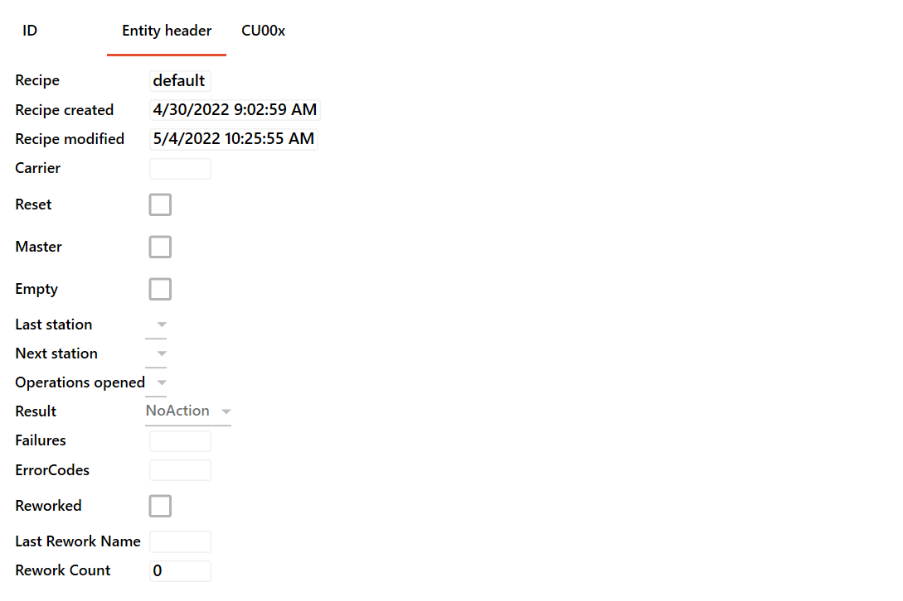
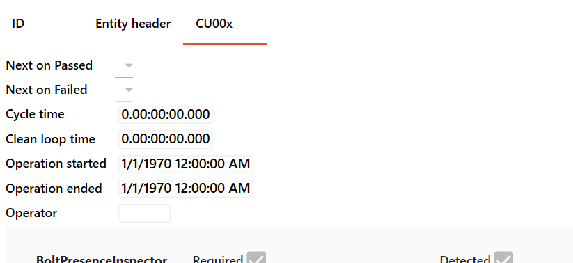

# MTS standard application template

## Preliminary note

The TcOpen group develops this application template in and for the MTS company. We are making it available to the community for use or inspiration.

The application template will develop to meet the needs of the MTS. We will accept the input from the community.
There are, though, some limits imposed on the changes of this particular template.
TcOpen will develop different application templates that will be more open to change.

## Overview

This application template aims to provide scaffolding for automated production/assembly machinery such as:

- single assembly station.
- group of standalone assembly stations with an ID system.
- conveyor-based assembly and testing lines with an ID system.
- carousel tables with an ID system.

The production environment is represented by a series of hierarchically organized units where:

> **Technology** encapsulates all stations/units and it is the root/top-level block.
>> **Controlled unit** represents a station or a unit that performs compact series of operations.

>>>**Components** represent all physical or virtual components used by the Controlled unit.

>>>**Tasked sequences** represent a series of actions organized sequentially (controlled unit contains by default ground and automat sequence).

>>>**Tasked services** represent a series of actions organized arbitrarily (controlled unit contains by default manual/service tasked service).

## Data-driven production process

The production flow is typically organized in sequences driven by a set of data called **Production settings**.

- `Production settings`  is a structure that contains settings to instruct the production flow (inclusion/exclusion of actions, limit, required values, etc.) as well as placeholders for data that arise during the production (measurement values, detected states, data tags of included components, etc.). Production setting and traceability data have the same structure so that settings and traced data are collected in a single data set.

- `Technological settings` is a structure containing data that does not relate directly to the production process, but rather to the setting of the technology (sensor calibration values, pick and place positions, etc.)

### Data and production flow

The first station (controlled unit) in the production chain loads the current set of production data to the assembly parts, that are assigned to that part. The data set contains information about the entire production process (all station settings are included).

#### Entity header

Each part has an *Entity header* that contains information about the flow and status of the given part.

- `Recipe` contains the name of the production setting data set.
- `Recipe created` date and time of recipe creation.
- `Recipe modified` date and time of last recipe modification.
- `Carrier` is the identifier of the mean of transport of the production part (pallet, carousel table position, etc).
- `Reset or ground position performed` indicates that when the part was in a station the station reset occurred.
- `IsMaster` indicates that the part is special (verification, process checking etc.)
- `Is Empty` indicates that the carrier is empty no parts were loaded.
- `Last station` is the last station where the part was processed in the production chain.
- `Next station` is the next destination station for the part to be processed.
- `Operations Opened` Indicates the station where the part is being processed.
- `Result` Indicates the status of the part (NoAction, InProgress, Passed, Failed)
- `Failures` verbatim description of failures that occurred during the processing of the part.
- `ErrorCodes` error codes that occurred during the processing of the part.
- `Was reworked` indicates that the part underwent rework.
- `Last rework name` name of the rework applied to the part.
- `Rework count` number of underwent reworks.

#### Controlled unit header

Each station (controlled unit) has a header that contains a set of information:

- `Next station on fail` sets where should the part go when the process on a given station fails.
- `Next station of passed` sets where should the part go when the process passes.
- `Cycle time` cycle time on a given station when the part was processed.
- `Clean loop time` clean cycle time (without carrier exchange) on a given station when the part was processed.
- `Operation started`  start operations time stamp on a given station.
- `Operation ended` end operations time stamp on a given station.
- `Operator` name or id of the operator logged into the given station at the time of processing of the part.

### How are data handled in stations (controlled units)

**Creating entity**: The first station in the chain of production loads *Process settings* to the part (entity) and opens the part for production (Result := InProgress).

**Opening entity**: Each following station retrieves data of the given part by its ID at the beginning of the process and checks whether it belongs to the station by checking that EntityHeader.NextStation matches the ID of the station. If the NextStation and ID match the station will start the operation on a given station otherwise the part will be released from the station without performing any operation. When the operations start the part is opened for production on the station (assigns id of the station to Entity header's Operations Opened). The process follows the settings available for the station. During the process, the station fills in traceability data (measurements, detection, ids of assembled parts, etc.) 

**Closing entity**: At the end of the operation the part is closed and the NextStation is assigned (depending on the result of the operations). The data are pushed back to a data repository for later retrieval in the next station.

**Finalizing entity**: The last station in the chain of production should finalize the part when the **InProgress** resuls changes into the overall result **Passed**, while failed result remains marked as **Failed**.

A special case represents the **reset or ground position** of a station. When the station is reset while the operations in a part are opened (Operation Opened is some station ID), then the reset results in the entity being marked as failed. If the station is reset and operations are not opened then the status of the entity is not modified.

# Application template architecture

The application's entry point is the `MAIN` program called cyclically from the PLC task. 
`MAIN` declares the instance of the `Technology` type that is the context of the whole application. You should place all your code within the `Main` method of technology object (`_technology.Main()`) that will contextualize all your code.

If you are not familiar with the architecture of the TcOpen framework `context` concept, you can find more 
[here](https://docs.tcopengroup.org/articles/TcOpenFramework/TcoCore/TcoContext.html) or more generic overview [here](https://docs.tcopengroup.org/articles/TcOpenFramework/TcoCore/Introduction.html).

*Following video introduces the application context*

# Technology object

`Technology` is **top/root object** of a comprehensive whole (production line, series of devices chained in an orderly fashion) that controls one PLC. The `technology` contains `controlled units` representing sufficiently autonomous parts of the technology (e.g., stations, devices, etc.).

## Technology commands

### GroundAll

The task that provides execution of ground task all controlled units within the technology. The ground task of each controlled unit should contain the control logic that brings the respective controlled unit into its initial state.

### AutomatAll

The task that provides execution of automatic task all controlled units within the technology. Automat task provides each controlled unit's nominal (automatic) cycle logic.

## Controlled units

The technology can contain multiple controlled units. The controlled unit has different `modes`: 
- **Ground**: brings the device into initial states (home position, state resets, etc.). The ground mode can contain subsequences for parallelization or organization of logic.
- **Automat**: represents the standard run of the unit. Automat mode if of sequence type. The ground mode can contain subsequences for parallelization or organization of logic.
- **Manual**: provides access to a series of tools to manipulate single components of the controlled unit.

>More about sequences: [formal explanation](https://docs.tcopengroup.org/articles/TcOpenFramework/TcoCore/TcoSequencer.html), [informal explanation](https://docs.tcopengroup.org/articles/TcOpenFramework/howtos/How_to_write_a_sequence/article.html)

>More about tasks: [formal explanation](https://docs.tcopengroup.org/articles/TcOpenFramework/TcoCore/TcoTask.html).

Controlled units also contains two main structures:

- **Components** encapsulates components (drives, sensors, pneumatical cylinders, etc.)
- [**ProcessData**](#processdata) is a PLCs' working copy of combined receipe and tracebility data, that is persisted in a repository ([TcoData](https://docs.tcopengroup.org/articles/TcOpenFramework/TcoData/Introduction.html)).

## ProcessData

This application template provides a versatile model to allow for the extended control of the program flow from a manageable data set. Process data represent the set of information to follow and process during production. One way of thinking about the process data is the recipe that, besides the instructive data, contains information that arises during the production process. Production data are filled into the data set during the production operations.

Typically, the process data are loaded at the beginning of the production into the first controlled unit (station). Then, an Id of the production entity is assigned and stored in the data repository. Each controlled unit (station) later retrieves the data for the given entity at the beginning of the process and returns the data (enriched by additional information about the production) to the repository at the end of the process.

## TechnologicalData

Technological data contain a manageable set of data related to the technology, such as drives settings, limits, global timers, etc. 

## ProcessTraceability

Process traceability is a PLC placeholder for accessing the production data repository. This object points to the same traceability repository as the `ProcessData` of any controlled unit.

# Controlled unit templates
Controlled unit `CU00X` is a template from which other controlled units can derive.
`CU00X` folder contains a template from which any controlled unit can be scaffolded. At this moment, there is PowerShell script `Create-Controlled-Unit` located in the root of the solution directory.

~~~
.\Create-Controlled-Unit.ps1 NEWCU
~~~

> The script may not work as expected when the solution is opened as filtered solution (slnf).

Running the script will modify the PLC project files; if the project is opened in the visual studio project reload will be required. In addition, you will need to add the call of the newly added controlled unit in the `Technology` manually.

~~~
FUNCTION_BLOCK Technology EXTENDS TcoCore.TcoContext
VAR
    _processSettings     : ProcessDataManager(THIS^);
    _technologySettings  : TechnologicalDataManager(THIS^);
    _processTraceability : ProcessDataManager(THIS^);
    {attribute addProperty Name "<#AUTOMAT ALL#>"}
    _automatAllTask : TcoCore.TcoTask(THIS^);
    {attribute addProperty Name "<#GROUND ALL#>"}
    _groundAllTask : TcoCore.TcoTask(THIS^);
    _cu00x         : CU00x(THIS^);
    
    _NEWCU : NEWCU(THIS^); <------ NEWLY ADDED
END_VAR
//-----------------------------------------------------

Main() <------ ATTENTION NOT BODY OF THE FUNCTION BLOCK BUT Main() METHOD!!!
//----------------------------------------------------
_processSettings();
THIS^.RtcSynchronize(true, '', 60);
_cu00x();

_NEWCU();  <------ NEWLY ADDED

//----------------------------------------------------
~~~