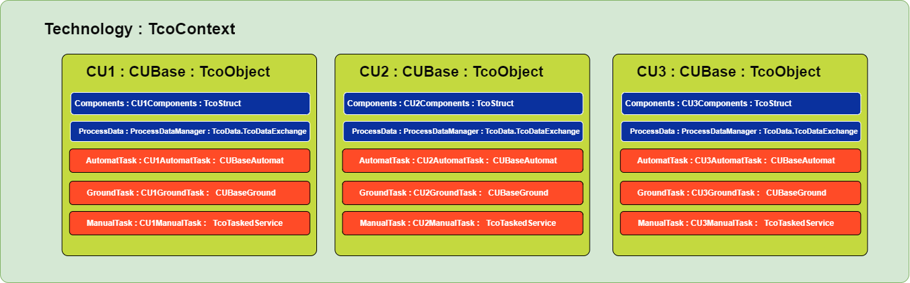

# MTS standard application template

## Preliminary note

The TcOpen group develops this application template in and for the MTS company. We are making it available to the community for use or inspiration.

The application template will develop to meet the needs of the MTS. We will accept the input from the community. 
There are, though, some limits imposed on the changes of this particular template. 
TcOpen will develop different application templates that will be more open to change.

-------------------------------------------

# Application template architecture

The application's entry point is the `MAIN` program called cyclically from the PLC task. 
`MAIN` declares the instance of the `Technology` type that is the context of the whole application. You should place all your code within the `Main` method of technology object (`_technology.Main()`) that will contextualize all your code.

If you are not familiar with the architecture of the TcOpen framework `context` concept, you can find more 
[here](https://docs.tcopengroup.org/articles/TcOpenFramework/TcoCore/TcoContext.html) or more generic overview [here](https://docs.tcopengroup.org/articles/TcOpenFramework/TcoCore/Introduction.html).

*Following video introduces the application context*

# Technology object

`Technology` is **top/root object** of a comprehensive whole (production line, series of devices chained in an orderly fashion) that controls one PLC. The `technology` contains `controlled units` representing sufficiently autonomous parts of the technology (e.g., stations, devices, etc.).

## Technology commands

### GroundAll

The task that provides execution of ground task all controlled units within the technology. The ground task of each controlled unit should contain the control logic that brings the respective controlled unit into its initial state.

### AutomatAll

The task that provides execution of automatic task all controlled units within the technology. Automat task provides each controlled unit's nominal (automatic) cycle logic.

## Controlled units

The technology can contain multiple controlled units. The controlled unit has different `modes`: 
- **Ground**: brings the device into initial states (home position, state resets, etc.). The ground mode can contain subsequences for parallelization or organization of logic.
- **Automat**: represents the standard run of the unit. Automat mode if of sequence type. The ground mode can contain subsequences for parallelization or organization of logic.
- **Manual**: provides access to a series of tools to manipulate single components of the controlled unit.

>More about sequences: [formal explanation](https://docs.tcopengroup.org/articles/TcOpenFramework/TcoCore/TcoSequencer.html), [informal explanation](https://docs.tcopengroup.org/articles/TcOpenFramework/howtos/How_to_write_a_sequence/article.html)

>More about tasks: [formal explanation](https://docs.tcopengroup.org/articles/TcOpenFramework/TcoCore/TcoTask.html).

Controlled units also contains two main structures:

- **Components** encapsulates components (drives, sensors, pneumatical cylinders, etc.)
- [**ProcessData**](#processdata) is a PLCs' working copy of combined receipe and tracebility data, that is persisted in a repository ([TcoData](https://docs.tcopengroup.org/articles/TcOpenFramework/TcoData/Introduction.html)).

## ProcessData

This application template provides a versatile model to allow for the extended control of the program flow from a manageable data set. Process data represent the set of information to follow and process during production. One way of thinking about the process data is the recipe that, besides the instructive data, contains information that arises during the production process. Production data are filled into the data set during the production operations.

Typically, the process data are loaded at the beginning of the production into the first controlled unit (station). Then, an Id of the production entity is assigned and stored in the data repository. Each controlled unit (station) later retrieves the data for the given entity at the beginning of the process and returns the data (enriched by additional information about the production) to the repository at the end of the process.

## TechnologicalData

Technological data contain a manageable set of data related to the technology, such as drives settings, limits, global timers, etc. 

## ProcessTraceability

Process traceability is a PLC placeholder for accessing the production data repository. This object points to the same traceability repository as the `ProcessData` of any controlled unit.

# Controlled unit template
Controlled unit `CU00X` is a template from which other controlle units can derive.
`CU00X` folder contains a template from which any controlled unit can be scaffolded. At this moment, there is PowerShell script `Create-Controlled-Unit` located in the root of the solution directory.

~~~
.\Create-Controlled-Unit.ps1 NEWCU
~~~

> The script may not work as expected when the solution is opened as filtered solution (slnf).

Running the script will modify the PLC project files; if the project is opened in the visual studio project reload will be required. In addition, you will need to add the call of the newly added controlled unit in the `Technology` manually.

~~~
FUNCTION_BLOCK Technology EXTENDS TcoCore.TcoContext
VAR
    _processSettings     : ProcessDataManager(THIS^);
    _technologySettings  : TechnologicalDataManager(THIS^);
    _processTraceability : ProcessDataManager(THIS^);
    {attribute addProperty Name "<#AUTOMAT ALL#>"}
    _automatAllTask : TcoCore.TcoTask(THIS^);
    {attribute addProperty Name "<#GROUND ALL#>"}
    _groundAllTask : TcoCore.TcoTask(THIS^);
    _cu00x         : CU00x(THIS^);
    
    _NEWCU : NEWCU(THIS^); <------ NEWLY ADDED
END_VAR
//-----------------------------------------------------

Main() <------ ATTENTION NOT BODY OF THE FUNCTION BLOCK BUT Main() METHOD!!!
//----------------------------------------------------
_processSettings();
THIS^.RtcSynchronize(true, '', 60);
_cu00x();

_NEWCU();  <------ NEWLY ADDED

//----------------------------------------------------
~~~

