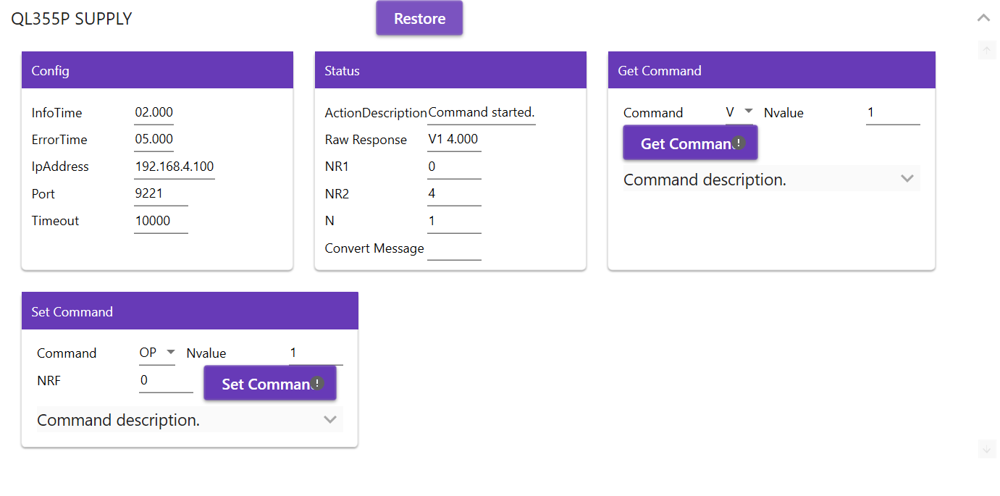

# TcoAimTTiPowerSupply

## Introduction

The **TcoAimTTiPowerSupply** is a set of libraries that cover TTi portfolio:the **Qlseries** power supplies for the target PLC platform [Twincat](https://www.beckhoff.com/en-en/products/automation/twincat/twincat-3-build-4024/) and [TcOpen](https://github.com/TcOpenGroup/TcOpen#readme) framework.

The package consists of a PLC library providing control logic and its .NET twin counterpart aimed at the visualization part.

## General TcOpen Prerequisites

**Check general prerequisites for TcOpen [here](https://github.com/TcOpenGroup/TcOpen#prerequisites).**

## TcoAimTTiPowerSupply

### PLC enviroment

---

#### **_Preconditions:_** "To connect to the specified power supply, check the manufacturer's documentation for the Ql series. To find the device, you can use the 'LX Discovery Tool' software."

---

#### Implementation steps.

#### 1. Create the Function Block that extends the **`TcoCore.TcoContext`** function block.

#### 2 Inside the declaration part of the function block created, add an instance of the **`TcoAimTTiPowerSupply.TcoQl355P_v_1_x_x`**. Add the **`Main`** method into this function block and insert the instances.

```csharp
FUNCTION_BLOCK WpfContext EXTENDS TcoCore.TcoContext
VAR
     {attribute addProperty Name "<#QL355P SUPPLY#>"}
    _supply : TcoAimTtiPowerSupply.TcoQl355P_v_1_x_x(THIS^);


END_VAR

```

#### 3. Here instances are called. By calling method `Service()` , all control elements of this component are accessible later in the visualization. By calling method `Service` is allowed control elements(components) via visualisation (service/ manual mode)

```csharp
IF _serviceModeActive THEN
	_supply.Service();

END_IF
_supply.Config.IpAddress:='192.168.4.100';
_supply.Config.Port:=9221;
_supply.Config.Timeout:=10000;
_supply.Config.InfoTime:=T#2S;
_supply.Config.ErrorTime:=T#5S;


_supply();

```

#### 4. In the declaration part of the **`MAIN(PRG)`** create an instance of the function block created in the step 2 according to the example.

```csharp
PROGRAM MAIN
VAR
      _wpfContext : WpfContext;
END_VAR
```

#### 5. Into the body of the **`MAIN(PRG)`** add the call of the **`Run()`** method of the instance created in the previous step, according to the example.

```csharp
_wpfContext.Run();
```

#### 6. Build and save the XAE project.

#### 7. Activate configuration, load the PLC program and swith the PLC into the run mode.

---

- ### .NET enviroment

---

#### **_Preconditions:_** All neccessary packages are installed, all neccessary references are set, connector to the target PLC is set.

- #### Implementation steps.

#### 1. Run the **`Vortex Builder`**.

#### 2. Into the **`MainWindow.xaml`** define **`DataContext`** to the **`MAIN`** of the **`TcoAimTTiPowerSupplyTestsPlc`**.

```xml
<Window
  x:Class="TcoAimTTiPowerSupply.Wpf.Sandbox.MainWindow"
  xmlns="http://schemas.microsoft.com/winfx/2006/xaml/presentation"
  xmlns:x="http://schemas.microsoft.com/winfx/2006/xaml"
  xmlns:d="http://schemas.microsoft.com/expression/blend/2008"
  xmlns:mc="http://schemas.openxmlformats.org/markup-compatibility/2006"
  xmlns:tcopen="clr-namespace:TcoAimTTiPowerSupplyTests;assembly=TcoAimTTiPowerSupplyTestsConnector"
  xmlns:vortex="http://vortex.mts/xaml"
  Title="MainWindow"
  Width="800"
  Height="450"
  DataContext="{x:Static tcopen:Entry.TcoAimTTiPowerSupplyTestsPlc}"
  mc:Ignorable="d"
>


</Window>
```

```csharp
       static string TargetAmsId = Environment.GetEnvironmentVariable("Tc3Target");
        static int TargetAmsPort = 852;

        public static TcoAimTTiPowerSupplyTestsTwinController TcoAimTTiPowerSupplyTestsPlc { get; }
            = new TcoAimTTiPowerSupplyTestsTwinController(Vortex.Adapters.Connector.Tc3.Adapter.Tc3ConnectorAdapter.Create(TargetAmsId, TargetAmsPort, true));
```

#### 3. Into the container added, insert the **`RenderableContentControl`** and bind its **`DataContext`** to the **` _supply : TcoAimTtiPowerSupply.TcoQl355P_v_1_x_x(THIS^);`**, using the **`PresentationType`** of the value **`Service`**.

```XML
	<vortex:RenderableContentControl Grid.Row="0" DataContext="{Binding MAIN._wpfContext._supply}" PresentationType="Service"/>

```

#### 4. Because communication between PLC and QL power supply components is based on the TcpIp protocol and utilizes `.NET` native communication libraries, it is necessary to initialize remote execution. To do this, you need to call the `Initialize()` method."

```csharp
    coAimTtiPowerSupplyTests.Entry.TcoAimTtiPowerSupplyTestsPlc.MAIN._wpfContext._supply.Initialize();
```

#### 4. After starting the application and expanding the view, final view should look as follows:

Collapsed Service view


Expanded (detailed info) view



Service view with expanded commands descriptions


### Plc Example usage in sequencer

```csharp
seq REF= _sequence1;

seq.Open();
seq.Observer := _observer;


IF (seq.Step(inStepID := 0,
    inEnabled := TRUE,
    inStepDescription := 'READY TO START')) THEN
    //--------------------------------------------------------

		_noOfAttmets:=0;

	answer := _dialog
			.Show()
			.WithType(eDialogType.Question)
			.WithCaption('Ready to go?')
			.WithText('Do you really want to setup voltage?')
			.WithYesNo().Answer;
			//

	 IF (answer = TcoCore.eDialogAnswer.Yes) THEN
		seq.CompleteStep();
	 ELSIF(answer = TcoCore.eDialogAnswer.No) THEN
		_sequence1Task.Restore();
	 END_IF;

    //--------------------------------------------------------
END_IF;


IF (seq.Step(inStepID := 10,
    inEnabled := TRUE,
    inStepDescription := 'RESTORE')) THEN
//--------------------------------------------------------

	_supply.Restore();
	seq.CompleteStep();


//--------------------------------------------------------
END_IF;
IF (seq.Step(inStepID := 11,
    inEnabled := TRUE,
    inStepDescription := 'SET VOLTAGE')) THEN
//--------------------------------------------------------
	cmd.Command:=eTcoQWlSeriesSupplySetCommands_v_1_x_x.V;
	cmd.NrfValue:=5.0;
	cmd.NValue:=1;
	 	IF _supply.SetCommand(inCommand:=cmd).Done  THEN
			seq.CompleteStep();
		END_IF

//--------------------------------------------------------
END_IF;

IF (seq.Step(inStepID := 12,
    inEnabled := TRUE,
    inStepDescription := 'GET VOLTAGE')) THEN
//--------------------------------------------------------
	getCmd.Command:=eTcoQWlSeriesSupplyGetCommands_v_1_x_x.V;
	getCmd.NValue:=1;
	 	IF _supply.GetCommand(inCommand:=getCmd).Done    THEN
			seq.CompleteStep();
		END_IF

//--------------------------------------------------------
END_IF;

IF (seq.Step(inStepID := 13,
    inEnabled := TRUE,
    inStepDescription := 'SET VOLTAGE ANOTHER WAY')) THEN
//--------------------------------------------------------

	 	IF _supply.SetVoltage(inNValue:=1,inVoltage:=4.0).Done  THEN
			seq.CompleteStep();
		END_IF

//--------------------------------------------------------
END_IF;

IF (seq.Step(inStepID := 14,
    inEnabled := TRUE,
    inStepDescription := 'GET VOLTAGE ANOTHER WAY')) THEN
//--------------------------------------------------------
		IF _supply.GetVoltage(inNValue:=1,outVoltage=>outVoltage).Done  THEN
			IF outVoltage=4.0 THEN
				seq.CompleteStep();
			END_IF;
		END_IF

//--------------------------------------------------------
END_IF;

IF (seq.Step(inStepID := 19,
    inEnabled := TRUE,
    inStepDescription := 'READY TO START')) THEN
    //--------------------------------------------------------

		_noOfAttmets:=0;

	answer := _dialog
			.Show()
			.WithType(eDialogType.Question)
			.WithCaption('Ready to go?')
			.WithText('Do you really want to setup current?')
			.WithYesNo().Answer;
			//

	 IF (answer = TcoCore.eDialogAnswer.Yes) THEN
		seq.CompleteStep();
	 ELSIF(answer = TcoCore.eDialogAnswer.No) THEN
		_sequence1Task.Restore();
	 END_IF;

    //--------------------------------------------------------
END_IF;


IF (seq.Step(inStepID := 20,
    inEnabled := TRUE,
    inStepDescription := 'RESTORE')) THEN
//--------------------------------------------------------

	_supply.Restore();
	seq.CompleteStep();


//--------------------------------------------------------
END_IF;
IF (seq.Step(inStepID := 21,
    inEnabled := TRUE,
    inStepDescription := 'SET CURRENT')) THEN
//--------------------------------------------------------
	cmd.Command:=eTcoQWlSeriesSupplySetCommands_v_1_x_x.I;
	cmd.NrfValue:=0.5;
	cmd.NValue:=1;
	 	IF _supply.SetCommand(inCommand:=cmd).Done  THEN
			seq.CompleteStep();
		END_IF

//--------------------------------------------------------
END_IF;

IF (seq.Step(inStepID := 22,
    inEnabled := TRUE,
    inStepDescription := 'GET CURRENT')) THEN
//--------------------------------------------------------
	getCmd.Command:=eTcoQWlSeriesSupplyGetCommands_v_1_x_x.I;
	getCmd.NValue:=1;
	 	IF _supply.GetCommand(inCommand:=getCmd).Done    THEN
			IF _supply.Status.State.Nr2Value=0.5 THEN
				seq.CompleteStep();
			END_IF;
		END_IF

//--------------------------------------------------------
END_IF;

IF (seq.Step(inStepID := 23,
    inEnabled := TRUE,
    inStepDescription := 'SET CURRENT ANOTHER WAY')) THEN
//--------------------------------------------------------

	 	IF _supply.SetCurrent(inNValue:=1,inCurrent:=0.2).Done  THEN
			seq.CompleteStep();
		END_IF

//--------------------------------------------------------
END_IF;

IF (seq.Step(inStepID := 24,
    inEnabled := TRUE,
    inStepDescription := 'GET CURRENT ANOTHER WAY')) THEN
//--------------------------------------------------------
		IF _supply.GetCurrent(inNValue:=1, outCurrent=>outCurrent).Done  THEN
			IF outCurrent=0.2 THEN
				seq.CompleteStep();
			END_IF;
		END_IF

//--------------------------------------------------------
END_IF;


IF (seq.Step(inStepID := 29,
    inEnabled := TRUE,
    inStepDescription := 'READY TO START')) THEN
    //--------------------------------------------------------

		_noOfAttmets:=0;

	answer := _dialog
			.Show()
			.WithType(eDialogType.Question)
			.WithCaption('Ready to go?')
			.WithText('Do you really want to set output?')
			.WithYesNo().Answer;
			//

	 IF (answer = TcoCore.eDialogAnswer.Yes) THEN
		seq.CompleteStep();
	 ELSIF(answer = TcoCore.eDialogAnswer.No) THEN
		_sequence1Task.Restore();
	 END_IF;

    //--------------------------------------------------------
END_IF;


IF (seq.Step(inStepID := 30,
    inEnabled := TRUE,
    inStepDescription := 'RESTORE')) THEN
//--------------------------------------------------------

	_supply.Restore();
	seq.CompleteStep();


//--------------------------------------------------------
END_IF;
IF (seq.Step(inStepID := 31,
    inEnabled := TRUE,
    inStepDescription := 'SET ON OUTPUT')) THEN
//--------------------------------------------------------
	cmd.Command:=eTcoQWlSeriesSupplySetCommands_v_1_x_x.OP;
	cmd.NrfValue:=1;
	cmd.NValue:=1;
	 	IF _supply.SetCommand(inCommand:=cmd).Done  THEN
			seq.CompleteStep();
		END_IF

//--------------------------------------------------------
END_IF;

IF (seq.Step(inStepID := 32,
    inEnabled := TRUE,
    inStepDescription := 'GET ON OUTPUT')) THEN
//--------------------------------------------------------
	getCmd.Command:=eTcoQWlSeriesSupplyGetCommands_v_1_x_x.OP;
	getCmd.NValue:=1;
	 	IF _supply.GetCommand(inCommand:=getCmd).Done    THEN
			IF _supply.Status.State.Nr1Value=1 THEN
				seq.CompleteStep();
			END_IF;
		END_IF

//--------------------------------------------------------
END_IF;

IF (seq.Step(inStepID := 33,
    inEnabled := TRUE,
    inStepDescription := 'SET OFF OUTPUT ANOTHER WAY')) THEN
//--------------------------------------------------------

	 	IF _supply.SetOutputOff(inNValue:=1).Done  THEN
			seq.CompleteStep();
		END_IF

//--------------------------------------------------------
END_IF;

IF (seq.Step(inStepID := 34,
    inEnabled := TRUE,
    inStepDescription := 'GET IF OUTPUT IS OFF ANOTHER WAY')) THEN
//--------------------------------------------------------
		IF _supply.GetOutputIsOff(inNValue:=1,outIsOff=>isOff).Done  THEN
			IF isOff=TRUE THEN
				seq.CompleteStep();
			END_IF;
		END_IF

//--------------------------------------------------------
END_IF;


IF (seq.Step(inStepID := 40,
    inEnabled := TRUE,
    inStepDescription := 'READY TO START')) THEN
    //--------------------------------------------------------

	_noOfAttmets:=0;
	_maxAllowedAttempts:=10;

	answer := _dialog
			.Show()
			.WithType(eDialogType.Question)
			.WithCaption('Ready to go?')
			.WithText('Do you really want to set output in cycle?')
			.WithYesNo().Answer;
			//

	 IF (answer = TcoCore.eDialogAnswer.Yes) THEN
		seq.CompleteStep();
	 ELSIF(answer = TcoCore.eDialogAnswer.No) THEN
		_sequence1Task.Restore();
	 END_IF;

    //--------------------------------------------------------
END_IF;


IF (seq.Step(inStepID := 41,
    inEnabled := TRUE,
    inStepDescription := 'SET ON OUTPUT')) THEN
//--------------------------------------------------------
	cmd.Command:=eTcoQWlSeriesSupplySetCommands_v_1_x_x.OP;
	cmd.NrfValue:=1;
	cmd.NValue:=1;
	 	IF _supply.SetCommand(inCommand:=cmd).Done  THEN
			seq.CompleteStep();
		END_IF

//--------------------------------------------------------
END_IF;

IF (seq.Step(inStepID := 42,
    inEnabled := TRUE,
    inStepDescription := 'GET ON OUTPUT')) THEN
//--------------------------------------------------------
	getCmd.Command:=eTcoQWlSeriesSupplyGetCommands_v_1_x_x.OP;
	getCmd.NValue:=1;
	 	IF _supply.GetCommand(inCommand:=getCmd).Done    THEN
			IF _supply.Status.State.Nr1Value=1 THEN
				seq.CompleteStep();
			END_IF;
		END_IF

//--------------------------------------------------------
END_IF;

IF (seq.Step(inStepID := 43,
    inEnabled := TRUE,
    inStepDescription := 'SET OFF OUTPUT ANOTHER WAY')) THEN
//--------------------------------------------------------

	 	IF _supply.SetOutputOff(inNValue:=1).Done  THEN
			seq.CompleteStep();
		END_IF

//--------------------------------------------------------
END_IF;

IF (seq.Step(inStepID := 44,
    inEnabled := TRUE,
    inStepDescription := 'GET IF OUTPUT IS OFF ANOTHER WAY')) THEN
//--------------------------------------------------------
		IF _supply.GetOutputIsOff(inNValue:=1,outIsOff=>isOff).Done  THEN
			IF isOff=TRUE THEN
				seq.CompleteStep();
			END_IF;
		END_IF

//--------------------------------------------------------
END_IF;


IF (seq.Step(inStepID := 45,
    inEnabled := TRUE,
    inStepDescription := 'REPEAT IT IF NECESSARY')) THEN
//--------------------------------------------------------


		IF _noOfAttmets<_maxAllowedAttempts THEN
			_noOfAttmets:=_noOfAttmets+1;
			seq.RequestStep(41);
			_supply.Restore();
		ELSE
		seq.CompleteStep();
		end_if;


//--------------------------------------------------------
END_IF;


IF (seq.Step(inStepID := seq.RESTORE_STEP_ID,
    inEnabled := TRUE,
    inStepDescription := 'RETURN TO THE START OF THE SEQUENCE')) THEN
    //--------------------------------------------------------
    	seq.CompleteSequence();
    //--------------------------------------------------------
END_IF;

seq.Close();
```
