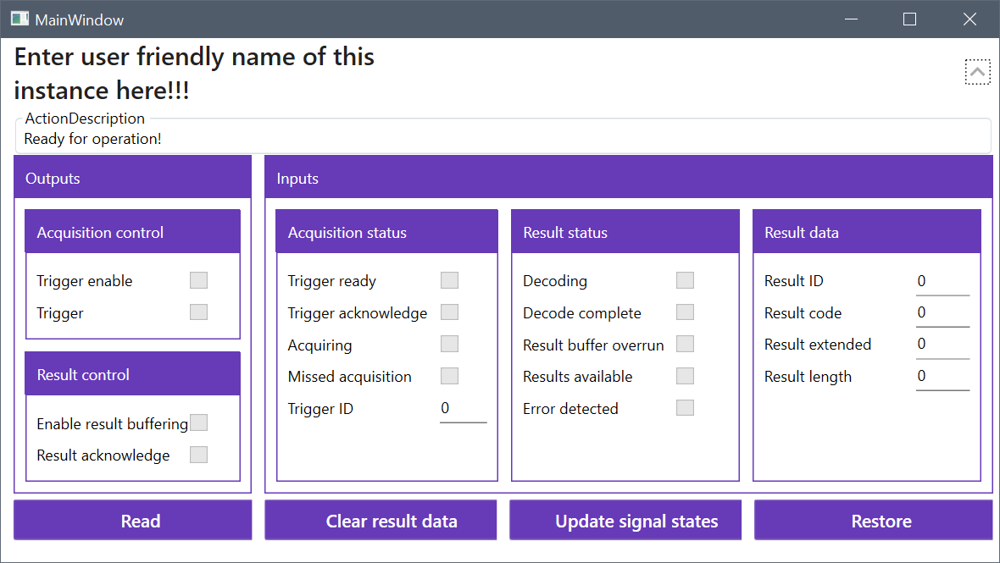
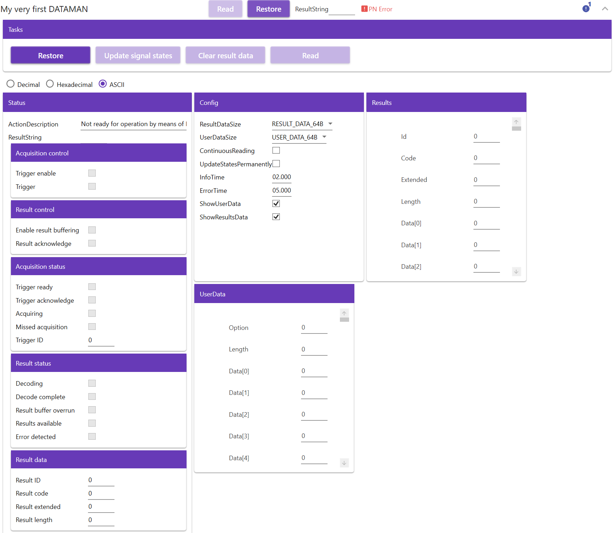
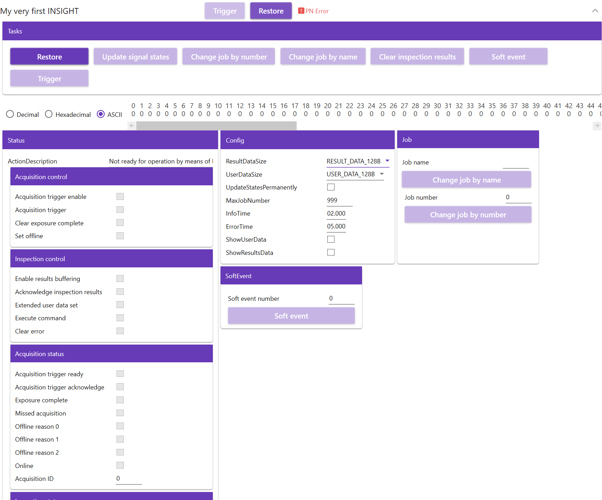
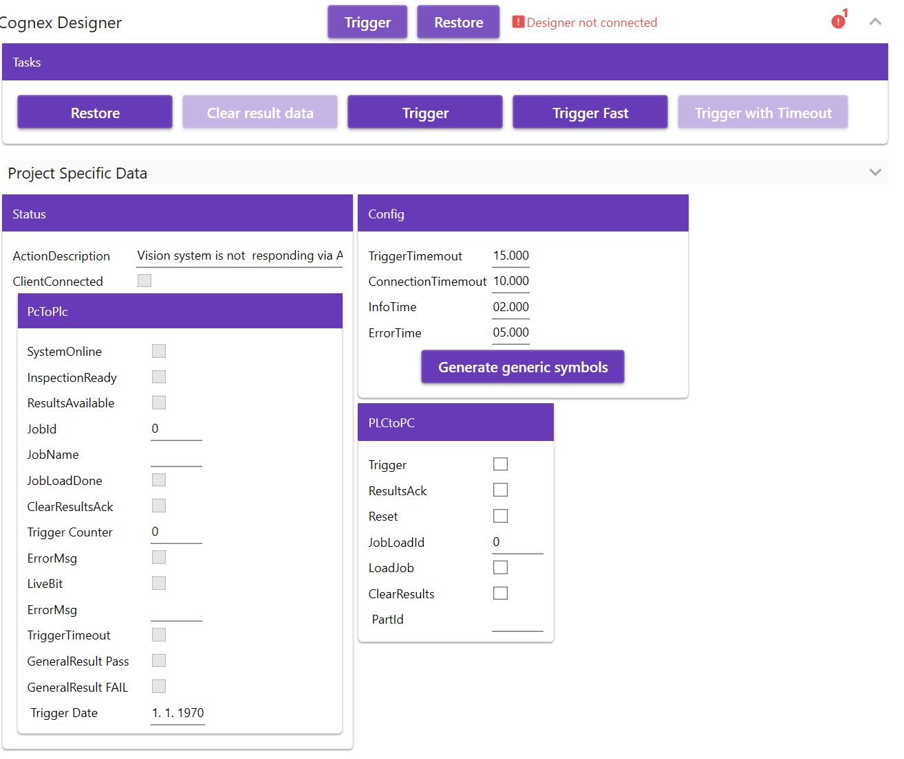
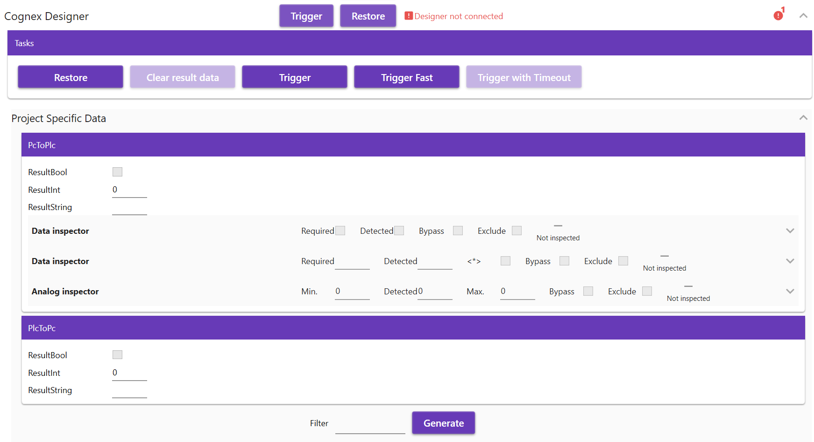
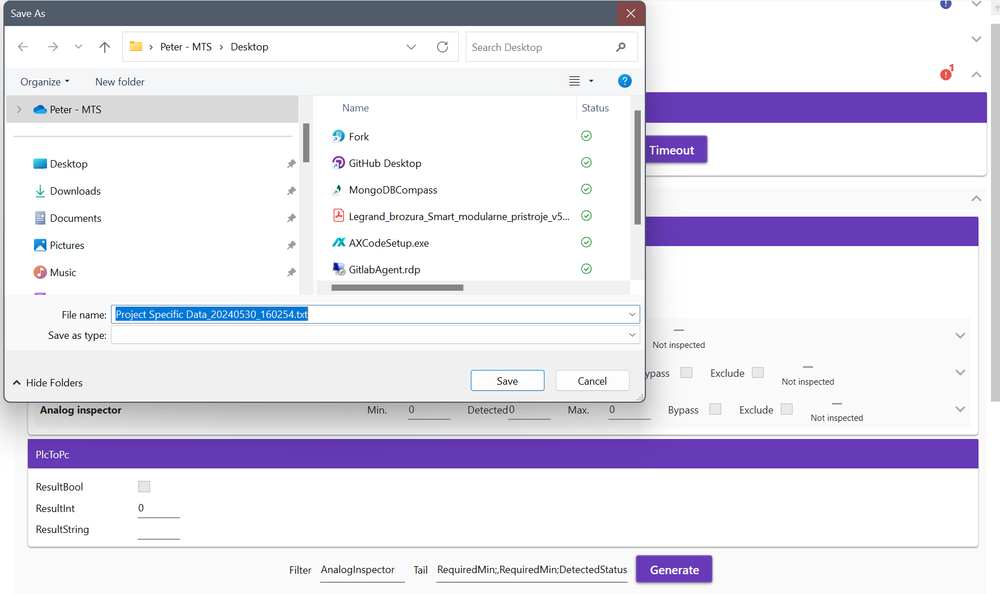

# TcoCognexVision

## Introduction

The **TcoCognexVision** is a set of libraries covering the product portfolio of the vision systems from the vendor [Cognex](https://www.cognex.com) for the target PLC platform [Twincat](https://www.beckhoff.com/en-en/products/automation/twincat/twincat-3-build-4024/) and [TcOpen](https://github.com/TcOpenGroup/TcOpen#readme) framework.

The package consists of a PLC library providing control logic and its .NET twin counterpart aimed at the visualization part. This package currently covers following product range:

1. Dataman firmware v5.x.x
2. More enroute

## General TcOpen Prerequisites

**Check general requisits for TcOpen [here](https://github.com/TcOpenGroup/TcOpen#prerequisites).**

## Dataman v5.x.x

- ### PLC enviroment
  ***
  #### **_Preconditions:_** The **`gsdml`** file(s) included in this package is(are) copied into the subfolder ..\Config\Io\Profinet\ of the TwinCAT3 instalation folder, before opening Visual Studio. The Profinet interface of the slave device is activated, its Profinet name is set and its network parameters are set to match the address range of the Profinet master. This settings needs to by done by [DATAMAN SETUP TOOL SOFTWARE](https://support.cognex.com/en/downloads/dataman/software-firmware) provided by [Cognex](https://www.cognex.com).
  ***
  - #### Implementation steps.
    #### 1. Declare the hardware structure in the Global Variable list (GVL).
    ```Smalltalk
    VAR_GLOBAL
        myVeryFirstDatamanGVL 	: TcoCognexVision.TcoDatamanIO_v_5_x_x;
    END_VAR
    ```
    #### 2. Build the XAE project.
    #### 3. Add Profinet master device, set its network adapter and network parameters.
    #### 4. Using the **`gsdml`** file mentioned, add Profinet slave device, choose proper DAP (Device Access Point) and set its Profinet name and network parameters to match those already assigned by the configuration tool.
    #### 5. If necessary for your application, change the predefined submodule **`User Data - 64 bytes`** in the slots 6 to matches your requirements.
    #### 6. If necessary for your application, change the predefined submodule **`Result Data - 64 bytes`** in the slots 7 to matches your requirements.
    #### 7. Link all items of the structure **`GVL.myVeryFirstDatamanGVL`** with the respective items of the Application Process Identifier (API) of the slave device, so as the items **`Inputs.PnIoBoxState`**, **`Inputs.PnIoBoxDiag`** and **`Outputs.PnIoBoxCtrl`**.
    #### 8. Create the Function Block that extends the **`TcoCore.TcoContext`** function block.
    #### 9. Inside the declaration part of the function block created, add an instance of the **`TcoCognexVision.TcoDataman_v_5_x_x`** function block with the initialization according to the example.
    ```Smalltalk
    FUNCTION_BLOCK myVeryFirstTcoContext EXTENDS TcoCore.TcoContext
    VAR
        {attribute addProperty Name "<#Enter the user friendly name of this instance here!!!#>"}
        myVeryFirstDataman : TcoCognexVision.TcoDataman_v_5_x_x(THIS^);
    END_VAR
    ```
    #### 10. Add the **`Main`** method to the function block created in the step 8, and insert the **`TcoDataman_v_5_x_x`** instance call with passing the mapped hardware structure.
    #### 11. Add call of the method **`Service()`** according to the example. By calling this method, all control elements of this component are accessible later in the visualization.
    ```Smalltalk
    myVeryFirstDataman(inoIoData:= GVL.myVeryFirstDatamanGVL);
    myVeryFirstDataman.Service();
    ```
    #### 12. In the declaration part of the **`MAIN(PRG)`** create an instance of the function block created in the step 8 according to the example.
    ```Smalltalk
    PROGRAM MAIN
    VAR
        myVeryFirstTcoContextInstance :	myVeryFirstTcoContext;
    END_VAR
    ```
    #### 13. Into the body of the **`MAIN(PRG)`** add the call of the **`Run()`** method of the instance created in the previous step, according to the example.
    ```Smalltalk
    myVeryFirstTcoContextInstance.Run();
    ```
    #### 14. Build and save the XAE project.
    #### 15. Activate configuration, load the PLC program and swith the PLC into the run mode.

---

- ### .NET enviroment
  ***
  #### **_Preconditions:_** All neccessary packages are installed, all neccessary references are set, connector to the target PLC is set. **`MainWindow.xaml`** has its view model declared and its **`DataContext`** is set to this view model, according to the example.
  ```XML
      <Window.DataContext>
          <local:MainWindowViewModel />
      </Window.DataContext>
  ```
  ***
  - #### Implementation steps.
    #### 1. Run the **`Vortex Builder`**.
    #### 2. Into the **`MainWindow.xaml`** insert any kind of container, for example **`StackPanel`** and bind its **`DataContext`** to the **`MAIN`** of the **`EntryPointToYourPlc`**.
    ```XML
    <StackPanel DataContext="{Binding EntryPointToYourPlc.MAIN}">
    </StackPanel>
    ```
    #### 3. Into the container added, insert the **`RenderableContentControl`** and bind its **`DataContext`** to the **`myVeryFirstTcoContextInstance.myVeryFirstDataman`**, using the **`PresentationType`** of the value **`Service`**.
    ```XML
    <vortex:RenderableContentControl DataContext="{Binding myVeryFirstTcoContextInstance.myVeryFirstDataman}" PresentationType="Service"/>
    ```
    #### 4. After starting the application and expanding the view, final view should look as follows:
    
- ### links
  - #### Example project could be found here [TodoEnterLinkToExample]()
  - #### How to video could be found here [TodoEnterLinkToVideo]()

## Components

## TcoDataman



## TcoInsight



## TcoDesigner

### Definition UserData and ResultsData

### Important: Project specific data have to be derived from `TcoCognexVision.TcoDesignerRootContainer` (this is required for correctly rendered Ui)

```pascal
    FUNCTION_BLOCK ProjectSpecificData EXTENDS TcoCognexVision.TcoDesignerRootContainer
    VAR_INPUT
    END_VAR
    VAR_OUTPUT
    END_VAR
    VAR
        {attribute wpf [Container(Layout.Stack,"PcToPlc")]}
        {attribute wpf [Group(Layout.GroupBox)]}
        {attribute addProperty Name "<#PcToPlc#>"}
        PcToPlc:DesignerResults;
        {attribute wpf [Container(Layout.Stack,"PlcToPc")]}
        {attribute wpf [Group(Layout.GroupBox)]}
        {attribute addProperty Name "<#PlcToPc#>"}
        PlcToPc:DesignerUserData;

    END_VAR
```

where `DesignerResults` are (here may be placed customized data (what project required from vision system to plc))

```pascal
   TYPE DesignerResults EXTENDS TcoCore.TcoStruct :
   STRUCT
       {attribute addProperty Name "<#ResultBool#>"}
       ResultBool:BOOL;
       {attribute addProperty Name "<#ResultInt#>"}
       ResultInt:INT;
       {attribute addProperty Name "<#ResultString#>"}
       ResultString:STRING;


       {attribute addProperty Name "<#Data inspector#>"}
       DigitalInspector:TcoInspectors.TcoDigitalInspector(THISSTRUCT);
       {attribute addProperty Name "<#Data inspector#>"}
       DataInspector:TcoInspectors.TcoDataInspector(THISSTRUCT);

       {attribute addProperty Name "<#Analog inspector#>"}
       AnalogInspector:TcoInspectors.TcoAnalogueInspector(THISSTRUCT);
   END_STRUCT
   END_TYPE
```

and where `DesignerUserData` are (here may be placed customized data (what project required from plc to vision system))

```pascal
   TYPE DesignerUserData EXTENDS TcoCore.TcoStruct :
   STRUCT
       {attribute addProperty Name "<#ResultBool#>"}
       ResultBool:BOOL;
       {attribute addProperty Name "<#ResultInt#>"}
       ResultInt:INT;
       {attribute addProperty Name "<#ResultString#>"}
       ResultString:STRING;

   END_STRUCT
   END_TYPE

```

### Declaration Plc

```pascal
    {attribute addProperty Name "<#Cognex Designer#>"}
	designer : TcoCognexVision.TcoDesigner_v_2_x_x(THIS^);
	//Project specific data
	{attribute addProperty Name "<#Project Specific Data#>"}
    _specificData : ProjectSpecificData(THIS^);
```

### Initialization

```pascal
    designer(inoData:=_specificData );
    designer.Service();
```

### XAML

```xaml
<vortex:RenderableContentControl
  DataContext="{Binding myVeryFirstTcoContextInstance.designer}"
  PresentationType="Service"
/>
```

### Service View




### ProjectSpecific data defined above in UI



### Export symbols for visions purposes

If filter field is empty all data wil be generated. If you would to ganerate only specific data you may apply filter or tail filter.(see picture below).

MAIN.myVeryFirstTcoContextInstance.\_specificData.PcToPlc.AnalogInspector.\_data.DetectedStatus




Final data suitable for import into designer will be:

```
MAIN.myVeryFirstTcoContextInstance._specificData.PcToPlc.AnalogInspector._data.RequiredMin;System.Double;
MAIN.myVeryFirstTcoContextInstance._specificData.PcToPlc.AnalogInspector._data.RequiredMin;System.Double;
MAIN.myVeryFirstTcoContextInstance._specificData.PcToPlc.AnalogInspector._data.DetectedStatus;System.Double;
```
