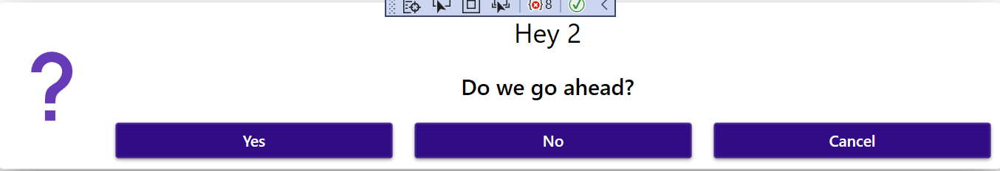
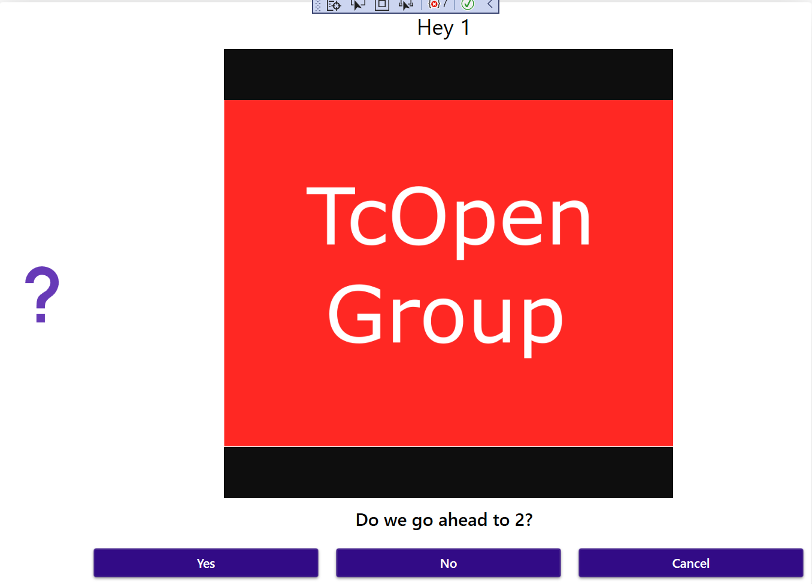
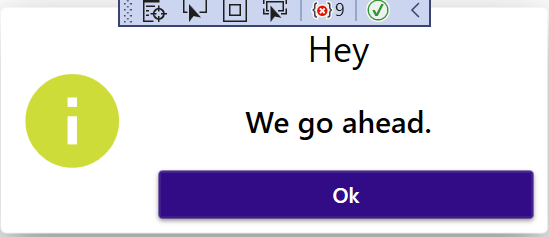
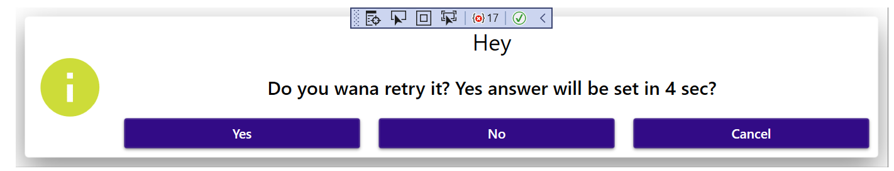
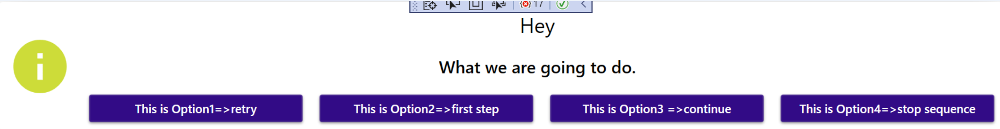
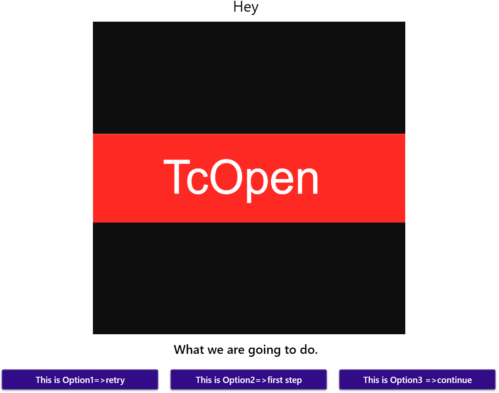
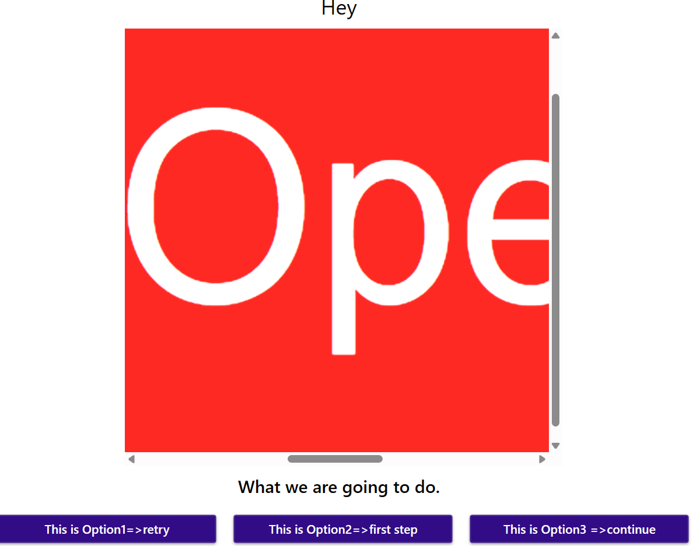

# TcoCore

[INTRODUCTION](docs/Introduction.md)

## Components


## Dialogs 

### Plc Hide dialog

```csharp		
	0:
		_dialog1.Restore();
		_dialog2.Restore();
		_dialog3.Restore();
		_dialog4.Restore();
		_dialogCustomized.Restore();
```

### Plc Example usage of Dialog

```csharp
   15:
        _dialog1.Show()
            .WithType(eDialogType.Question)
            .WithYesNoCancel()
            .WithCaption('Hey 2')
            .WithText('Do we go ahead?');

        IF (_dialog1.Answer = TcoCore.eDialogAnswer.Yes) THEN
            _state := 20;
        END_IF;

        IF (_dialog1.Answer = TcoCore.eDialogAnswer.No) THEN
            _state := 1000;
        END_IF;

        IF (_dialog1.Answer = TcoCore.eDialogAnswer.Cancel) THEN
            _state := 0;
            _invokeDiaglog1 := FALSE;
        END_IF;
```


### Plc Example usage of Dialog with Image

```csharp
 10:
        _dialog1.Show()
            .WithType(eDialogType.Question)
            .WithYesNoCancel()
			.WithImage('D:\MTS\Develop\TcOpenGroup\TcOpen\assets\logo\TcOpenLogo.png',500,500)
            .WithCaption('Hey 1')
            .WithText('Do we go ahead to 2?');

        IF (_dialog1.Answer = TcoCore.eDialogAnswer.Yes) THEN
            _state := 15;
        END_IF;

        IF (_dialog1.Answer = TcoCore.eDialogAnswer.No) THEN
            _state := 1000;
        END_IF;

        IF (_dialog1.Answer = TcoCore.eDialogAnswer.Cancel) THEN
            _state := 0;
            _invokeDiaglog1 := FALSE;
        END_IF;
```


### Plc Example usage of Dialog Ok only

```csharp
  20:
        IF (_dialog2.Show()
            .WithType(eDialogType.Info)
            .WithOk()
            .WithCaption('Hey')
            .WithText('We go ahead.')
            .Answer =
            TcoCore.eDialogAnswer.OK) THEN
            _state := 30;
        END_IF
```


### Plc Example usage of Dialog Timed out (External close)

Here may be used any signal or condition when dialog should be closed with choosen answer.

```csharp
  30:
        _state := 40;
        _tonDisposeDialog(In := FALSE);
    40:
        _tonDisposeDialog(IN := TRUE, PT := T#4S);
		_dialog4.ShowWithExternalClose(inOkAnswerSignal:=FALSE , inYesAnswerSignal:= _tonDisposeDialog.Q, inNoAnswerSignal:= FALSE, inCancelAnswerSignal:= FALSE)
		    .WithType(eDialogType.Info)
            .WithYesNoCancel()
            .WithCaption('Hey')
            .WithText('Do you wana retry it? Yes answer will be set in 4 sec?');

        IF (_dialog4.Answer = TcoCore.eDialogAnswer.Yes) THEN
            _state := 0;
        END_IF;

        IF (_dialog4.Answer = TcoCore.eDialogAnswer.No) THEN
            _state := 50;
        END_IF;

        IF (_dialog4.Answer = TcoCore.eDialogAnswer.Cancel) THEN
            _state := 0;
            _invokeDiaglog1 := FALSE;
        END_IF;
```


### Plc Example usage of Customized Dialog

Here may be used any signal or condition when dialog should be closed with choosen answer.

```csharp
  50:
         _dialogCustomized.Show()
            .WithType(eDialogType.Info)
            .WithOption1('This is Option1=>retry')
			  .WithOption2('This is Option2=>first step')
			    .WithOption3('This is Option3 =>continue')
				  .WithOption4('This is Option4=>stop sequence')
            .WithCaption('Hey')
            .WithText('What we are going to do.');
            
			 IF (_dialogCustomized.Answer = TcoCore.eCustomizedDialogAnswer.Option1) THEN
				_state := 50;
			END_IF;
	
			IF (_dialogCustomized.Answer = TcoCore.eCustomizedDialogAnswer.Option2) THEN
				_state := 0;
			END_IF;
	
			IF (_dialogCustomized.Answer = TcoCore.eCustomizedDialogAnswer.Option3) THEN
				_state := 51;
			END_IF;
	
			IF (_dialogCustomized.Answer = TcoCore.eCustomizedDialogAnswer.Option4) THEN
				_state := 0;
				_invokeCustomizedDiaglog := FALSE;
				_invokeDiaglog1 := FALSE;
			END_IF;
```


## Plc Example usage of Customized Dialog with image

```csharp
 51:
         _dialogCustomized.Show()
            
            .WithOption1('This is Option1=>retry')
			  .WithOption2('This is Option2=>first step')
			    .WithOption3('This is Option3 =>continue')
			.WithImage('D:\MTS\Develop\TcOpenGroup\TcOpen\assets\logo\TcOpenWide.png',500,500)
            .WithCaption('Hey')
            .WithText('What we are going to do.');
            
			 IF (_dialogCustomized.Answer = TcoCore.eCustomizedDialogAnswer.Option1) THEN
				_state := 50;
			END_IF;
	
			IF (_dialogCustomized.Answer = TcoCore.eCustomizedDialogAnswer.Option2) THEN
				_state := 0;
			END_IF;
	
			IF (_dialogCustomized.Answer = TcoCore.eCustomizedDialogAnswer.Option3) THEN
				_state := 60;
			END_IF;
	
			IF (_dialogCustomized.Answer = TcoCore.eCustomizedDialogAnswer.Option4) THEN
				_state := 0;
				_invokeCustomizedDiaglog := FALSE;
				_invokeDiaglog1 := FALSE;
			END_IF;
```


