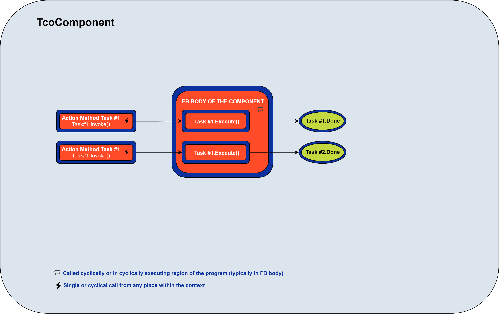
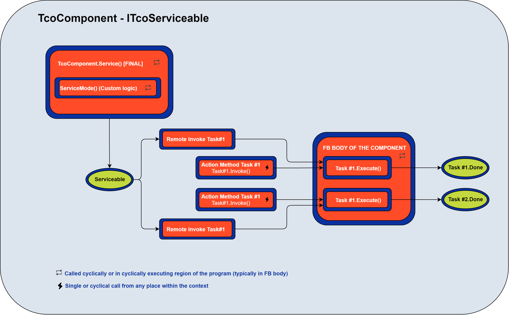

## Components 

**(TcoComponent : ITcoComponent)**

[API](~/api/TcoCore/PlcDocu.TcoCore.TcoComponent.yml)

The ```component``` in TcOpen is a Function Block/class that controls a physical (Robot, Piston, Drive) or virtual (Operator, Warehouse) component.

Another way of thinking about this concept is an ```API/Driver``` that allows the consumer to execute and manage a physical or virtual appliance. All components inherit from ```TcoComponent``` and all functions are implemented as ```TcoTask```.

Each component implements the logic required to run cyclically in the *body* of the Function Block. The body of the Function Block must be called from an appropriate place in the PLC program.

The methods that perform actions **MUST** return ```TcoCore.ITcoTaskStatus``` (typically ```TcoCore.TcoTask```). This rule applies even to the logic that requires a single-cycle execution.




**Simple pneumatic cylinder component**

Tasks specify what actions the cylinder performs. Implementation of tasks is clearly separated.

Methods enable users to invoke these actions via public API.

~~~iecst
FUNCTION_BLOCK PneumaticCylinder EXTENDS TcoCore.TcoComponent, IMPLEMENTS IPneumaticCylinder
VAR_INPUT
    inHomeSensor : BOOL;
    inWorkSensor : BOOL;    
END_VAR    

VAR_OUTPUT
    outMoveHomeSignal : BOOL;
    outMoveWorkSignal : BOOL;
END_VAR    

VAR
    _MoveHomeTask : TcoCore.TcoTask(THIS^);
    _MoveWorkTask : TcoCore.TcoTask(THIS^);
END_VAR
//--------------------------------------------------------
                   FB BODY [CYCLIC CALL]
//--------------------------------------------------------
IF(_MoveHomeTask.Execute()) THEN
    outMoveHomeSignal := TRUE;
    outMoveWorkSignal := FALSE;
    _MoveHomeTask.DoneWhen(inHomeSensor);
END_IF;    

IF(_MoveWorkTask.Execute()) THEN
    outMoveHomeSignal := FALSE;
    outMoveWorkSignal := TRUE;
    _MoveWorkTask.DoneWhen(inWorkSensor);
END_IF;
//--------------------------------------------------------
                   MoveHome Method
//--------------------------------------------------------
METHOD PUBLIC MoveHome : ITcoTaskStatus
//----
MoveHome := _MoveHomeTask.Invoke();

//--------------------------------------------------------
                   MoveWork Method
//--------------------------------------------------------
METHOD PUBLIC MoveWork : ITcoTaskStatus
//----
MoveWork := _MoveWorkTask.Invoke();
~~~

### Serviceablity

Serviceability means that the task's execution can be triggered from outside the PLC environment (HMI/SCADA).

All tasks declared in the component will become ```serviceable``` when ```TcoComponent.Service()``` method is called cyclically.

The ```Service``` method is final and cannot be overridden; you can, however, place custom logic in the override of ```ServiceMode``` method; its call is ensured by ```Service``` method.

The serviceable mode would be typically used in the manual mode of a unit.

```TcoComponent``` implements ```ITcoServiceable``` interface.


