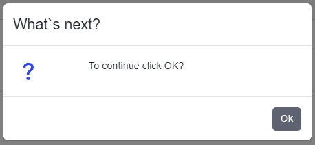

# Tco Dialogs Blazor

Dialogs provide capability to interact with the user rising dialogs directly from the PLC program, now available in Blazor as well.
For example of rising dialog from PLC look [here](https://docs.tcopengroup.org/articles/TcOpenFramework/TcoCore/TcoDialogs.html).

Because Blazor is web technology, there are differences of implementation of dialogs between Blazor and WPF. Initialization is slightly different, but the overall functionality should be same. Bootstrap [modals](https://getbootstrap.com/docs/5.0/components/modal/) are used for dialogs. The dialog rising event is caught in code and thanks to Blazor Javascript Interop we are able to show dialogs.

# Implementation

Main functionality of Blazor dialogs is implemented within **TcOpen.Inxton.TcoCore.Blazor** library. [SignalR](https://docs.microsoft.com/en-us/aspnet/core/signalr/introduction?view=aspnetcore-6.0) technology is used for synchronizing dialog responses within multiple clients.

`DialogProxyServiceBlazor` is used for catching events of dialogs rising from PLC. Afterwards DialogProxyService instance is passed to `TcoDialogLocatorView` component. When dialog is raised, event is caught in TcoDialogLocatorView with specific dialog type. With help of `RenderableContentControl`, correct type of dialog is found and corresponding HTML is rendered. At last, dialog (Bootstrap modal) is invoked with Javascript Interop and UI will show.

Another important parameter of TcoDialogLocatorView is **DialogId**. DialogId is used to invoke correct instance of modal for specific page. When multiple clients are on same page, dialog should be showed only on this page for all clients. Also, when dialog is closed on one client, dialog must be closed on the rest clients as well. Therefore, **dialog id must be same as last segment of page URI!** Jump to Usage section for example.

Also TcoDialogLocatorView contain `DialogOpenDelay` parameter, where is possible to specify opening delay of dialog in milliseconds. Default delay for showing dialog is 500 ms. Try to increase this delay, if you have problem with showing dialogs. If you decrease this delay, unexpected behavior may occur.

# Usage

Let's consider following simple example of rising dialog from PLC within a sequence.

```
IF(_dialog.Show()
			.WithOk()
			.WithCaption('What`s next?')
			.WithText('To continue click OK?').Answer = TcoCore.eDialogAnswer.OK) THEN
			CompleteStep();
	END_IF;
```

Following UI should be showed:



To show dialog UI in Blazor, we need to do following steps:

## 1. Add Bootstrap javascript and JQuery in \<body\> element within `_Host.cshtml` file:

```
<script src="/_content/Inxton.Vortex.Presentation.Controls.Blazor-experimental/js/inxton-bootstrap.bundle.min.js"></script>
<script src="/_content/Inxton.Vortex.Presentation.Controls.Blazor-experimental/js/jquery-3.6.0.min.js"></script>
```

You can use inbuilt libraries within **Inxton.Vortex.Presentation.Controls.Blazor-experimental** package or default Bootstrap libraries.

## 2. Initialize dialogs in startup

Add following code ConfigureServices method in Startup.cs

```csharp
 services.AddTcoCoreExtensions();
```

Map `dialoghub` to endpoint in Configure method in Startup.cs. Add following code inside `app.UseEndpoints`:

```csharp
endpoints.MapHub<DialogHub>("/dialoghub");s
```

## 3. Listen to dialogs in specific page

Add to @code section of your Blazor component following code:

```csharp
public static  DialogProxyServiceBlazor _dialogService { get; set; } = DialogProxyServiceBlazor.Create(new[] { Entry.PLC.TECH_MAIN._app._station001 });
```

DialogProxyService will listen for dialogs in `PLC.TECH_MAIN._app._station001` vortex object. Pass your desired object to Create method, where you want to listen for dialogs.

**Important!** Instance of DialogProxyServiceBlazor must be **static**, otherwise unexpected behavior may occur!

Add instance of `TcoDialogLocatorView` to your view, only when `_dialogService` is not null. Pass correct parameters to this instance. For example last segment of page URI is `custation001`, therefore string `custation001` must be set as dialog ID.

```csharp
@if (_dialogService != null )
{
    <TcoDialogLocatorView DialogService="_dialogService" DialogId="custation001"></TcoDialogLocatorView>
}
```

## Example of razor page, which supports TcoDialogs:

```csharp
@page "/custation001"
@inherits RenderableComponentBase
@inject NavigationManager _navigationManager
<h1>Station001</h1>
//Your UI here
.
.
.

@if (_dialogService != null )
{
    <TcoDialogLocatorView DialogService="_dialogService" DialogId="custation001"></TcoDialogLocatorView>
}

@code {

    // listening for dialogs on _station001 object
    public static  DialogProxyServiceBlazor _dialogService { get; set; } = DialogProxyServiceBlazor.Create(new[] { Entry.PlcHammer.TECH_MAIN._app._station001 });

}
```

# Example

This is example of usage TcoDialogs in TcOpen.Hammer Blazor application for station001 on multiple clients.

