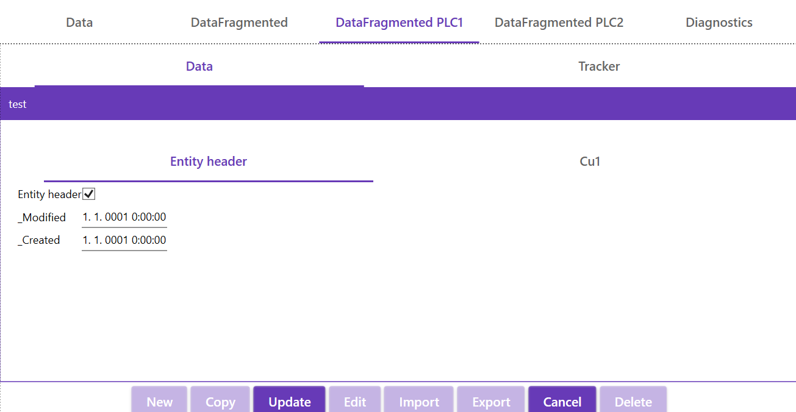
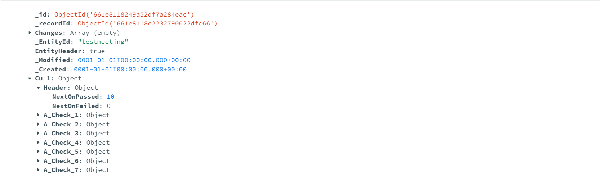
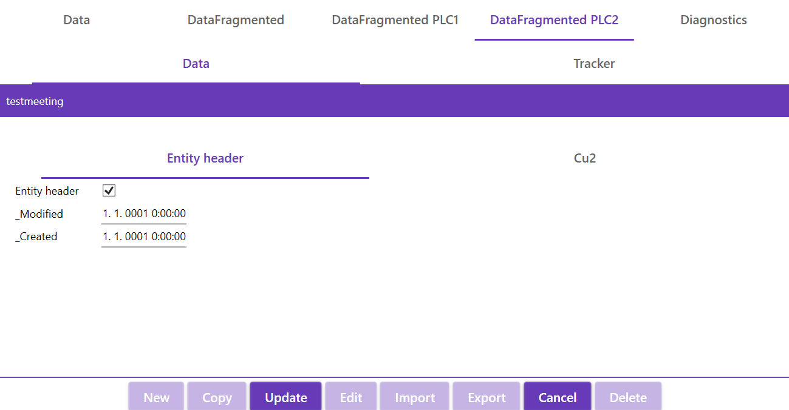
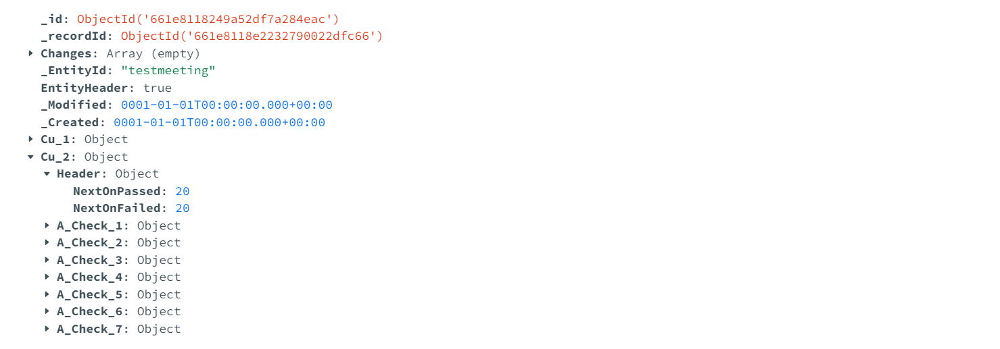

# TcoData
## Introduction

The TcoData library is a comprehensive software framework designed to facilitate efficient data handling by remote task execution in industrial automation and control systems. This library serves as a bridge between programmable logic controllers (PLCs) and PC-based data repositories, enabling seamless communication, data manipulation, and task execution across distributed systems.


## Example of definition repository

```csharp
  var parameters = new MongoDbRepositorySettings<PlainSandboxData>("mongodb://localhost:27017", "TestDataBase", "TestCollection");
            var repository = Repository.Factory<PlainSandboxData>(parameters);

	// initialize repository
	Entry.TcoDataTests.MAIN.sandbox.DataManager.InitializeRepository(repository);
    // if data exchange PLC<->PC based system is reqired
	Entry.TcoDataTests.MAIN.sandbox.DataManager.InitializeRemoteDataExchange();
```
	

## Example of fragmented repositories

### PLC1
```csharp
TYPE stProcessData_Plc1 EXTENDS TcoData.TcoEntity :
STRUCT
	{attribute wpf [Container(Layout.Stack)]}
	{attribute addProperty Name "Entity header"}
	EntityHeader, stEntityHeader: BOOL;	
	_Modified : DT;
	_Created : DT;
	{attribute wpf [Container(Layout.Stack)]}
	{attribute addProperty Name "Cu1"}	
	Cu_1 : stCu_ProcessData;
END_STRUCT
END_TYPE
```

```csharp
//<DataManagerDeclarations>
// Function block for data maipulation must extend from TcoData.TcoDataExchange.
FUNCTION_BLOCK TcoDataManagerPlc1 EXTENDS TcoData.TcoDataExchange
VAR
	// This is the structure that contains the actual data we will work with. The `STRUCT` must extend `TcoData.TcoEntity`
    _data : stProcessData_Plc1;
END_VAR
//</DataManagerDeclarations>
```

```csharp
	var parametersFragmentedPlc1 = new MongoDbRepositorySettings<PlainstProcessData_Plc1>("mongodb://localhost:27017", "TestDataBase", "TestProcessData");

	List<Expression<Func<PlainstProcessData_Plc1, PlainstProcessData_Plc1>>> fragmentExpressionPlc1 = new List<Expression<Func<PlainstProcessData_Plc1, PlainstProcessData_Plc1>>>();
	// here you can add  members  you interested in (option 1)
	fragmentExpressionPlc1.Add(data => new PlainstProcessData_Plc1 { EntityHeader = data.EntityHeader });
	fragmentExpressionPlc1.Add(data => new PlainstProcessData_Plc1 { Cu_1 = data.Cu_1  });

	var repositoryFragmentedPlc1 = new MongoDbFragmentedRepository<PlainstProcessData_Plc1, PlainstProcessData_Plc1>(parametersFragmentedPlc1, fragmentExpressionPlc1);
	Entry.TcoDataTests.MAIN.sandbox.DataManagerPlc1.InitializeRepository(repositoryFragmentedPlc1);
```
---
**_Note:_**

`DataManagerPlc1` will handle  only with data defined in fragmentExpresion. That means only data defined in fragments for this repository will be updated.Data such as `_Modified` and `_Created` are skiped for writing (are not in list).

 #### Data  created via UI view  PLC 1 repository




 #### Data storesd in  repository PLC1



### PLC2

```csharp
TYPE stProcessData_Plc2 EXTENDS TcoData.TcoEntity :
STRUCT
	{attribute wpf [Container(Layout.Stack)]}
	{attribute addProperty Name "Entity header"}
	EntityHeader, stEntityHeader: BOOL;	
	_Modified : DT;
	_Created : DT;
	{attribute wpf [Container(Layout.Stack)]}
	{attribute addProperty Name "Cu2"}	
	Cu_2 : stCu_ProcessData;

END_STRUCT
END_TYPE
```
```csharp
//<DataManagerDeclarations>
// Function block for data maipulation must extend from TcoData.TcoDataExchange.
FUNCTION_BLOCK TcoDataManagerPlc2 EXTENDS TcoData.TcoDataExchange
VAR
	// This is the structure that contains the actual data we will work with. The `STRUCT` must extend `TcoData.TcoEntity`
    _data : stProcessData_Plc2;
END_VAR
//</DataManagerDeclarations>
```


```csharp
    var parametersFragmentedPlc2 = new MongoDbRepositorySettings<PlainstProcessData_Plc2>("mongodb://localhost:27017", "TestDataBase", "TestProcessData");

	List<Expression<Func<PlainstProcessData_Plc2, PlainstProcessData_Plc2>>> fragmentExpressionPlc2 = new List<Expression<Func<PlainstProcessData_Plc2, PlainstProcessData_Plc2>>>();
	// here you can add  members  you interested in (option 2)

	fragmentExpressionPlc2.Add(data => new PlainstProcessData_Plc2 { EntityHeader = data.EntityHeader, Cu_2 = data.Cu_2 });
	;
	var repositoryFragmentedPlc2 = new MongoDbFragmentedRepository<PlainstProcessData_Plc2, PlainstProcessData_Plc2>(parametersFragmentedPlc2, fragmentExpressionPlc2);
	Entry.TcoDataTests.MAIN.sandbox.DataManagerPlc2.InitializeRepository(repositoryFragmentedPlc2);
```

---
**_Note:_**

`DataManagerPlc2` will handle  only with data defined in fragmentExpresion. That means only data defined in fragments for this repository will be updated.Data such as `_Modified` and `_Created`  are skiped during writing.


 #### Data  created via UI view  PLC 2 repository




 #### Data stored in  repository PLC2

