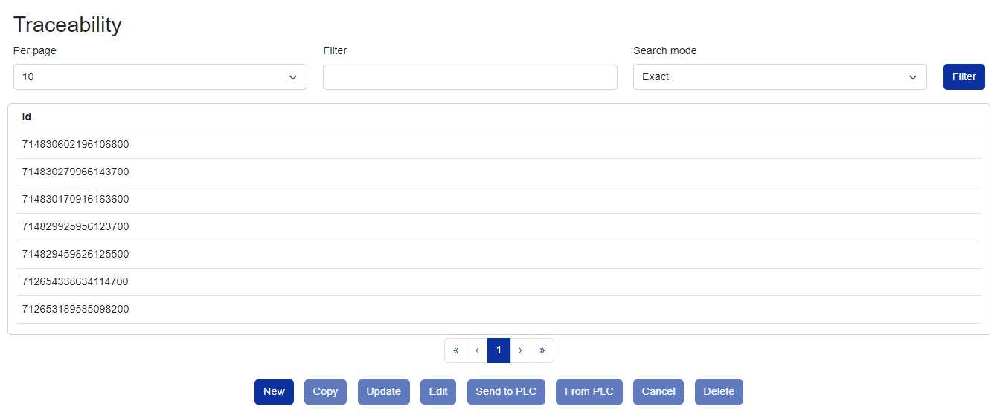
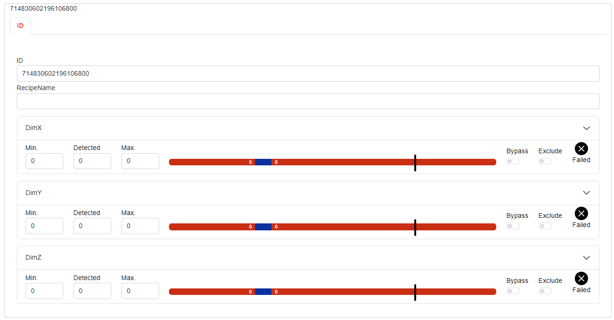

# Tco Data Blazor

TcOpen Framework contains a set of libraries that provide a simple yet powerful data exchange between PLC and an arbitrary data repository. TcoData implements a series of repository operations known as CRUD.

More information about usage of data framework is available [here](https://docs.tcopengroup.org/articles/TcOpenFramework/TcoData/Introduction.html).

Currently supported data repositories are:

- InMemory
- Json
- MongoDB
- RavenDB

# Blazor example

Blazor data views are implemented in TcOpen.Inxton.Data.Blazor library.
Supported features are:

- Data exchange between Blazor app and PLC
- Visualizing data in DataGrid with support of filtering and pagination
- Detail views of selected data
- CRUD operations

## Example data visualization

## Selected data detail view

