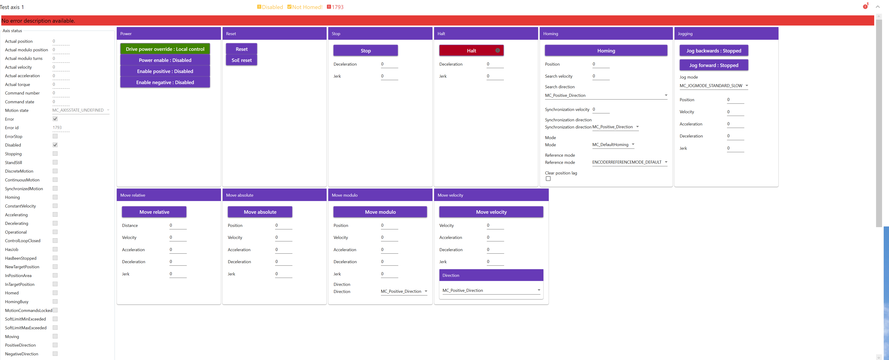
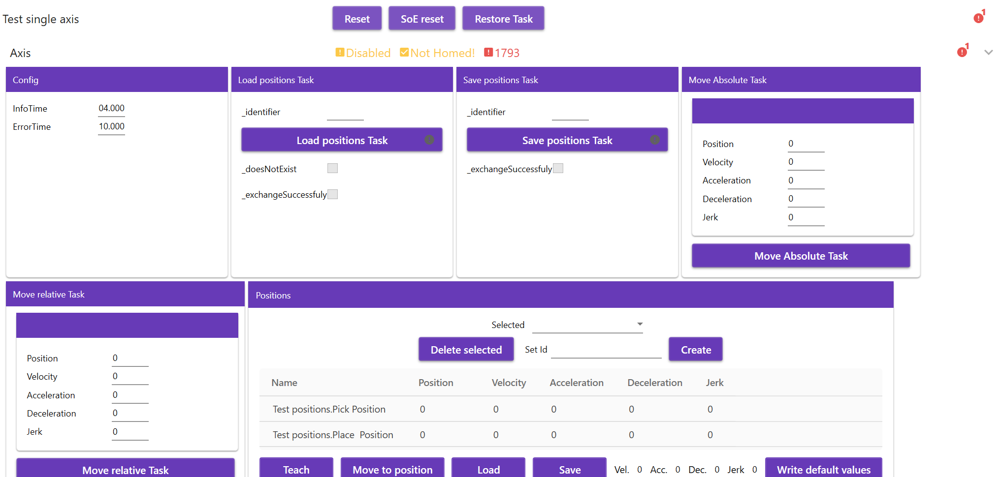
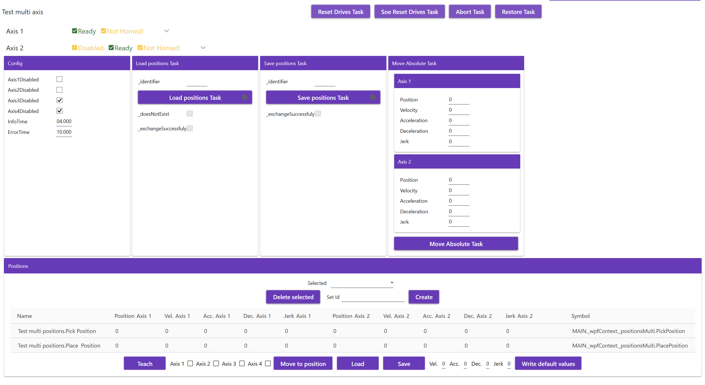

# TcoDrivesBeckhoff

## Introduction

The **TcoDrivesBeckhoff** is a set of libraries covering generic drives, single and multi cartesian axis systems  for the target PLC platform [Twincat](https://www.beckhoff.com/en-en/products/automation/twincat/twincat-3-build-4024/) and [TcOpen](https://github.com/TcOpenGroup/TcOpen#readme) framework.

The package consists of a PLC library providing control logic and its .NET twin counterpart aimed at the visualization part.

## General TcOpen Prerequisites

**Check general prerequisites for TcOpen [here](https://github.com/TcOpenGroup/TcOpen#prerequisites).**

 ## TcoDrivesBeckhoff
### PLC enviroment
--- 
#### **_Preconditions:_** The **`gsdml`** file(s) should be copied into the subfolder ..\Config\Io\EtherCat\ of the TwinCAT3 instalation folder, before opening Visual Studio. The EtherCat interface of the slave device is activated. The file depends on manufacturer of drive. Drives settings needs to by done in settings directly in Visual Studio (Beckhoff drive) or by third parties software (IndraDriveDs if Rexroth drives) 
---

#### Implementation steps.
#### 1. Declare the hardware structures in the Global Variable list (GVL).
```csharp

VAR_GLOBAL
    SingleAxis	:	TcoDrivesBeckhoff.TcoAxisRef;
    Axis1	:	TcoDrivesBeckhoff.TcoAxisRef;
    Axis2	:	TcoDrivesBeckhoff.TcoAxisRef;
    Axis3	:	TcoDrivesBeckhoff.TcoAxisRef;
    Axis4	:	TcoDrivesBeckhoff.TcoAxisRef;
END_VAR
```
#### 2. Build the XAE project.

#### 3. Add Ethercat master device, set its network adapter and network parameters.

#### 4. Scann for new EtherCat devices

#### 5. Connect your Gvl structures with drives hardware. Refers to bechokff drives documentation if there are some issues, or for guidance.

#### 6. Create the Function Block that extends the **`TcoCore.TcoContext`** function block.

#### 7. Inside the declaration part of the function block created, add an instance of the **`TcoDrivesBeckhoff.TcoDriveSimple`** , **`TcoDrivesBeckhoff.TcoSingleAxis`** or **`TcoDrivesBeckhoff.TcoMultiAxis`**. Add the **`Main`** method into this function block  and insert the instances. Call with passing the mapped hardware structure

```csharp
FUNCTION_BLOCK WpfContext EXTENDS TcoCore.TcoContext
VAR
    _serviceModeActive : BOOL;
    {attribute addProperty Name "<#Test drive 1#>"}
    _axis1 : TcoDrivesBeckhoff.TcoDriveSimple(THIS^);

    {attribute addProperty Name "<#Test positions#>"}
    _positions : SomeTestPositions(THIS^);

    {attribute addProperty Name "<#Test single axis#>"}
    _singleAxis : TcoDrivesBeckhoff.TcoSingleAxis(THIS^);

    {attribute addProperty Name "<#Test multi positions#>"}
    _positionsMulti : SomeTestMultiPositions(THIS^);

    {attribute addProperty Name "<#Test multi axis#>"}
    _multiAxis : TcoDrivesBeckhoff.TcoMultiAxis(THIS^);   
    
    
    _moveParam: TcoMultiAxisMoveParam;

END_VAR

```

#### 8. If are you going to work with **`TcoDrivesBeckhoff.TcoSingleAxis`** or **`TcoDrivesBeckhoff.TcoMultiAxis`** there is necessary declare positions function block. (in this case  function block is **` _positions : SomeTestPositions(THIS^)`** for single axis and **`  _positionsMulti : SomeTestPositions(THIS^)`** for multi axis. )
    
#### 9. Here is an example  for single axis system **`SomeTestPositions`**. This fb must be extended  from `TcoDrivesBeckhoff.TcoSingleAxisPositionsRootContainer`.

```csharp
FUNCTION_BLOCK SomeTestPositions EXTENDS TcoDrivesBeckhoff.TcoSingleAxisPositionsRootContainer
VAR_INPUT
END_VAR
VAR_OUTPUT
END_VAR
VAR
	{attribute addProperty Name "<#Pick Position#>"}
	PickPosition:TcoDrivesBeckhoff.TcoMultiAxisMoveParam;
	{attribute addProperty Name "<#Place  Position#>"}
	PlacePosition:TcoDrivesBeckhoff.TcoMultiAxisMoveParam;
END_VAR
```

#### 10. Here is an example  for multi axis system **`SomeTestMultiPositions`**. This fb must be extended  from `TcoDrivesBeckhoff.TcoMultiAxisPositionsRootContainer

```csharp
FUNCTION_BLOCK SomeTestMultiPositions EXTENDS TcoDrivesBeckhoff.TcoMultiAxisPositionsRootContainer
    VAR_INPUT
    END_VAR
    VAR_OUTPUT
    END_VAR
    VAR
        {attribute addProperty Name "<#Pick Position#>"}
        PickPosition:TcoDrivesBeckhoff.TcoMultiAxisMoveParam;
        {attribute addProperty Name "<#Place  Position#>"}
        PlacePosition:TcoDrivesBeckhoff.TcoMultiAxisMoveParam;
        //...declare another positions here
    END_VAR
```

#### 11. Here  instances are called with passing the mapped hardware structure. By calling method `Service()` , all control elements of this component are accessible later in the visualization. By calling method `Service` is allowed control elements(components) via visualisation (service/ manual mode)

```csharp
//simple drive
axis1(inEnable := _enable1,
    inEnablePositive := _enablePositive1,
    inEnableNegative := _enableNegative1,
    inCalibrationCam := _calibrationCam1 or GVL._calibrationCam,
    inoAxisRef := GVL.SimpleAxis1);
    
// single axis
_singleAxis.Config.InfoTime:=T#4S;
_singleAxis.Config.ErrorTime:=T#10S;
		
	
_singleAxis(inEnable := _enable1,
    inEnablePositive := _enablePositive1,
    inEnableNegative := _enableNegative1,
    inCalibrationCam := _calibrationCam1 or GVL._calibrationCam,
    refAxis := GVL.SingleAxis,
	inoPositions:= _positions);

//multi axis

// this means it is three axis cartesian system
//_multiAxis.Config.Axis4Disabled:=TRUE;

_multiAxis.Config.InfoTime:=T#4S;
_multiAxis.Config.ErrorTime:=T#10S;
	
_multiAxis(inEnableAxis1 := _enableMulti,
    inEnablePositiveAxis1 := _enableMultiPositive,
    inEnableNegativeAxis1 := _enableMultiNegative,
    inCalibrationCamAxis1 := _calibrationMultiCam OR GVL._calibrationCam,
	refAxis1:=GVL.Axis1,	
	inEnableAxis2 := _enableMulti,
    inEnablePositiveAxis2 := _enableMultiPositive,
    inEnableNegativeAxis2 := _enableMultiNegative,
    inCalibrationCamAxis2 := _calibrationMultiCam OR GVL._calibrationCam,
	refAxis2:=GVL.Axis2,	
	inEnableAxis3 := _enableMulti,
    inEnablePositiveAxis3 := _enableMultiPositive,
    inEnableNegativeAxis3 := _enableMultiNegative,
    inCalibrationCamAxis3 := _calibrationMultiCam OR GVL._calibrationCam,
	refAxis3:=GVL.Axis3,
	inEnableAxis4 := _enableMulti,
    inEnablePositiveAxis4 := _enableMultiPositive,
    inEnableNegativeAxis4 := _enableMultiNegative,
    inCalibrationCamAxis4 := _calibrationMultiCam OR GVL._calibrationCam,
	refAxis4:=GVL.Axis4,
	inoPositions:= _positionsMulti);

    _axis1.Service();
    _singleAxis.Service();
	_multiAxis.Service();
```

#### 12. In the declaration part of the **`MAIN(PRG)`** create an instance of the function block created in the step 8 according to the example. 
```csharp
PROGRAM MAIN
VAR
      _wpfContext : WpfContext;
END_VAR
```

#### 13. Into the body of the **`MAIN(PRG)`** add the call of the **`Run()`** method of the instance created in the previous step, according to the example.    

```csharp
_wpfContext.Run();
```

#### 14. Build and save the XAE project.

#### 15. Activate configuration, load the PLC program and swith the PLC into the run mode.

-------------------------------

- ### .NET enviroment

--- 

#### **_Preconditions:_** All neccessary packages are installed, all neccessary references are set, connector to the target PLC is set. **`MainWindow.xaml`** has its view model declared and its **`DataContext`** is set to this view model, according to the example.

```XML
    <Window.DataContext>
        <local:MainWindowViewModel />
    </Window.DataContext>
```
---
- #### Implementation steps.

#### 1. Run the **`Vortex Builder`**.

#### 2. Into the **`MainWindow.xaml`** define **`DataContext`** to the **`MAIN`** of the **`TcoDrivesBeckhoffTestsPlc`**.
```xml
<Window x:Class="TcoDrivesBeckhoff.Wpf.Sandbox.MainWindow"
     xmlns:tcopen="clr-namespace:TcoDrivesBeckhoffTests;assembly=TcoDrivesBeckhoffTestsConnector"
     DataContext="{Binding {x:Static tcopen:Entry.TcoDrivesBeckhoffTestsPlc}}"


</Window>
```

```csharp
    static string TargetAmsId = Environment.GetEnvironmentVariable("Tc3Target");
        static int TargetAmsPort = 852;

        public static TcoDrivesBeckhoffTestsTwinController TcoDrivesBeckhoffTestsPlc { get; }
            = new TcoDrivesBeckhoffTestsTwinController(Vortex.Adapters.Connector.Tc3.Adapter.Tc3ConnectorAdapter.Create(TargetAmsId, TargetAmsPort, true));
```

#### 3. Into the container added, insert the **`RenderableContentControl`** and bind its **`DataContext`** to the **`   _tcoDriveSimpleTestContext : TcoDriveSimpleTestContext`**, using the **`PresentationType`** of the value **`Service`**.
```XML
     <vortex:RenderableContentControl Grid.Row="0" DataContext="{Binding MAIN._wpfContext._axis1}" PresentationType="Service"/>
      <vortex:RenderableContentControl Grid.Row="0" DataContext="{Binding MAIN._wpfContext._singleAxis}" PresentationType="Service"/>
       <vortex:RenderableContentControl Grid.Row="0" DataContext="{Binding MAIN._wpfContext._multiAxis}" PresentationType="Service"/>
```

#### 5. If we want to work with saving/loading positions, first, it is necessary to define a repository handler. See example bellow.
```csharp

            var handler = RepositoryDataSetHandler<PositioningParamItem>.CreateSet(new RavenDbRepository<EntitySet<PositioningParamItem>>
                             (new RavenDbRepositorySettings<EntitySet<PositioningParamItem>>(new string[] { @"http://localhost:8080" },$"Positions_{TcoDrivesBeckhoffTests.Entry.TcoDrivesBeckhoffTestsPlc.MAIN._wpfContext._singleAxis.Symbol}", "", "")));


            TcoDrivesBeckhoffTests.Entry.TcoDrivesBeckhoffTestsPlc.MAIN._wpfContext._singleAxis.InitializeRemoteDataExchange(handler);

            var handler2 = RepositoryDataSetHandler<PositioningParamItem>.CreateSet(new RavenDbRepository<EntitySet<PositioningParamItem>>
                            (new RavenDbRepositorySettings<EntitySet<PositioningParamItem>>(new string[] { @"http://localhost:8080" },$"Positions_{TcoDrivesBeckhoffTests.Entry.TcoDrivesBeckhoffTestsPlc.MAIN._wpfContext._multiAxis.Symbol}", "", "")));


            TcoDrivesBeckhoffTests.Entry.TcoDrivesBeckhoffTestsPlc.MAIN._wpfContext._multiAxis.InitializeRemoteDataExchange(handler2);
```
#### 5. After starting the application and expanding the view, final view should look as follows:


Collapsed Service view 

Simple drive


SingleAxis


MultiAxis


Expanded (detailed info) view

Simple drive


SingleAxis


MultiAxis


Service view report an error notification


### Example usage
```csharp
seq REF= _sequence1;

seq.Open();
seq.Observer := _observer;


 
		
IF (seq.Step(inStepID := 0,
    inEnabled := TRUE,
    inStepDescription := 'READY TO START')) THEN
    //--------------------------------------------------------

	answer := _dialog			
			.Show()	
			.WithType(eDialogType.Question)				
			.WithCaption('Ready to go?')
			.WithText('Do you really want to start movements? Do we go ahead?')			
			.WithYesNo().Answer;
			//
			
	 IF (answer = TcoCore.eDialogAnswer.Yes) THEN    	 	
		seq.CompleteStep();
	 ELSIF(answer = TcoCore.eDialogAnswer.No) THEN
		_sequence1Task.Restore();
	 END_IF;	

    //--------------------------------------------------------			
END_IF;

IF (seq.Step(inStepID := 10,
    inEnabled := TRUE,
    inStepDescription := 'MULTI AXIS  HOMING IF NECESSARY')) THEN
    //--------------------------------------------------------    
	 	_enableMulti:=TRUE;
		_enableMultiNegative:=TRUE;
		_enableMultiPositive:=TRUE;
	
		IF  _multiAxis.Axis_1._axisStatus.Operational AND _multiAxis.Axis_1._axisStatus.Homed 
			 AND _multiAxis.Axis_2._axisStatus.Operational AND _multiAxis.Axis_2._axisStatus.Homed 
			 AND _multiAxis.Axis_3._axisStatus.Operational AND _multiAxis.Axis_3._axisStatus.Homed 
			 AND _multiAxis.Axis_4._axisStatus.Operational AND _multiAxis.Axis_4._axisStatus.Homed THEN
       	seq.CompleteStep();
		ELSIF
			 _multiAxis.Axis_1._axisStatus.Operational 
			 AND _multiAxis.Axis_2._axisStatus.Operational 
			 AND _multiAxis.Axis_3._axisStatus.Operational 
			 AND _multiAxis.Axis_4._axisStatus.Operational THEN
			_multiAxis.Axis_1.Home(inPosition := 0,
				inHomingMode := TcoDrivesBeckhoff.eHomingMode.MC_Direct,
				inClearPositionLag := FALSE,
				inSearchDirection := TcoDrivesBeckhoff.eDirection.MC_Undefined_Direction,
				inSearchVelocity := _velocity,
				inSyncDirection := TcoDrivesBeckhoff.eDirection.MC_Undefined_Direction,
				inSyncVelocity := _velocity,
				inReferenceMode := TcoDrivesBeckhoff.eEncoderReferenceMode.ENCODERREFERENCEMODE_DEFAULT);
					 
			 _multiAxis.Axis_2.Home(inPosition := 0,
				inHomingMode := TcoDrivesBeckhoff.eHomingMode.MC_Direct,
				inClearPositionLag := FALSE,
				inSearchDirection := TcoDrivesBeckhoff.eDirection.MC_Undefined_Direction,
				inSearchVelocity := _velocity,
				inSyncDirection := TcoDrivesBeckhoff.eDirection.MC_Undefined_Direction,
				inSyncVelocity := _velocity,
				inReferenceMode := TcoDrivesBeckhoff.eEncoderReferenceMode.ENCODERREFERENCEMODE_DEFAULT);
					 
			 _multiAxis.Axis_3.Home(inPosition := 0,
				inHomingMode := TcoDrivesBeckhoff.eHomingMode.MC_Direct,
				inClearPositionLag := FALSE,
				inSearchDirection := TcoDrivesBeckhoff.eDirection.MC_Undefined_Direction,
				inSearchVelocity := _velocity,
				inSyncDirection := TcoDrivesBeckhoff.eDirection.MC_Undefined_Direction,
				inSyncVelocity := _velocity,
				inReferenceMode := TcoDrivesBeckhoff.eEncoderReferenceMode.ENCODERREFERENCEMODE_DEFAULT);
			
			_multiAxis.Axis_4.Home(inPosition := 0,
				inHomingMode := TcoDrivesBeckhoff.eHomingMode.MC_Direct,
				inClearPositionLag := FALSE,
				inSearchDirection := TcoDrivesBeckhoff.eDirection.MC_Undefined_Direction,
				inSearchVelocity := _velocity,
				inSyncDirection := TcoDrivesBeckhoff.eDirection.MC_Undefined_Direction,
				inSyncVelocity := _velocity,
				inReferenceMode := TcoDrivesBeckhoff.eEncoderReferenceMode.ENCODERREFERENCEMODE_DEFAULT);
	
			IF  (_multiAxis.Axis_1.HomeTask.Done OR _multiAxis.Axis_1.HomeTask.Error)
				 AND (_multiAxis.Axis_2.HomeTask.Done OR _multiAxis.Axis_2.HomeTask.Error)
				 AND (_multiAxis.Axis_3.HomeTask.Done OR _multiAxis.Axis_3.HomeTask.Error)
				 AND (_multiAxis.Axis_4.HomeTask.Done OR _multiAxis.Axis_4.HomeTask.Error) THEN
				seq.CompleteStep();
			END_IF;
		ELSE
			answer := _dialog			
			.Show()	
			.WithType(eDialogType.Question)				
			.WithCaption('SOME ERROR')
			.WithText('There are some errors, restore will be provided!').WithOk().Answer;	
			 IF (answer = TcoCore.eDialogAnswer.OK) THEN    	 		
				_multiAxis.Restore();
				_sequence1Task.Restore();
			END_IF;
		
		END_IF;
		
    //--------------------------------------------------------			
END_IF;

IF (seq.Step(inStepID := 11,
    inEnabled := TRUE,
    inStepDescription := 'LOAD POSITIONS')) THEN
    //--------------------------------------------------------   
	
	 	IF _multiAxis.LoadPositionsTask.WithId('default').Invoke().Done  THEN
			seq.CompleteStep();
		END_IF
		
    //--------------------------------------------------------			
END_IF;

IF (seq.Step(inStepID := 12,
    inEnabled := _multiAxis.LoadPositionsTask.DoesNotExist,
    inStepDescription := 'LOAD/CREATE POSITIONS')) THEN
    //--------------------------------------------------------   
	answer := _dialog			
			.Show()	
			.WithType(eDialogType.Question)				
			.WithCaption('Positions set missing!')
			.WithText('Do you really want create default set?')			
			.WithYesNo().Answer;
			//
			
	 IF (answer = TcoCore.eDialogAnswer.Yes) THEN    	 	
		seq.CompleteStep();
	 ELSIF(answer = TcoCore.eDialogAnswer.No) THEN
		_sequence1Task.Restore();
	 END_IF;	
		
    //--------------------------------------------------------			
END_IF;
IF (seq.Step(inStepID := 13,
    inEnabled := _multiAxis.LoadPositionsTask.DoesNotExist,
    inStepDescription := 'POSITION NOT EXIST NECESSARY TO CREATE POSITIONS')) THEN
    //--------------------------------------------------------

	_velocity:=1400;
	_deceleration:=5000;
	_acceleration:=5000;
	_jerk:=15000;
   
	_positionsMulti.PickPos.Axis1.Position:= _multiAxis.Axis_1.AxisStatus.ActPos-1000;
	_positionsMulti.PickPos.Axis1.Velocity := _velocity;
	_positionsMulti.PickPos.Axis1.Acceleration := _acceleration;
	_positionsMulti.PickPos.Axis1.Deceleration := _deceleration;		
	_positionsMulti.PickPos.Axis1.Jerk :=  _jerk;
	
		 
	_positionsMulti.PickPos.Axis2.Position:= _multiAxis.Axis_2.AxisStatus.ActPos-1000;
	_positionsMulti.PickPos.Axis2.Velocity := _velocity;
	_positionsMulti.PickPos.Axis2.Acceleration := _acceleration;
	_positionsMulti.PickPos.Axis2.Deceleration := _deceleration;
	_positionsMulti.PickPos.Axis2.Jerk :=  _jerk;

	_positionsMulti.PickPos.Axis3.Position:= _multiAxis.Axis_3.AxisStatus.ActPos-1000;
	_positionsMulti.PickPos.Axis3.Velocity := _velocity;
	_positionsMulti.PickPos.Axis3.Acceleration := _acceleration;
	_positionsMulti.PickPos.Axis3.Deceleration := _deceleration;
	_positionsMulti.PickPos.Axis3.Jerk :=  _jerk;

	_positionsMulti.PickPos.Axis4.Position:= _multiAxis.Axis_4.AxisStatus.ActPos-1000;
	_positionsMulti.PickPos.Axis4.Velocity := _velocity;
	_positionsMulti.PickPos.Axis4.Acceleration := _acceleration;
	_positionsMulti.PickPos.Axis4.Deceleration := _deceleration;
	_positionsMulti.PickPos.Axis4.Jerk :=  _jerk;		
	
	 	IF _multiAxis.SavePositionsTask.WithId('default').Invoke().Done 
			AND	_multiAxis.SavePositionsTask.ReadSuccessfuly THEN
			seq.CompleteStep();
		END_IF
		
    //--------------------------------------------------------			
END_IF;

IF (seq.Step(inStepID := 14,
    inEnabled := TRUE,
    inStepDescription := 'LOAD CREATED POSITIONS')) THEN
    //--------------------------------------------------------   
	
	 	IF _multiAxis.LoadPositionsTask.WithId('default').Invoke().Done 
			AND	_multiAxis.LoadPositionsTask.ReadSuccessfuly THEN
			seq.CompleteStep();
		END_IF
		
    //--------------------------------------------------------			
END_IF


IF (seq.Step(inStepID := 25,
    inEnabled := TRUE,
    inStepDescription := 'MULTI AXIS  MOVEMENTS')) THEN
    //--------------------------------------------------------    
	 	_enableMulti:=TRUE;
		_enableMultiNegative:=TRUE;
		_enableMultiPositive:=TRUE;
		

//
		IF  _multiAxis.MoveAbsolute(_positionsMulti.PickPos).Done THEN
			
			seq.CompleteStep();
		END_IF
		
		
		
    //--------------------------------------------------------			
END_IF;

IF (seq.Step(inStepID := 50,
    inEnabled := TRUE,
    inStepDescription := 'SIMULATE ERROR')) THEN
    //--------------------------------------------------------
//<StandardDialog>	
	answer := _dialog			
			.Show()	
			.WithType(eDialogType.Question)				
			.WithCaption('Question?')
			.WithText('Do you really want to simulate error?')			
			.WithYesNo().Answer;
			//
			
	 IF (answer = TcoCore.eDialogAnswer.Yes) THEN    	 	
		seq.CompleteStep();
	 ELSIF(answer = TcoCore.eDialogAnswer.No) THEN
		_sequence1Task.Restore();
	 END_IF;	
    //--------------------------------------------------------			
END_IF;

IF (seq.Step(inStepID := 100,
    inEnabled := TRUE,
    inStepDescription := 'MULTI AXIS SIMULATE ERROR')) THEN
    //--------------------------------------------------------    
	 	_enableMulti:=TRUE;
		_enableMultiNegative:=TRUE;
		_enableMultiPositive:=TRUE;
		
		_velocity:=15000;
		_deceleration:=-1;
		_acceleration:=-1;
		_jerk:=15000;

		
		_moveParam.Axis1.Position:= _multiAxis.Axis_1.AxisStatus.ActPos-1000;
		_moveParam.Axis1.Velocity := _velocity;
		_moveParam.Axis1.Acceleration := _acceleration;
		_moveParam.Axis1.Deceleration := _deceleration;		
		_moveParam.Axis1.Jerk :=  _jerk;
		
			 
		_moveParam.Axis2.Position:= _multiAxis.Axis_2.AxisStatus.ActPos-1000;
		_moveParam.Axis2.Velocity := _velocity;
		_moveParam.Axis2.Acceleration := _acceleration;
		_moveParam.Axis2.Deceleration := _deceleration;
		_moveParam.Axis2.Jerk :=  _jerk;

		_moveParam.Axis3.Position:= _multiAxis.Axis_3.AxisStatus.ActPos-1000;
		_moveParam.Axis3.Velocity := _velocity;
		_moveParam.Axis3.Acceleration := _acceleration;
		_moveParam.Axis3.Deceleration := _deceleration;
		_moveParam.Axis3.Jerk :=  _jerk;

		_moveParam.Axis4.Position:= _multiAxis.Axis_4.AxisStatus.ActPos-1000;
		_moveParam.Axis4.Velocity := _velocity;
		_moveParam.Axis4.Acceleration := _acceleration;
		_moveParam.Axis4.Deceleration := _deceleration;
		_moveParam.Axis4.Jerk :=  _jerk;		  

		IF  _multiAxis.MoveAbsolute(_moveParam).Error THEN
			
			seq.CompleteStep();
		END_IF
		
    //--------------------------------------------------------			
END_IF;

//<TcoDigitalInspector>	
IF (seq.Step(inStepID := 200,
    inEnabled := TRUE,
    inStepDescription := 'CLEAR ERROR')) THEN
    //--------------------------------------------------------
//<StandardDialog>	
	answer := _dialog			
			.Show()	
			.WithType(eDialogType.Question)				
			.WithCaption('Question?')
			.WithText('Do you want to reset error?')			
			.WithYesNo().Answer;
			//
			
	 IF (answer = TcoCore.eDialogAnswer.Yes) THEN    	 	
		seq.CompleteStep();
	 ELSIF(answer = TcoCore.eDialogAnswer.No) THEN
		_sequence1Task.Restore();
	 END_IF;	
    //--------------------------------------------------------			
END_IF;


IF (seq.Step(inStepID := 249,
    inEnabled := TRUE,
    inStepDescription := 'RESET AXIS')) THEN
    //--------------------------------------------------------	

	 IF _multiAxis.ResetDrives().Done AND_THEN
        NOT _multiAxis.Axis_1.AxisStatus.Error 
		AND NOT _multiAxis.Axis_2.AxisStatus.Error
		AND NOT _multiAxis.Axis_2.AxisStatus.Error
		AND NOT _multiAxis.Axis_2.AxisStatus.Error THEN
		seq.CompleteStep();
	end_if;
    //--------------------------------------------------------			
END_IF;


IF (seq.Step(inStepID := 300,
    inEnabled := TRUE,
    inStepDescription := 'ASKING FOR RESTORING')) THEN
    //--------------------------------------------------------
//<StandardDialog>	
	answer := _dialog			
			.Show()	
			.WithType(eDialogType.Question)				
			.WithCaption('Question?')
			.WithText('Do you want to restore MultiAxis component?')			
			.WithYesNo().Answer;
			//
			
	 IF (answer = TcoCore.eDialogAnswer.Yes) THEN    	 	
		_multiAxis.Restore();
		seq.CompleteStep();
	 ELSIF(answer = TcoCore.eDialogAnswer.No) THEN
		_sequence1Task.Restore();
	 END_IF;	
    //--------------------------------------------------------			
END_IF;


IF (seq.Step(inStepID := 400,
    inEnabled := TRUE,
    inStepDescription := 'MOVE WITH ONLY ONE AXIS')) THEN
    //--------------------------------------------------------

	answer := _dialog			
			.Show()	
			.WithType(eDialogType.Question)				
			.WithCaption('ONE AXIS EXAMPLE?')
			.WithText('Do you  want to start movements with one axis?')			
			.WithYesNo().Answer;
			//
			
	 IF (answer = TcoCore.eDialogAnswer.Yes) THEN    	 	
		seq.CompleteStep();
	 ELSIF(answer = TcoCore.eDialogAnswer.No) THEN
		_sequence1Task.Restore();
	 END_IF;	

    //--------------------------------------------------------			
END_IF;

IF (seq.Step(inStepID := 425,
    inEnabled := TRUE,
    inStepDescription := 'ONE AXIS EXAMPLE')) THEN
    //--------------------------------------------------------    
	 	_enableMulti:=TRUE;
		_enableMultiNegative:=TRUE;
		_enableMultiPositive:=TRUE;
		
		_velocity:=1400;
		_deceleration:=5000;
		_acceleration:=5000;
		_jerk:=15000;

	  

		IF  _multiAxis.Axis_1.MoveAbsolute(
				inPosition:=_multiAxis.Axis_1.AxisStatus.ActPos-1000,
				inVelocity:=_velocity,
				inAcceleration:=_acceleration,
				inDeceleration:=_deceleration,
				inJerk:=_jerk).Done THEN
			
			seq.CompleteStep();
		END_IF
		
		
		
    //--------------------------------------------------------			
END_IF;


IF (seq.Step(inStepID := 500,
    inEnabled := TRUE,
    inStepDescription := 'EXAMPLE LONG RANGE MOVMENT ABORTED')) THEN
    //--------------------------------------------------------

	answer := _dialog			
			.Show()	
			.WithType(eDialogType.Question)				
			.WithCaption('Abort movement?')
			.WithText('Do you  want to start movements and abort it?')			
			.WithYesNo().Answer;
			//
			
	 IF (answer = TcoCore.eDialogAnswer.Yes) THEN    	 	
		seq.CompleteStep();
	 ELSIF(answer = TcoCore.eDialogAnswer.No) THEN
		_sequence1Task.Restore();
	 END_IF;	

    //--------------------------------------------------------			
END_IF;

IF (seq.Step(inStepID := 525,
    inEnabled := TRUE,
    inStepDescription := 'ABORT MOVEMENT AXIS EXAMPLE')) THEN
    //--------------------------------------------------------    
		_enableMulti:=TRUE;
		_enableMultiNegative:=TRUE;
		_enableMultiPositive:=TRUE;
		
		_velocity:=1400;
		_deceleration:=5000;
		_acceleration:=5000;
		_jerk:=15000;

		answer := _dialog			
			.Show()	
			.WithType(eDialogType.Question)				
			.WithCaption('Movement running')
			.WithText('Do you  want to abort movement?')			
			.WithYesNo().Answer;
			//
			
		 IF (answer = TcoCore.eDialogAnswer.Yes) THEN 
			_multiAxis.AbortTask.Invoke();   	 	
			seq.CompleteStep();
		 ELSIF(answer = TcoCore.eDialogAnswer.No) THEN
			_sequence1Task.Restore();
		 END_IF;	
		
		_moveParam.Axis1.Position:= _multiAxis.Axis_1.AxisStatus.ActPos+10000;
		_moveParam.Axis1.Velocity := _velocity;
		_moveParam.Axis1.Acceleration := _acceleration;
		_moveParam.Axis1.Deceleration := _deceleration;		
		_moveParam.Axis1.Jerk :=  _jerk;
		
			 
		_moveParam.Axis2.Position:= _multiAxis.Axis_2.AxisStatus.ActPos-1000;
		_moveParam.Axis2.Velocity := _velocity;
		_moveParam.Axis2.Acceleration := _acceleration;
		_moveParam.Axis2.Deceleration := _deceleration;
		_moveParam.Axis2.Jerk :=  _jerk;

		_moveParam.Axis3.Position:= _multiAxis.Axis_3.AxisStatus.ActPos-1000;
		_moveParam.Axis3.Velocity := _velocity;
		_moveParam.Axis3.Acceleration := _acceleration;
		_moveParam.Axis3.Deceleration := _deceleration;
		_moveParam.Axis3.Jerk :=  _jerk;

		_moveParam.Axis4.Position:= _multiAxis.Axis_4.AxisStatus.ActPos-1000;
		_moveParam.Axis4.Velocity := _velocity;
		_moveParam.Axis4.Acceleration := _acceleration;
		_moveParam.Axis4.Deceleration := _deceleration;
		_moveParam.Axis4.Jerk :=  _jerk;		  

		IF  _multiAxis.MoveAbsolute(_moveParam).Done THEN
			
			seq.CompleteStep();
		END_IF
		
		
    //--------------------------------------------------------			
END_IF;

IF (seq.Step(inStepID := 600,
    inEnabled := TRUE,
    inStepDescription := 'ASKING FOR RESTORING')) THEN
    //--------------------------------------------------------

	answer := _dialog			
			.Show()	
			.WithType(eDialogType.Question)				
			.WithCaption('Question?')
			.WithText('Do you want to restore MultiAxis component?')			
			.WithYesNo().Answer;
			//
			
	 IF (answer = TcoCore.eDialogAnswer.Yes) THEN    	 	
		_multiAxis.Restore();
		seq.CompleteStep();
	 ELSIF(answer = TcoCore.eDialogAnswer.No) THEN
		_sequence1Task.Restore();
	 END_IF;	
    //--------------------------------------------------------			
END_IF;

IF (seq.Step(inStepID := seq.RESTORE_STEP_ID,
    inEnabled := TRUE,
    inStepDescription := 'RETURN TO THE START OF THE SEQUENCE')) THEN
    //--------------------------------------------------------	
    	seq.CompleteSequence();
    //--------------------------------------------------------			
END_IF;

seq.Close();
```


