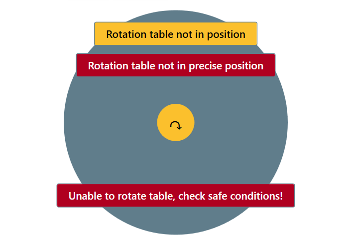
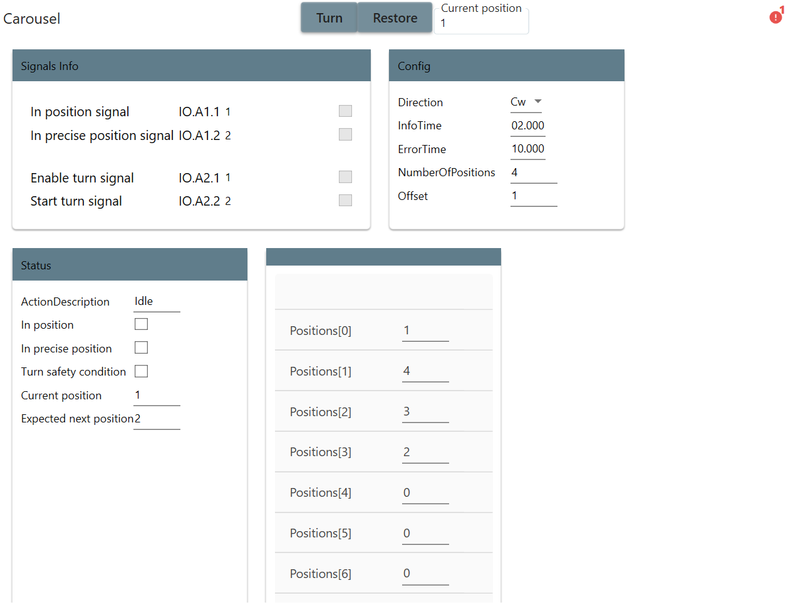
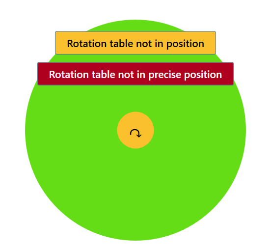
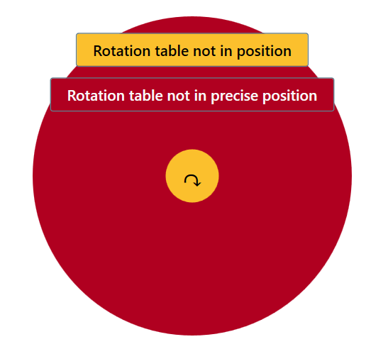

# TcoElements

TcoElements is a collection of components for accessing and managing I/O primitives, such as Digital Inputs, Digital Outputs, Analog Inputs, Analog Outputs etc.

For detailed documentation, see the [TcOpen Documentation site](https://docs.tcopengroup.org/api/TcoElements/PlcDocu.TcoElements)

## TcoDi

`TcoDi` provides access to digital input, with a series of functions to read the state of the input, with built-in diagnostics functions.


## TcoDo

`TcoDo` provides access to digital output, with a series of functions to read the state of the input, with built-in diagnostics functions.


## TcoAi

`TcoAi` provides access to analog input, with a series of functions to read the state of the input, with built-in diagnostics functions.


## TcoAo

`TcoAo` provides access to analog input, with a series of functions to read the state of the input, with built-in diagnostics functions.


## TcoCarousel

`TcoCarousel` used in manufacturing or production environments to move and position items between different workstations. It typically consists of a circular table that rotates to bring items to different positions around the table, along with a robotic arm or other mechanism to pick up and move the items as needed.

Picture below is default view for carousel. A view provide us sates informations such as : In position,In precise position,and general safety condition to turn table. The circle the middle is information about direction, and background of this circle signalize information that table(carousel) is `InPosition`(Warning color is not (Yellow), Notification(Green) color is in position.) see `TcoCore.Wpf.TcoColors`



### PLC enviroment

---

**_Preconditions:_**

Nothig. It is control by single input/output

---

- ### Implementation steps

#### 1. Declare the hardware structure in the Global Variable list (GVL)

```csharp
     {attribute addProperty Name "A1"}
      A1 : InputsBase_8;
      {attribute addProperty Name "A2"}
      A2 : OutputsBase_8;
```

#### 2. Build the XAE project

#### 3. Link all items of the structure **`IO`**.

#### 4. Inside the declaration part of the function block created, add an instance of the **`TcoElemnts.TcoCarousel`** function block with the initialization according to the example

```csharp
FUNCTION_BLOCK TcoElementsSandbox EXTENDS TcoCore.TcoContext
VAR
      {attribute addProperty Name "Carousel"}
	   _carousel : TcoElements.TcoCarousel(THIS^);
END_VAR
```

#### 5. Create the Function Block that extends the **`TcoCore.TcoContext`** function block

#### 6. Add the **`Main`** method to the function block created in the step 5, and insert the **`TcoElemnts.TcoCarousel`** instance call with passing the mapped hardware structure

#### 7. Add call of the method **`Service()`** according to the example. By calling this method, all control elements of this component are accessible later in the visualization

```csharp
   _carousel.Config.ErrorTime:=T#10S;
   _carousel.Config.InfoTime:=T#2S;
   _carousel.Config.Direction:=eTcoCarouselDirection.Cw;
   _carousel.Config.NumberOfPositions:=8;
   _carousel.Config.Offset:=1;

   _carousel(
      inoInPosition:=IO.A1._1 ,
      inoInPrecisePosition:=IO.A1._2 ,
      inoEnableTurn:= IO.A2._1,
      inoStartTurn:= IO.A2._2,
      inSafetyCondition:=IO.A2._3 ,
      inBasePositionNumber:=codedPosition );

   _carousel.Service();

```

#### 8. In the declaration part of the **`MAIN(PRG)`** create an instance of the function block created in the step 5 according to the example

```csharp
PROGRAM MAIN
VAR
    _tcoElementsSandbox : myVeryFirstTcoContext;
END_VAR
```

#### 9. Into the body of the **`MAIN(PRG)`** add the call of the **`Run()`** method of the instance created in the previous step, according to the example

```csharp
   _tcoElementsSandbox.Run();
```

#### 10. Build and save the XAE project

#### 11. Activate configuration, load the PLC program and swith the PLC into the run mode

- ### .NET enviroment

---

#### **_Preconditions:_** All neccessary packages are installed, all neccessary references are set, connector to the target PLC is set. **`MainWindow.xaml`** has its view model declared and its **`DataContext`** is set to this view model, according to the example

```XML
<Window.DataContext>
    <local:MainWindowViewModel />
</Window.DataContext>
```

## NET enviroment

Preconditions: All neccessary packages are installed, all neccessary references are set, connector to the target PLC is set. MainWindow.xaml has its view model declared and its DataContext is set to this view model, according to the example

```XAML
<Window.DataContext>
    <local:MainWindowViewModel />
</Window.DataContext>
```

- ### Implementation steps

1. Run the Vortex Builder
2. Into the MainWindow.xaml insert any kind of container, for example StackPanel and bind its DataContext to the MAIN of the EntryPointToYourPlc

```XAML

    <StackPanel DataContext="{Binding TcoElementsTestsPlc.MAIN._tcoElementsSandbox}">
    </StackPanel>
```

3. Into the container added, insert the RenderableContentControl and bind its DataContext to the TcoElementsSandbox.\_carousel, using the PresentationType of the value Service

```XAML
   <vortex:RenderableContentControl DataContext="{Binding _carousel}" PresentationType="Service"></vortex:RenderableContentControl>
```

The presentation Type of the value can be used also Base

```XAML
   <vortex:RenderableContentControl DataContext="{Binding _carousel}" PresentationType="Service"></vortex:RenderableContentControl>
```

4. After starting the application and expanding the view, final view should look as follows

Collapsed Service view


Expanded (detailed info) view



Service view report an error notification


Default view


Default view turning is active



Default view turning is in error



Default view turning is in position not axtive , but safety condision are not met.


## Safety implementation

```csharp
   _carousel.Config.ErrorTime:=T#10S;
   _carousel.Config.InfoTime:=T#2S;
   _carousel.Config.Direction:=eTcoCarouselDirection.Cw;
   _carousel.Config.NumberOfPositions:=8;
   _carousel.Config.Offset:=1;

   _safetyOk := true; //
   _carousel(
      inoInPosition:=IO.A1._1 ,
      inoInPrecisePosition:=IO.A1._2 ,
      inoEnableTurn:= IO.A2._1,
      inoStartTurn:= IO.A2._2,
      inSafetyCondition:=_safetyOk ,
      inBasePositionNumber:=codedPosition );
```

## inSafetyCondition

In code above is assigned by variable `_safetyOk`
This input is a condition that prevents the rotation of the table, possibly due to collisions with cylinders, axes, or other objects.

---

**_Note:_**
Do not use signal from Light Curtain here.

---

## Suspend/Abort methods

An example below showing constrain for turning table. By calling method `Suspend` means turning task is still active, but outputs are off (physically not rotating ) and is also produced alarm notification. There is another option `Abort`. By calling this method is turning task is **aborted**

---

**_Note:_**

Typical signal for suspend method as input might be signal from `Light curtain`

---

---

**_Important:_**

This methods must be called after initialization of function block!!!

---

```csharp

  _carousel(
      inoInPosition:=IO.A1._1 ,
      inoInPrecisePosition:=IO.A1._2 ,
      inoEnableTurn:= IO.A2._1,
      inoStartTurn:= IO.A2._2,
      inSafetyCondition:=_safetyOk ,
      inBasePositionNumber:=codedPosition );

   _carousel.Suspend(inoDisableCondition:= _disableSignal1 ,Invert:=FALSE); //this might be signal from Light Curtain (safety is inerupted)
   _carousel.Suspend(inoDisableCondition:=_disableSignal2 ,Invert:=TRUE);


```
