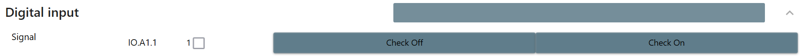
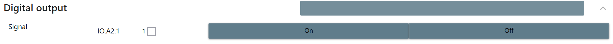
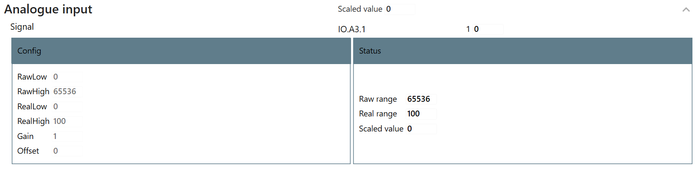
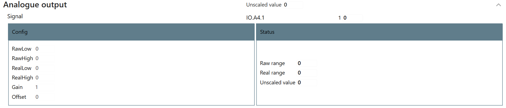

# TcoElements

TcoElements is a collection of components for accessing and managing I/O primitives, such as Digital Inputs, Digital Outputs, Analog Inputs, Analog Outputs etc.

For detailed documentation, see the [TcOpen Documentation site](https://docs.tcopengroup.org/api/TcoElements/PlcDocu.TcoElements)

## TcoDi

`TcoDi` provides access to digital input, with a series of functions to read the state of the input, with built-in diagnostics functions.

   

## TcoDo

`TcoDo` provides access to digital output, with a series of functions to read the state of the input, with built-in diagnostics functions.

   

## TcoAo

`TcoAi` provides access to analog input, with a series of functions to read the state of the input, with built-in diagnostics functions.

   

## TcoAo

`TcoAo` provides access to analog input, with a series of functions to read the state of the input, with built-in diagnostics functions.

      