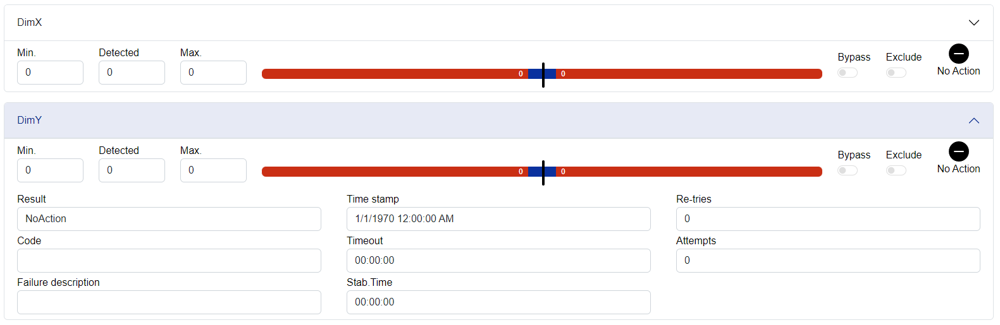

# Blazor Inspectors

## Introduction

Inspectors provide mechanisms for checking the different types of data. Inspector compares input data with the required value. In addition to a simple comparison of values, the inspector provides stabilization timing and timeout for failed inspection. Inspectors can integrate with coordination primitives like `TcoSequencer` that offer extended capabilities in decision flow for failed checks.

## Inspector types

### TcoDigitalInspector

Inspector provides evaluation of `discrete` value. The input value compares against the `Required` value. The inspection passes when the input value matches the required value without interruption for the duration of stabilization time.

### TcoAnalogueInspector

Provides evaluation of `continuous` values. The inspector checks that the input value falls within the limit of `Min` and `Max`. The inspection passes when the input value is within the required limit without interruption for the duration of stabilization time.

### TcoDataInspector

Provides evaluation of `alphanumerical` values. The input value compares against the `Required` value. The inspection passes when the input value matches the required value without interruption for the duration of stabilization time. In addition to exact comparison, data inspector allows for simple pattern matching where `#` = any number and `*` = any character.
