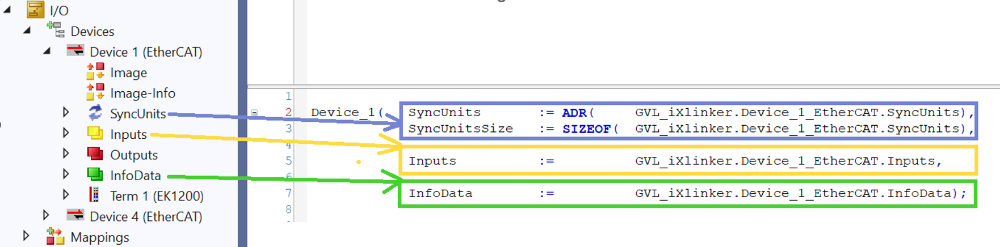

# TcoIo

**TcoIo** library provides a set of structures for working with EtherCAT-based hardware within the TcOpen framework.

## Base structures

The EtherCAT slave base structures are empty structures without any members, containing only some layout attributes and topology-related attributes. These are the structures with the prefixes `EtcSlaveBase`, `EtcSlaveBoxBase`, and `EtcSlaveTerminalBase`. The purpose of these structures is just to affect which view is going to be used during rendering as all of them have their MVVM counterpart.

From the topology (or physical) point of view, there are two types of EtherCAT slaves. The slave with Y type of port A and the slave with K type of port A. Y type means EtherCAT, K type E-bus. So each EtherCAT slave that can be connected to the EtherCAT master (using metallic cable or fiber optic cable), has the A port of Y type. This is typical for all couplers like EK1100 or EP boxes or EPP boxes. The structures for all of such slaves extend from the EtcSlaveBoxBase structure.

Each EtherCAT slave that can be connected only directly to E-bus, has the A port of K type. This is typical for all terminals like ELxxx or EJxxx. The structures for all of such slaves extend from the EtcSlaveTerminalBase structure.

As both of these EtherCAT slave types are EtherCAT slaves, the structures EtcSlaveBoxBase and EtcSlaveTerminalBase extend from EtcSlaveBase.

So when rendering the specific slave in the view of the EtcSlaveBase is decided if it will be rendered as the EtcSlaveBoxBase or as the EtcSlaveTerminalBase.

Each process data object (PDO) of each EtherCAT slave can be either input PDO or output PDO. So each structure of the PDO of the input type extends from InputBase and each structure of the PDO of the output type extends from OutputBase. On the visualization side, the InputBase view consists of the items with disabled modification of the value, while the OuputBase has enabled modification of the value.

## Diagnostics

EtherCAT diagnostics uses internally the function blocks Tc2_EtherCAT.FB_EcGetAllSlaveStates and Tc2_EtherCAT.FB_EcGetConfSlaves to read out the state of all slaves. To prevent the cyclical calling of the diagnostic function blocks and to prevent the unnecessary load of the EtherCAT network, the readout of the slave states is triggered only in specific cases. These cases are evaluated cyclically.

The diagnostic is triggered:

1.) If the WcState of any SyncUnit of the EtherCAT master became TRUE.

2.) If at least one slave of any SyncUnit is in InitState.

3.) If at least one slave of any SyncUnit is in PreopState.

4.) If at least one slave of any SyncUnit is in BootState.

5.) If at least one slave of any SyncUnit is in SafeOpState.

6.) If at least one slave of any SyncUnit signals error.

7.) If the invalid vendor Id or product code has been red on at least one slave of any SyncUnit.

8.) If the initialization error occurred on at least one slave of any SyncUnit.

9.) If at least one slave of any SyncUnit is not present.

10.) If at least one slave of any SyncUnit signals the link error.

11.) If at least one slave of any SyncUnit signals the missing link.

12.) If at least one slave of any SyncUnit signals the unexpected link.

13.) If the Change-Count counter of the InfoData of the EtherCAT master signals that “something” has changed.

## Diagnostics implementation

Autogenerated diagnostic view of the EtherCAT master consists of three messengers and acknowledge command. The reason why only three messages are displayed is that the cause of any issue at the EtherCAT network may be:

1.) At the “output” of the n’th slave

2.) Between “output” of the n’th slave and the “input”of the (n+1)’th slave

3.) At the “input” of the (n+1)’th slave

All the other following errors are irrelevant as they are just consequences of the previously mentioned causes.

Even if the state of the EtherCAT master has been changed back to the normal state or to a different error state, the content of the messages remains the same, until it is acknowledged by the Acknowledge command.

To make the diagnostics work, it is necessary to create an instance of the TcoIo.TcoEthercatMasterDevice for each EtherCAT master, create the mappings according to the picture and cyclically call this instance inside the Main method of the TcoContext.

