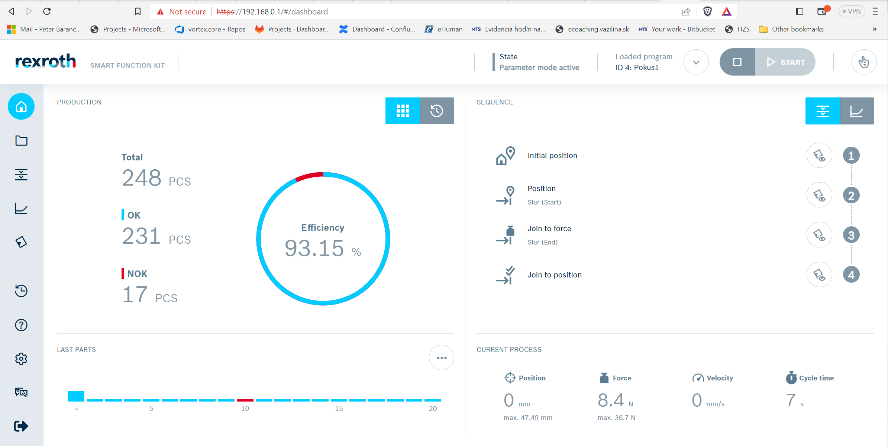
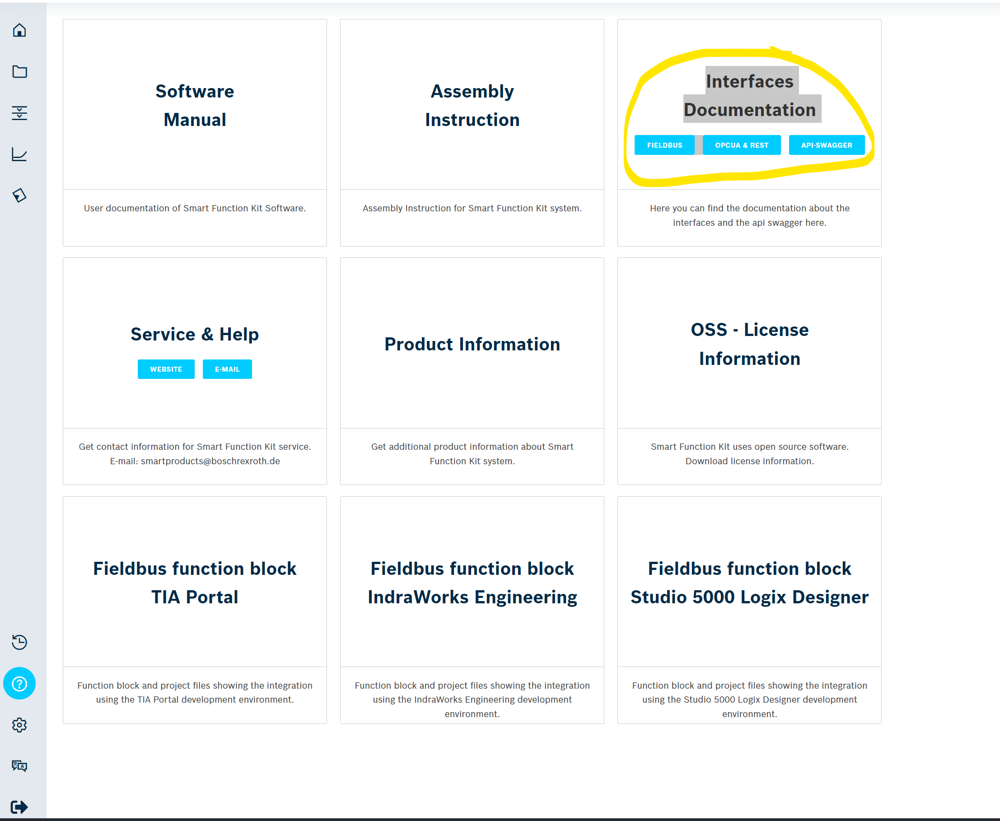
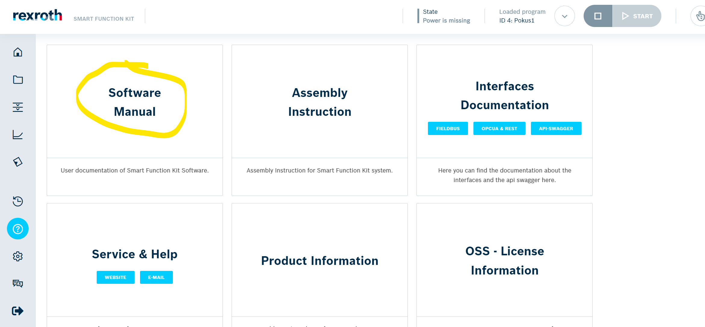

# TcoRexrothPress

## Introduction

The **TcoRexrothPress** is a set of libraries covering the product portfolio of the pressing systems from the vendor [Rexroth](https://www.boschrexroth.com/en/dc/) for the target PLC platform [Twincat](https://www.beckhoff.com/en-en/products/automation/twincat/twincat-3-build-4024/) and [TcOpen](https://github.com/TcOpenGroup/TcOpen#readme) framework.

The package consists of a PLC library providing control logic and its .NET twin counterpart aimed at the visualization part. This package currently covers Smart Function Kit firmware v4.x.x.

## General TcOpen Prerequisites

**Check general requisits for TcOpen [here](https://github.com/TcOpenGroup/TcOpen#prerequisites).**

## TcoSmartFunctionKit_v_4_x_x

- ### PLC enviroment

---

**_Preconditions:_**

The **`gsdml`** file(s) included in this package is(are) copied into the subfolder ..\Config\Io\EtherCAT\ of the TwinCAT3 instalation folder, before opening Visual Studio. It is possible use alredy predefined device stored in `Press (IndraDrive MPC20 (1 CCD Master +0 CCD Slaves)).xti` file (Here is predefined whole structure for SOE comunication). Boot files are stored in `TcOpen\src\TcoRexrothPress\src\TcoRexrothPressConnector\ddf\`

---

---

**_Note:_**

Configuration and comisionig of SFK(Smart Function Kit) is possible provide via built in webserver. [SFK Webserver] (<https://192.168.0.1/#/dashboard>) provided by [Rexroth](https://www.boschrexroth.com/en/dc/). Ip address might be different!

---



Here you can find all documenatation such as required structure on bus, available command ....



- ### Implementation steps

#### 1. Declare the hardware structure in the Global Variable list (GVL)

```csharp
        VAR_GLOBAL
            {attribute addProperty Name "Press IO"}
            RexrothPress:TcoSmartFunctionKitIO_v_4_x_x;
            {attribute addProperty Name "AdsAddr"}
            AdsAddr AT %I* : TcoAmsAddr;
            {attribute addProperty Name "State"}
            State AT %I* : UINT;
        END_VAR
```

#### 2. Build the XAE project

#### 3. Add Profinet master device, set its network adapter and network parameters

#### 4. Using the **`gsdml`** file mentioned, add Ethercat slave device, then rescan devices on Ecat bus and use cofiguration described in rexroth documentiation. You can also use predefined template in `xti` file and add it into topology directly

#### 7. Link all items of the structure **`GVL_xLinker.RexrothPress`**. You can also link ads information for Ecat diagnostic purposes such as the items **`AdsAddr`** and **`State`**. If **`AdsAddr`** is empty you diagnostic is irelevant

#### 8. Create the Function Block that extends the **`TcoCore.TcoContext`** function block

#### 9. Inside the declaration part of the function block created, add an instance of the **`TcoRexrothPress.TcoSmartFunctionKit_v_4_x_x`** function block with the initialization according to the example

```csharp
FUNCTION_BLOCK myVeryFirstTcoContext EXTENDS TcoCore.TcoContext
VAR
        {attribute addProperty Name "<#My very first SFK#>"}
        sfk : TcoRexrothPress.TcoSmartFunctionKit_v_4_x_x (THIS^);
END_VAR
```

#### 10. Add the **`Main`** method to the function block created in the step 8, and insert the **`TcoRexrothPress.TcoSmartFunctionKit_v_4_x_x`** instance call with passing the mapped hardware structure

#### 11. Add call of the method **`Service()`** according to the example. By calling this method, all control elements of this component are accessible later in the visualization

```csharp
    sfk.Config.ErrorTime:=T#20S;
    sfk.Config.InfoTime:=T#10S;
    sfk.Config.CurveExportLocation:='d:\expot\'; // if empty export not performed
    sfk.Config.IpAddress:='192.168.0.1';   // for rest comunication

    adsInfo.netId:=GVL_iXlinker.AdsAddr.netId;  //ads info from eCAT bus
    adsInfo.port:=GVL_iXlinker.AdsAddr.port;
    sfk(inoIoData:=GVL_iXlinker.RexrothPress,AdsAddr:=adsInfo);

    sfk.Service();

```

#### 12. In the declaration part of the **`MAIN(PRG)`** create an instance of the function block created in the step 8 according to the example

```csharp
PROGRAM MAIN
VAR
    myVeryFirstTcoContextInstance : myVeryFirstTcoContext;
END_VAR
```

#### 13. Into the body of the **`MAIN(PRG)`** add the call of the **`Run()`** method of the instance created in the previous step, according to the example

```csharp
myVeryFirstTcoContextInstance.Run();
```

#### 14. Build and save the XAE project

#### 15. Activate configuration, load the PLC program and swith the PLC into the run mode

- ### .NET enviroment

---

#### **_Preconditions:_** All neccessary packages are installed, all neccessary references are set, connector to the target PLC is set. **`MainWindow.xaml`** has its view model declared and its **`DataContext`** is set to this view model, according to the example

```XML
<Window.DataContext>
    <local:MainWindowViewModel />
</Window.DataContext>
```

---

- #### Implementation steps

#### 1. Run the **`Vortex Builder`**

#### 2. Into the **`MainWindow.xaml`** insert any kind of container, for example **`StackPanel`** and bind its **`DataContext`** to the **`MAIN`** of the **`EntryPointToYourPlc`**

```XML
    <StackPanel DataContext="{Binding TcoRexrothPressTestPlc.MAIN}">
    </StackPanel>
```

#### 3. Into the container added, insert the **`RenderableContentControl`** and bind its **`DataContext`** to the **`myVeryFirstTcoContextInstance.myVeryFirstDataman`**, using the **`PresentationType`** of the value **`Service`**

```XML
<vortex:RenderableContentControl DataContext="{Binding myVeryFirstTcoContextInstance.sfk}" PresentationType="Service"/>
```

#### 4. After starting the application and expanding the view, final view should look as follows

- #### Collapsed view


- #### Expanded (detailed info) view


- #### Has error view

      When you click on Health indicator ,diaagnostic information is shown.

  

- #### Error information view


- #### Avawilable commands list view

All available commands and properiate parameters (are shown/ hide automaticaly) reflecting command in sfk documentation


- ### Tasks

  - Run Command - by invoking this task,command defined in combobox will be fired. All commands and their functions are described in sfk documentation (picture below, possible download pdf file)

    

  - GetResult Command - this command provide last results via REST api.

    ***

    **_Note:_**

    There is neccessary to define a specific `IP address`.

    ***

    

  - Save last Curve Command - this remote tas provide us last curve results and measures da via REST api. All this data are exported to defined location and organize into directories splitted by yyyyMMdd. File format is `json`. Name of this exported file is in format `SERIALNUMBER_CURVEID_yyyyMMddHHmmss.json`

    

```json
 "id": "6436811dbba56b04d1ec0e0e",
    "program": {
        "id": "6253ed04257f8404d30c2f33",
        "fieldbusId": 4,
        "name": "Pokus1",
        "driveId": "6253ed040c2f33",
        "functions": [
            {
                "parameters": [
                    {
                        "type": "INPUT",
                        "name": "velocity",
                        "value": 50
                    },
                    {
                        "type": "INPUT",
                        "name": "acceleration",
                        "value": 2.4
                    },
                    {
                        "type": "FAILURE",
                        "name": "overload"
                    },
                    {
                        "type": "SUCCESS",
                        "name": "position",
                        "value": 0
                    }
                ],
                "name": "initialPosition",
                "trendingEnabled": true,
                "visible": true,
                "position": 1
            },


            //some data are skiped due size!!!


    "maxForce": 36.7,
    "maxPosition": 47.49,
    "valid": true,
    "validations": [],
    "createdDate":new Date(1681293597526),
    "cycleTime": 6.98,
    "validationTime": 55,
    "status": "FINISHED",
    "customId": "AMC HJSGHdhkghgjflv",
    "variableValues": [],
    "dataRecordingDisabled": false,
    "samplingInterval": 4,
    "offset": {
        "x": 0,
        "y": 0
    },
    "_id": "6436811dbba56b04d1ec0e0e",
    "__v": 1
}
```

- ### Example in sequence

```pascal

IF (Step(1000, TRUE, 'SFK RESTORE')) THEN
    //-------------------------------------
		THIS^.ParentSequence.Station.Components.Sfk.Restore();
		StepCompleteWhen(TRUE);
    //-------------------------------------
END_IF

done:=false;
IF (Step(2000, TRUE, 'SFK STOP MOVEMENT')) THEN
    //-------------------------------------
		THIS^.ParentSequence.Station.Components.Sfk.Request.Command:=eTcoSmartFunctionKitCommand.StopMovement;
		done:=THIS^.ParentSequence.Station.Components.Sfk.RunCommand().Done;

		StepCompleteWhen(done);
		IF done THEN
			THIS^.ParentSequence.Station.Components.Sfk.Restore();
		END_IF
    //-------------------------------------
END_IF

IF (Step(3000, TRUE, 'SFK RESET')) THEN
    //-------------------------------------
		THIS^.ParentSequence.Station.Components.Sfk.Request.Command:=eTcoSmartFunctionKitCommand.ClearError;
		done:=THIS^.ParentSequence.Station.Components.Sfk.RunCommand().Done ;
		StepCompleteWhen(done);
		IF done THEN
			THIS^.ParentSequence.Station.Components.Sfk.Restore();
		END_IF
    //-------------------------------------
END_IF
IF (Step(4000, TRUE, 'SFK HOME')) THEN
    //-------------------------------------
		THIS^.ParentSequence.Station.Components.Sfk.Request.Command:=eTcoSmartFunctionKitCommand.StartHoming;
		done := THIS^.ParentSequence.Station.Components.Sfk.RunCommand().Done ;

		StepCompleteWhen(done);

		IF done THEN
			THIS^.ParentSequence.Station.Components.Sfk.Restore();
		END_IF
    //-------------------------------------
END_IF

IF (Step(5000, TRUE, 'SFK SET PROGRAM')) THEN
    //-------------------------------------
		THIS^.ParentSequence.Station.Components.Sfk.Request.Command:=eTcoSmartFunctionKitCommand.SetProgramActive;
		THIS^.ParentSequence.Station.Components.Sfk.Request.ProgramId:=4;

		done:=THIS^.ParentSequence.Station.Components.Sfk.RunCommand().Done ;

		StepCompleteWhen(done);
		IF done THEN
			THIS^.ParentSequence.Station.Components.Sfk.Restore();
		END_IF
    //-------------------------------------
END_IF
IF (Step(6000, TRUE, 'SFK START PROGRAM')) THEN
    //-------------------------------------
		THIS^.ParentSequence.Station.Components.Sfk.Request.Command:=eTcoSmartFunctionKitCommand.StartProgram;
		_counterData:=_counterData+1;
		fillChar:='00000000000';


		_counterDataString:=DINT_TO_STRING(_counterData);
		THIS^.ParentSequence.Station.Components.Sfk.Request.SerialNumber:=Tc2_Standard.MID(STR:=fillChar , LEN:=11- Tc2_Standard.LEN(_counterDataString), POS:=1 );

		done:=THIS^.ParentSequence.Station.Components.Sfk.RunCommand().Done ;
		StepCompleteWhen(done);
		IF done THEN
			THIS^.ParentSequence.Station.Components.Sfk.Restore();
		END_IF
    //-------------------------------------
END_IF


IF (Step(7000, TRUE, 'EXPORT CURVE')) THEN
    //-------------------------------------

		StepCompleteWhen(THIS^.ParentSequence.Station.Components.Sfk.ExportLastCurve().Done );
    //-------------------------------------
END_IF

IF (Step(10000, TRUE, 'PARALELL TASK DONE')) THEN
    //-------------------------------------
    _task.DoneWhen(TRUE );
    //-------------------------------------
END_IF

```
