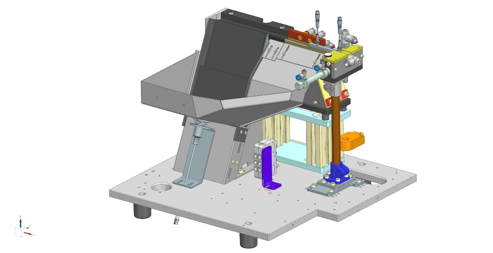
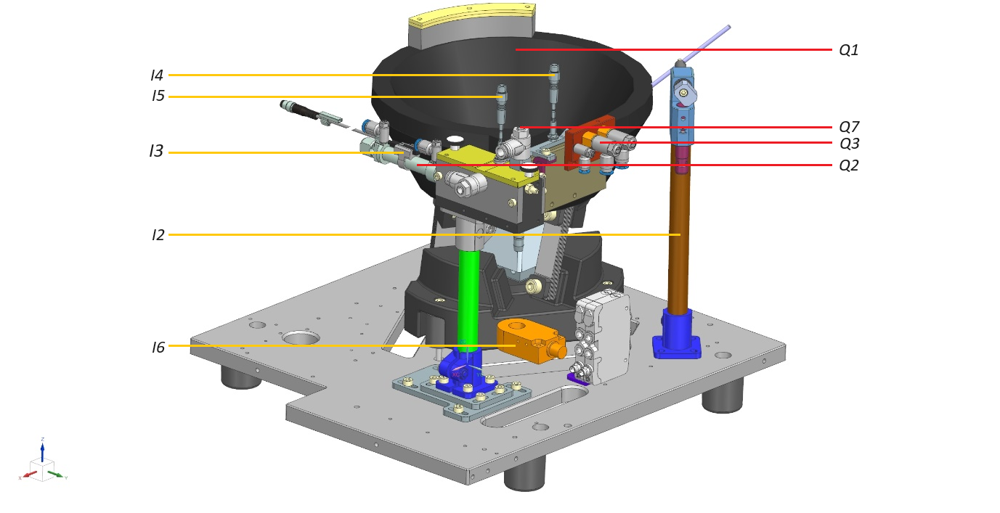
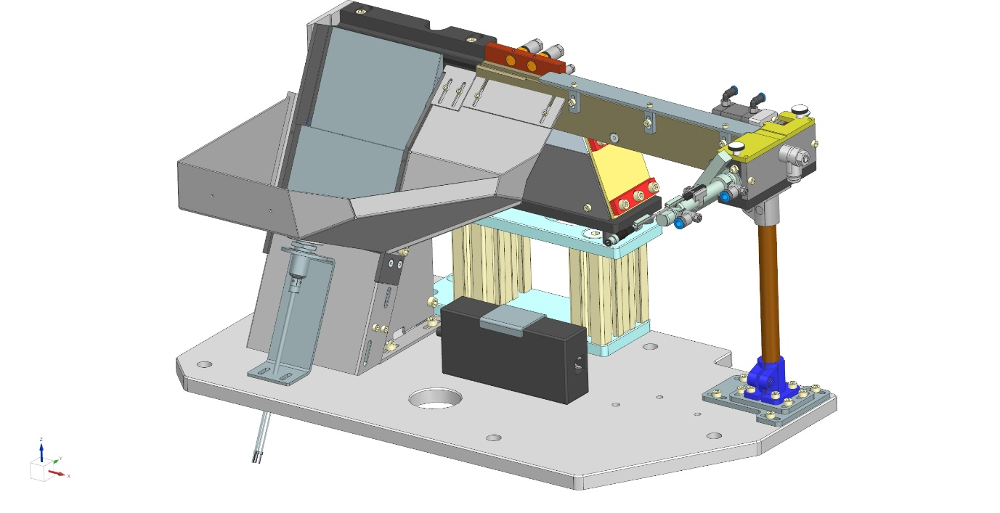
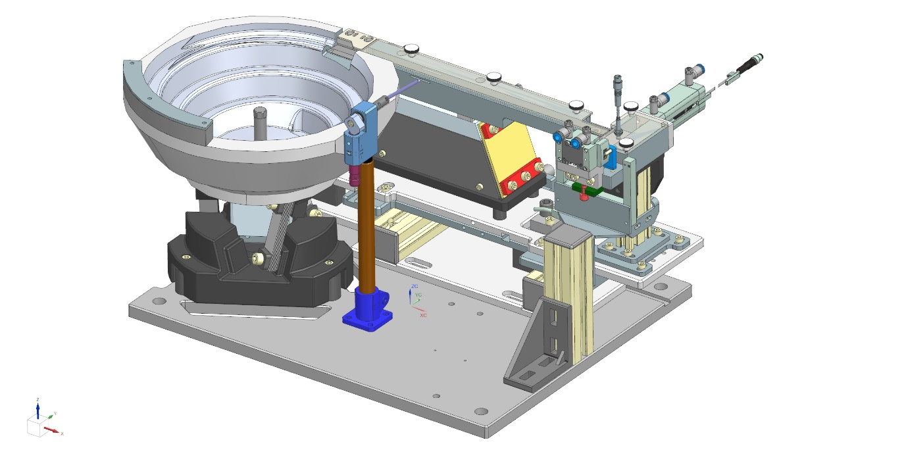
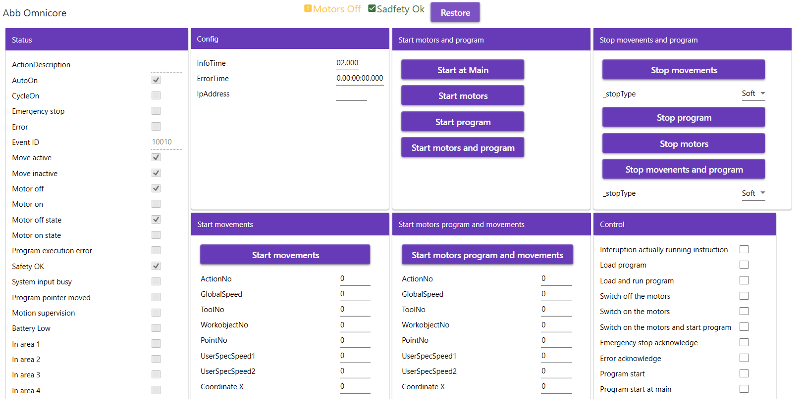
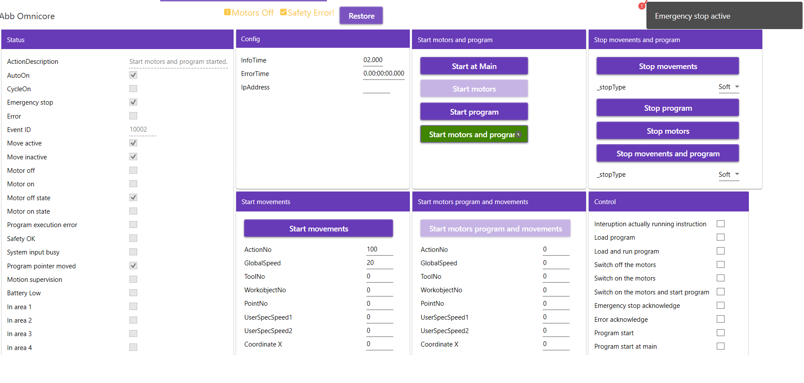

# TcoTixonFeeding

## Introduction

The **TcoTixonFeeding** is a set of software components that cover 5 products in MTS's manufacturing portfolio: the **Tixon Step**, **Tixon Vibro**, **Tixon Pick Step**, **Tixon Pick Vibro** and the **Tixon Pick Vibro Basic** which is suitable also for non-Tixon solutions.
All products can be optionally equipped with a **HOPPER** conveyor that serves additional supply of feeding components.

All of these are for the target PLC platform [Twincat](https://www.beckhoff.com/en-en/products/automation/twincat/twincat-3-build-4024/) and [TcOpen](https://github.com/TcOpenGroup/TcOpen#readme) framework.

The package consists of a PLC library providing control logic and its .NET twin counterpart aimed at the visualization part.

## General TcOpen Prerequisites

**Check general prerequisites for TcOpen [here](https://github.com/TcOpenGroup/TcOpen#prerequisites).**

## Tixon Step


### Tixon Step - Inputs
| Input	| Name |
| ----- | ------- |
| I1	| Tixon controller in auto |
| I2	| Feeder has components |
| I3	| Separator in home position |
| I4	| Filling sensor |
| I5	| Separator present |
| I6	| Steper in home position |
| I7	| Steper in work position |
| I8	| Component out of box |

### Tixon Step - Outputs
| Output| Name |
| ----- | ------- |
| Q1	| Feeding A |
| Q2	| Separe component |
| Q3	| Blow |
| Q4	| Red Led feeder |
| Q5	| Green led feeder |
| Q6	| Hopper |
| Q7	| Steper valve |
| Q8	| Shot component |

### Tixon Step - Config
| Variable Name					| Type	| Default value |
| ----------------------------- | ----- | ------- | 
| BlinkTime						| TIME	| T#500MS |
| FeederEmptyTime				| TIME	| T#5S |
| BufferEmptyTime				| TIME	| T#1S |
| BufferFullTime				| TIME	| T#1S |
| BufferBlowStartTime			| TIME	| T#300MS |
| BufferIdleTime				| TIME	| T#5S |
| BufferBlowFullTime			| TIME	| T#1S |
| BufferBlowActive				| BOOL	| TRUE |
| TimeToComponentInSeparator	| TIME	| T#300MS |
| TimeToComponentOutSeparator	| TIME	| T#1S |
| HopperActive					| BOOL	| FALSE |
| TimeToHopperStart				| TIME	| T#5S |
| TimeToHopperRun				| TIME	| T#30S |
| SteperInWorkTime				| TIME	| T#1S |
| SteperInHomeTime				| TIME	| T#1S |
| ErrorTimeSeparator			| TIME	| T#0S |
| ErrorTimeBuffer				| TIME	| T#0S |
| ErrorTimeStepper				| TIME	| T#0S |
| ErrorTimeHopper				| TIME	| T#0S |

---

## Tixon Vibro


### Tixon Vibro - Inputs
| Input	| Name |
| ----- | ------- |
| I1	| Tixon controller in auto |
| I2	| Feeder has components |
| I3	| Separator in home position |
| I4	| Filling sensor |
| I5	| Separator present |
| I6	| Component out of box |

### Tixon Vibro - Outputs
| Output| Name |
| ----- | ------- |
| Q1	| Feeding A |
| Q2	| Separe component |
| Q3	| Blow |
| Q4	| Red Led feeder |
| Q5	| Green led feeder |
| Q6	| Hopper |
| Q7	| Shot component |

### Tixon Vibro - Config
| Variable Name					| Type	| Default value |
| ----------------------------- | ----- | ------- | 
| BlinkTime						| TIME	| T#500MS |
| FeederEmptyTime				| TIME	| T#5S |
| BufferEmptyTime				| TIME	| T#1S |
| BufferFullTime				| TIME	| T#1S |
| BufferBlowStartTime			| TIME	| T#300MS |
| BufferIdleTime				| TIME	| T#5S |
| BufferBlowFullTime			| TIME	| T#1S |
| BufferBlowActive				| BOOL	| TRUE |
| TimeToComponentInSeparator	| TIME	| T#300MS |
| TimeToComponentOutSeparator	| TIME	| T#1S |
| HopperActive					| BOOL	| FALSE |
| TimeToHopperStart				| TIME	| T#5S |
| TimeToHopperRun				| TIME	| T#30S |
| ErrorTimeSeparator			| TIME	| T#0S |
| ErrorTimeBuffer				| TIME	| T#0S |
| ErrorTimeHopper				| TIME	| T#0S |

---

## Tixon Pick Step


### Tixon Pick Step - Inputs
| Input	| Name |
| ----- | ------- |
| I1	| Tixon controller in auto |
| I2	| Feeder has components |
| I3	| Separator in home position |
| I4	| Filling sensor |
| I5	| Separator present |
| I6	| Separator in work position |
| I7	| Stepper in home position |
| I8	| Stepper in work position |
| 		| InPickZone |


### Tixon Pick Step - Outputs
| Output| Name |
| ----- | ------- |
| Q1	| Feeding A |
| Q2	| Separe component |
| Q3	| Blow |
| Q4	| Red Led feeder |
| Q5	| Green led feeder |
| Q6	| Hopper |
| Q7	| Steper valve |

### Tixon Pick Step - Config
| Variable Name					| Type	| Default value |
| ----------------------------- | ----- | ------- | 
| BlinkTime						| TIME	| T#500MS |
| FeederEmptyTime				| TIME	| T#5S |
| BufferEmptyTime				| TIME	| T#1S |
| BufferFullTime				| TIME	| T#1S |
| BufferBlowStartTime			| TIME	| T#300MS |
| BufferIdleTime				| TIME	| T#5S |
| BufferBlowFullTime			| TIME	| T#1S |
| BufferBlowActive				| BOOL	| TRUE |
| TimeToComponentInSeparator	| TIME	| T#300MS |
| TimeToComponentOutSeparator	| TIME	| T#1S |
| HopperActive					| BOOL	| FALSE |
| TimeToHopperStart				| TIME	| T#5S |
| TimeToHopperRun				| TIME	| T#30S |
| SeparatorActive				| BOOL	| TRUE |
| SteperInWorkTime				| TIME	| T#1S |
| SteperInHomeTime				| TIME	| T#1S |
| ErrorTimeSeparator			| TIME	| T#0S |
| ErrorTimeBuffer				| TIME	| T#0S |
| ErrorTimeStepper				| TIME	| T#0S |
| ErrorTimeHopper				| TIME	| T#0S |

---

## Tixon Pick Vibro


### Tixon Pick Vibro - Inputs
| Input	| Name |
| ----- | ------- |
| I1	| Tixon controller in auto |
| I2	| Feeder has components |
| I3	| Separator in home position |
| I4	| Filling sensor |
| I5	| Separator present |
| I6	| Separator in work position |
| 		| InPickZone |


### Tixon Pick Vibro - Outputs
| Output| Name |
| ----- | ------- |
| Q1	| Feeding A |
| Q2	| Separe component |
| Q3	| Blow |
| Q4	| Red Led feeder |
| Q5	| Green led feeder |
| Q6	| Hopper |
| Q7	| Feeding B |
| Q8	| Blow B |

### Tixon Pick Vibro - Config
| Variable Name					| Type	| Default value |
| ----------------------------- | ----- | ------- | 
| BlinkTime						| TIME	| T#500MS |
| FeederEmptyTime				| TIME	| T#5S |
| BufferEmptyTime				| TIME	| T#1S |
| BufferFullTime				| TIME	| T#1S |
| BufferBlowStartTime			| TIME	| T#300MS |
| BufferIdleTime				| TIME	| T#5S |
| BufferBlowFullTime			| TIME	| T#1S |
| BufferBlowActive				| BOOL	| TRUE |
| TimeToComponentInSeparator	| TIME	| T#300MS |
| TimeToComponentOutSeparator	| TIME	| T#1S |
| HopperActive					| BOOL	| FALSE |
| TimeToHopperStart				| TIME	| T#5S |
| TimeToHopperRun				| TIME	| T#30S |
| SeparatorActive				| BOOL	| TRUE |
| FeederBlowBStartTime			| TIME	| T#1S |
| FeederBlowBFullTime			| TIME	| T#1S |
| FeederBlowBActive				| BOOL	| FALSE |
| ErrorTimeSeparator			| TIME	| T#0S |
| ErrorTimeBuffer				| TIME	| T#0S |
| ErrorTimeHopper				| TIME	| T#0S |

---

## Tixon Pick Vibro Basic
TODO: add picture

### Tixon Pick Vibro Basic - Inputs
| Input	| Name |
| ----- | ------- |
| I1	| Tixon controller in auto |
| I2	| Feeder has components |
| I3	| Separator in home position |
| *I4*	| *FILLING SENSOR NOT USED*  |
| I5	| Separator present |
| I6	| Separator in work position |
| 		| InPickZone |

### Tixon Pick Vibro Basic - Outputs
| Output| Name |
| ----- | ------- |
| Q1	| Feeding A |
| Q2	| Separe component |
| Q3	| Blow |
| Q4	| Red Led feeder |
| Q5	| Green led feeder |
| Q6	| Hopper |

### Tixon Pick Vibro Basic - Config
| Variable Name					| Type	| Default value |
| ----------------------------- | ----- | ------- | 
| BlinkTime						| TIME	| T#500MS |
| FeederEmptyTime				| TIME	| T#5S |
| BufferEmptyTime				| TIME	| T#1S |
| BufferFullTime				| TIME	| T#1S |
| BufferBlowStartTime			| TIME	| T#300MS |
| BufferIdleTime				| TIME	| T#5S |
| BufferBlowFullTime			| TIME	| T#1S |
| BufferBlowActive				| BOOL	| TRUE |
| TimeToComponentInSeparator	| TIME	| T#300MS |
| TimeToComponentOutSeparator	| TIME	| T#1S |
| HopperActive					| BOOL	| FALSE |
| TimeToHopperStart				| TIME	| T#5S |
| TimeToHopperRun				| TIME	| T#30S |
| SeparatorActive				| BOOL	| TRUE |
| ErrorTimeSeparator			| TIME	| T#0S |
| ErrorTimeHopper				| TIME	| T#0S |

### PLC enviroment
--- 
#### **_Preconditions:_** The **`gsdml`** file(s) should be copied into the subfolder ..\Config\Io\EtherCat\ of the TwinCAT3 instalation folder, before opening Visual Studio. The Profinet interface of the slave device is activated. The file depends on manufacturer of drive. Robot settings needs to by done in settings   by RobotStudio sfotware by ABB or directly via robot teach pendant. 
---

#### **_Preconditions:_** The robot software is part of repository. Use **RobotStudio** to open project. And transfer it  to robot.
---

#### Implementation steps.
#### 1. Declare the hardware structures in the Global Variable list (GVL).
```csharp

VAR_GLOBAL
  	Robot1	:	TcoTixonFeeding.TcoIrc5_IO_v_1_x_x;
	Robot2	:	TcoTixonFeeding.TcoOmnicore_IO_v_1_x_x;
END_VAR
```
#### 2. Build the XAE project.

#### 3. Add Profinet master device, set its network adapter and network parameters.

#### 4. Scann for new Profinet devices, or use already prepared `xti` files and  use `Add Existing`. This files are localized in `.\src\TcoTixonFeeding\src\TcoTixonFeedingConnector\ddf\`. `Robot1.xti` is valid for Irc5 and `Robot2.xti` for `Omnicore` 

#### 5. Connect your Gvl structures with  hardware. Refers to bechokff drives documentation if there are some issues, or for guidance how to mapping. 

#### 6. Create the Function Block that extends the **`TcoCore.TcoContext`** function block.

#### 7. Inside the declaration part of the function block created, add an instance of the **`TcoTixonFeeding.TcoIrc5_v_1_x_x`** , **`TcoTixonFeeding.TcoSingleAxis`** or **`TcoTixonFeeding.TcoOmnicore_v_1_x_x`**. Add the **`Main`** method into this function block  and insert the instances. Call with passing the mapped hardware structure

```csharp
FUNCTION_BLOCK WpfContext EXTENDS TcoCore.TcoContext
VAR
     {attribute addProperty Name "<#Abb IRC 5#>"}
    _robot1 : TcoTixonFeeding.TcoIrc5_v_1_x_x(THIS^);
	{attribute addProperty Name "<#Abb Omnicore#>"}
    _robot2 : TcoTixonFeeding.TcoOmnicore_v_1_x_x(THIS^);


END_VAR

```

#### 8. Here  instances are called with passing the mapped hardware structure. By calling method `Service()` , all control elements of this component are accessible later in the visualization. By calling method `Service` is allowed control elements(components) via visualisation (service/ manual mode)

```csharp
/IF _serviceModeActive THEN
   	_robot1.Service();
  	_robot2.Service();
 


END_IF
_robot1(
    inoData := GVL.Robot1);


_robot2(
    inoData := GVL.Robot2);
```

#### 9. In the declaration part of the **`MAIN(PRG)`** create an instance of the function block created in the step 7 according to the example. 
```csharp
PROGRAM MAIN
VAR
      _wpfContext : WpfContext;
END_VAR
```

#### 10. Into the body of the **`MAIN(PRG)`** add the call of the **`Run()`** method of the instance created in the previous step, according to the example.    

```csharp
_wpfContext.Run();
```

#### 14. Build and save the XAE project.

#### 15. Activate configuration, load the PLC program and swith the PLC into the run mode.

-------------------------------

- ### .NET enviroment

--- 

#### **_Preconditions:_** All neccessary packages are installed, all neccessary references are set, connector to the target PLC is set.
- #### Implementation steps.

#### 1. Run the **`Vortex Builder`**.

#### 2. Into the **`MainWindow.xaml`** define **`DataContext`** to the **`MAIN`** of the **`TcoTixonFeedingTestsPlc`**.
```xml
<Window x:Class="TcoTixonFeeding.Wpf.Sandbox.MainWindow"
        xmlns="http://schemas.microsoft.com/winfx/2006/xaml/presentation"
        xmlns:x="http://schemas.microsoft.com/winfx/2006/xaml"
        xmlns:d="http://schemas.microsoft.com/expression/blend/2008"
        xmlns:mc="http://schemas.openxmlformats.org/markup-compatibility/2006"
        xmlns:tcopen="clr-namespace:TcoTixonFeedingTests;assembly=TcoTixonFeedingTestsConnector"
        xmlns:vortex="http://vortex.mts/xaml" 
        Title="MainWindow"
        Width="800"
        Height="450"
        DataContext="{x:Static tcopen:Entry.TcoTixonFeedingTestsPlc}"
        mc:Ignorable="d">


</Window>
```

```csharp
       static string TargetAmsId = Environment.GetEnvironmentVariable("Tc3Target");
        static int TargetAmsPort = 852;

        public static TcoTixonFeedingTestsTwinController TcoTixonFeedingTestsPlc { get; }
            = new TcoTixonFeedingTestsTwinController(Vortex.Adapters.Connector.Tc3.Adapter.Tc3ConnectorAdapter.Create(TargetAmsId, TargetAmsPort, true));
```

#### 3. Into the container added, insert the **`RenderableContentControl`** and bind its **`DataContext`** to the **`   _robot1 : TcoTixonFeeding.TcoIrc5_v_1_x_x(THIS^)`** or **` _robot2 : TcoTixonFeeding.TcoOmnicore_v_1_x_x(THIS^)`**, using the **`PresentationType`** of the value **`Service`**.
```XML
    <vortex:RenderableContentControl Grid.Row="0" DataContext="{Binding MAIN._wpfContext._robot1}" PresentationType="Service"/>
	<vortex:RenderableContentControl Grid.Row="0" DataContext="{Binding MAIN._wpfContext._robot2}" PresentationType="Service"/>
```

```
#### 4. After starting the application and expanding the view, final view should look as follows:
```


Collapsed Service view 


Expanded (detailed info) view



Service view report an error notification




### Plc Example usage in sequencer

```csharp
seq REF= _sequence1;

seq.Open();
seq.Observer := _observer;


 
		
IF (seq.Step(inStepID := 0,
    inEnabled := TRUE,
    inStepDescription := 'READY TO START')) THEN
    //--------------------------------------------------------
	_param.GlobalSpeed :=100;
		_noOfAttmets:=0;

	answer := _dialog			
			.Show()	
			.WithType(eDialogType.Question)				
			.WithCaption('Ready to go?')
			.WithText('Do you really want to start movements? Do we go ahead?')			
			.WithYesNo().Answer;
			//
			
	 IF (answer = TcoCore.eDialogAnswer.Yes) THEN    	 	
		seq.CompleteStep();
	 ELSIF(answer = TcoCore.eDialogAnswer.No) THEN
		_sequence1Task.Restore();
	 END_IF;	

    //--------------------------------------------------------			
END_IF;


IF (seq.Step(inStepID := 10,
    inEnabled := TRUE,
    inStepDescription := 'RESTORE')) THEN
//--------------------------------------------------------   
	
	_robot1.Restore();
	seq.CompleteStep();
	
		
//--------------------------------------------------------			
END_IF;
IF (seq.Step(inStepID := 11,
    inEnabled := TRUE,
    inStepDescription := 'STOP MOVEMENTS AND PROGRAM')) THEN
//--------------------------------------------------------   
	
	 	IF _robot1.StopMovementsAndProgram(inStopType:=eTcoRoboticsStopType.Soft).Done  THEN
			seq.CompleteStep();
		END_IF
		
//--------------------------------------------------------			
END_IF;

IF (seq.Step(inStepID := 12,
    inEnabled := TRUE,
    inStepDescription := 'START AT MAIN')) THEN
//--------------------------------------------------------   
	
	 	IF _robot1.StartAtMain().Done  THEN
			seq.CompleteStep();
		END_IF;
		
//--------------------------------------------------------			
END_IF;

IF (seq.Step(inStepID := 13,
    inEnabled := TRUE,
    inStepDescription := 'START MOTORS AND PROGRAM')) THEN
//--------------------------------------------------------   
	
	 	IF _robot1.StartMotorsAndProgram().Done  THEN
			seq.CompleteStep();
		END_IF;
		
//--------------------------------------------------------			
END_IF;

IF (seq.Step(inStepID := 14,
    inEnabled := TRUE,
    inStepDescription := 'START MOVEMENTS')) THEN
//--------------------------------------------------------   
	_maxAllowedAttempts:=10;
	
	
	seq.CompleteStep();
	
	
//--------------------------------------------------------			
END_IF;

IF (seq.Step(inStepID := 15,
    inEnabled := TRUE,
    inStepDescription := 'START MOVEMENTS')) THEN
//--------------------------------------------------------   
	_param.ActionNo:=100;
	
	IF _robot1.StartMovements(inData:=_param).Done   THEN
		seq.CompleteStep();
		_robot1.Restore();
	END_IF
	
//--------------------------------------------------------			
END_IF;


IF (seq.Step(inStepID := 16,
    inEnabled := TRUE,
    inStepDescription := 'START ANOTHER MOVE MOVEMENTS')) THEN
//--------------------------------------------------------   
	_param.ActionNo:=1;
	_param.GlobalSpeed:=90;
	IF _robot1.StartMovements(inData:=_param).Done  THEN
		IF _noOfAttmets<_maxAllowedAttempts THEN
			_noOfAttmets:=_noOfAttmets+1;
			seq.RequestStep(14);
			_robot1.Restore();
		ELSE 
		seq.CompleteStep();
		end_if;
	END_IF
	
//--------------------------------------------------------			
END_IF;


//
IF (seq.Step(inStepID := 500,
    inEnabled := TRUE,
    inStepDescription := 'EXAMPLE OF MOVMENT ABORTED')) THEN
//    --------------------------------------------------------

	answer := _dialog			
			.Show()	
			.WithType(eDialogType.Question)				
			.WithCaption('Abort movement?')
			.WithText('Do you  want to start movements and abort it?')			
			.WithYesNo().Answer;
			
			
	 IF (answer = TcoCore.eDialogAnswer.Yes) THEN    	 	
		seq.CompleteStep();
	 ELSIF(answer = TcoCore.eDialogAnswer.No) THEN
		_sequence1Task.Restore();
	 END_IF;	

//    --------------------------------------------------------			
END_IF;

IF (seq.Step(inStepID := 525,
    inEnabled := TRUE,
    inStepDescription := 'STOP MOVEMENT  EXAMPLE')) THEN
//    --------------------------------------------------------    
		

		answer := _dialog			
			.Show()	
			.WithType(eDialogType.Question)				
			.WithCaption('Movement running')
			.WithText('Do you  want to abort movement?')			
			.WithYesNo().Answer;
			
			
		 IF (answer = TcoCore.eDialogAnswer.Yes) THEN 
			_robot1.StopMovements(inStopType:=TcoAbstractions.eTcoRoboticsStopType.Quick);   	 	
			seq.CompleteStep();
		 ELSIF(answer = TcoCore.eDialogAnswer.No) THEN
			_sequence1Task.Restore();
		 END_IF;	
		
	_param.ActionNo:=100;	
	_param.GlobalSpeed :=20;
	IF _robot1.StartMovements(inData:=_param).Done  THEN
		seq.CompleteStep();
	END_IF
	
		
		
//    --------------------------------------------------------			
END_IF;

IF (seq.Step(inStepID := 600,
    inEnabled := TRUE,
    inStepDescription := 'ASKING FOR RESTORING')) THEN
//    --------------------------------------------------------

	answer := _dialog			
			.Show()	
			.WithType(eDialogType.Question)				
			.WithCaption('Question?')
			.WithText('Do you want to restore TcoIrc5 component?')			
			.WithYesNo().Answer;
			
			
	 IF (answer = TcoCore.eDialogAnswer.Yes) THEN    	 	
		_robot1.Restore();
		seq.CompleteStep();
	 ELSIF(answer = TcoCore.eDialogAnswer.No) THEN
		_sequence1Task.Restore();
	 END_IF;	
//    --------------------------------------------------------			
END_IF;

IF (seq.Step(inStepID := seq.RESTORE_STEP_ID,
    inEnabled := TRUE,
    inStepDescription := 'RETURN TO THE START OF THE SEQUENCE')) THEN
    //--------------------------------------------------------	
    	seq.CompleteSequence();
    //--------------------------------------------------------			
END_IF;

seq.Close();