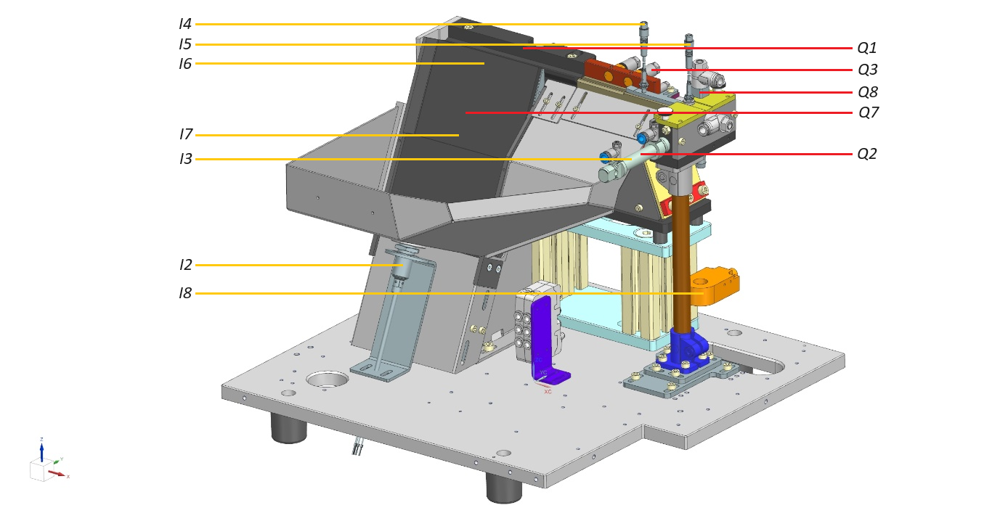
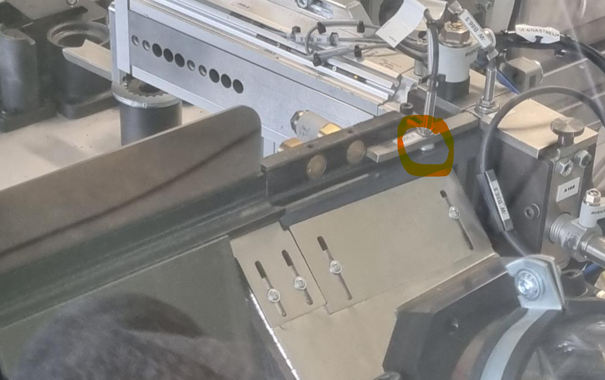

# TcoTixonFeeding

## Introduction

The **TcoTixonFeeding** is a set of libraries that cover two product platforms in ABB's manufacturing portfolio: the **IRC5** and the **Omnicore** platform." for the target PLC platform [Twincat](https://www.beckhoff.com/en-en/products/automation/twincat/twincat-3-build-4024/) and [TcOpen](https://github.com/TcOpenGroup/TcOpen#readme) framework.
The **TcoTixonFeeding** is a set of software components that cover 5 products in MTS's manufacturing portfolio: the
[Tixon Step](#tixon-step),
[Tixon Vibro](#tixon-vibro),
[Tixon Pick Step](#tixon-pick-step),
[Tixon Pick Vibro](#tixon-pick-vibro) and the
[Tixon Pick Vibro Basic](#tixon-pick-vibro-basic) which is suitable also for non-Tixon solutions.
All products can be optionally equipped with a **HOPPER** conveyor that serves additional supply of feeding components.

All of these are for the target PLC platform [TwinCAT](https://www.beckhoff.com/en-en/products/automation/twincat/) and [TcOpen](https://github.com/TcOpenGroup/TcOpen#readme) framework.

The package consists of a PLC library providing control logic and its .NET twin counterpart aimed at the visualization part.

## General TcOpen Prerequisites

**Check general prerequisites for TcOpen [here](https://github.com/TcOpenGroup/TcOpen#prerequisites).**

## TcoTixonFeeding

## Tixon Step



### Tixon Step - Inputs

| Input | Name                                  |
| ----- | ------------------------------------- |
| I1    | Tixon controller in auto              |
| I2    | Feeder has components                 |
| I3    | Separator in home position            |
| I4    | Filling sensor                        |
| I5    | Separator present                     |
| I6    | Steper in home position               |
| I7    | Steper in work position               |
| I8    | Component out of box                  |
| I9    | Separator in work position (optional) |

### Tixon Step - Outputs

| Output | Name             |
| ------ | ---------------- |
| Q1     | Feeding A        |
| Q2     | Separe component |
| Q3     | Blow             |
| Q4     | Red Led feeder   |
| Q5     | Green led feeder |
| Q6     | Hopper           |
| Q7     | Steper valve     |
| Q8     | Shot component   |

### Tixon Step - Config

| Variable Name                | Type | Default value |
| ---------------------------- | ---- | ------------- |
| BlinkTime                    | TIME | T#500MS       |
| FeederEmptyTime              | TIME | T#5S          |
| BufferEmptyTime              | TIME | T#1S          |
| BufferFullTime               | TIME | T#1S          |
| BufferBlowStartTime          | TIME | T#300MS       |
| BufferIdleTime               | TIME | T#5S          |
| BufferBlowFullTime           | TIME | T#1S          |
| BufferBlowActive             | BOOL | TRUE          |
| TimeToComponentInSeparator   | TIME | T#300MS       |
| TimeToComponentOutSeparator  | TIME | T#1S          |
| HopperActive                 | BOOL | FALSE         |
| TimeToHopperStart            | TIME | T#5S          |
| TimeToHopperRun              | TIME | T#30S         |
| SteperInWorkTime             | TIME | T#1S          |
| SteperInHomeTime             | TIME | T#1S          |
| ErrorTimeSeparator           | TIME | T#0S          |
| ErrorTimeBuffer              | TIME | T#0S          |
| ErrorTimeStepper             | TIME | T#0S          |
| ErrorTimeHopper              | TIME | T#0S          |
| OutOfBoxSensorDisabled       | BOOL | FALSE         |
| SeparatorHasWorkPosition     | BOOL | FALSE         |
| BufferStuckedOnFillingSensor | TIME | T#30S         |

---

### NOTE!

This option BufferStuckedOnFillingSensor is introduced due screw stuck on Filling sensor. (Required new step feed to push this stucked component) See picture below (Thx AdamPitak)



## Tixon Vibro


### Tixon Vibro - Inputs

| Input | Name                       |
| ----- | -------------------------- |
| I1    | Tixon controller in auto   |
| I2    | Feeder has components      |
| I3    | Separator in home position |
| I4    | Filling sensor             |
| I5    | Separator present          |
| I6    | Component out of box       |

### Tixon Vibro - Outputs

| Output | Name             |
| ------ | ---------------- |
| Q1     | Feeding A        |
| Q2     | Separe component |
| Q3     | Blow             |
| Q4     | Red Led feeder   |
| Q5     | Green led feeder |
| Q6     | Hopper           |
| Q7     | Shot component   |

### Tixon Vibro - Config

| Variable Name               | Type | Default value |
| --------------------------- | ---- | ------------- |
| BlinkTime                   | TIME | T#500MS       |
| FeederEmptyTime             | TIME | T#5S          |
| BufferEmptyTime             | TIME | T#1S          |
| BufferFullTime              | TIME | T#1S          |
| BufferBlowStartTime         | TIME | T#300MS       |
| BufferIdleTime              | TIME | T#5S          |
| BufferBlowFullTime          | TIME | T#1S          |
| BufferBlowActive            | BOOL | TRUE          |
| TimeToComponentInSeparator  | TIME | T#300MS       |
| TimeToComponentOutSeparator | TIME | T#1S          |
| HopperActive                | BOOL | FALSE         |
| TimeToHopperStart           | TIME | T#5S          |
| TimeToHopperRun             | TIME | T#30S         |
| ErrorTimeSeparator          | TIME | T#0S          |
| ErrorTimeBuffer             | TIME | T#0S          |
| ErrorTimeHopper             | TIME | T#0S          |
| OutOfBoxSensorDisabled      | BOOL | FALSE         |
| SeparatorHasWorkPosition    | BOOL | FALSE         |

---

## Tixon Pick Step


For placement of signals see [Tixon Step](#tixon-step) picture.

### Tixon Pick Step - Inputs

| Input | Name                       |
| ----- | -------------------------- |
| I1    | Tixon controller in auto   |
| I2    | Feeder has components      |
| I3    | Separator in home position |
| I4    | Filling sensor             |
| I5    | Separator present          |
| I6    | Separator in work position |
| I7    | Stepper in home position   |
| I8    | Stepper in work position   |
|       | InPickZone                 |

### Tixon Pick Step - Outputs

| Output | Name             |
| ------ | ---------------- |
| Q1     | Feeding A        |
| Q2     | Separe component |
| Q3     | Blow             |
| Q4     | Red Led feeder   |
| Q5     | Green led feeder |
| Q6     | Hopper           |
| Q7     | Steper valve     |

### Tixon Pick Step - Config

| Variable Name               | Type | Default value |
| --------------------------- | ---- | ------------- |
| BlinkTime                   | TIME | T#500MS       |
| FeederEmptyTime             | TIME | T#5S          |
| BufferEmptyTime             | TIME | T#1S          |
| BufferFullTime              | TIME | T#1S          |
| BufferBlowStartTime         | TIME | T#300MS       |
| BufferIdleTime              | TIME | T#5S          |
| BufferBlowFullTime          | TIME | T#1S          |
| BufferBlowActive            | BOOL | TRUE          |
| TimeToComponentInSeparator  | TIME | T#300MS       |
| TimeToComponentOutSeparator | TIME | T#1S          |
| HopperActive                | BOOL | FALSE         |
| TimeToHopperStart           | TIME | T#5S          |
| TimeToHopperRun             | TIME | T#30S         |
| SeparatorActive             | BOOL | TRUE          |
| SteperInWorkTime            | TIME | T#1S          |
| SteperInHomeTime            | TIME | T#1S          |
| ErrorTimeSeparator          | TIME | T#0S          |
| ErrorTimeBuffer             | TIME | T#0S          |
| ErrorTimeStepper            | TIME | T#0S          |
| ErrorTimeHopper             | TIME | T#0S          |

---

## Tixon Pick Vibro


For placement of signals see [Tixon Vibro](#tixon-vibro) picture.

### Tixon Pick Vibro - Inputs

| Input | Name                       |
| ----- | -------------------------- |
| I1    | Tixon controller in auto   |
| I2    | Feeder has components      |
| I3    | Separator in home position |
| I4    | Filling sensor             |
| I5    | Separator present          |
| I6    | Separator in work position |
|       | InPickZone                 |

### Tixon Pick Vibro - Outputs

| Output | Name             |
| ------ | ---------------- |
| Q1     | Feeding A        |
| Q2     | Separe component |
| Q3     | Blow             |
| Q4     | Red Led feeder   |
| Q5     | Green led feeder |
| Q6     | Hopper           |
| Q7     | Feeding B        |
| Q8     | Blow B           |

### Tixon Pick Vibro - Config

| Variable Name               | Type | Default value |
| --------------------------- | ---- | ------------- |
| BlinkTime                   | TIME | T#500MS       |
| FeederEmptyTime             | TIME | T#5S          |
| BufferEmptyTime             | TIME | T#1S          |
| BufferFullTime              | TIME | T#1S          |
| BufferBlowStartTime         | TIME | T#300MS       |
| BufferIdleTime              | TIME | T#5S          |
| BufferBlowFullTime          | TIME | T#1S          |
| BufferBlowActive            | BOOL | TRUE          |
| TimeToComponentInSeparator  | TIME | T#300MS       |
| TimeToComponentOutSeparator | TIME | T#1S          |
| HopperActive                | BOOL | FALSE         |
| TimeToHopperStart           | TIME | T#5S          |
| TimeToHopperRun             | TIME | T#30S         |
| SeparatorActive             | BOOL | TRUE          |
| FeederBlowBStartTime        | TIME | T#1S          |
| FeederBlowBFullTime         | TIME | T#1S          |
| FeederBlowBActive           | BOOL | FALSE         |
| ErrorTimeSeparator          | TIME | T#0S          |
| ErrorTimeBuffer             | TIME | T#0S          |
| ErrorTimeHopper             | TIME | T#0S          |

---

## Tixon Pick Vibro Basic

TODO: add picture

### Tixon Pick Vibro Basic - Inputs

| Input | Name                       |
| ----- | -------------------------- |
| I1    | Tixon controller in auto   |
| I2    | Feeder has components      |
| I3    | Separator in home position |
| I4    | Filling sensor             |
| I5    | Separator present          |
| I6    | Separator in work position |
|       | InPickZone                 |

### Tixon Pick Vibro Basic - Outputs

| Output | Name             |
| ------ | ---------------- |
| Q1     | Feeding A        |
| Q2     | Separe component |
| Q3     | Blow             |
| Q4     | Red Led feeder   |
| Q5     | Green led feeder |
| Q6     | Hopper           |

### Tixon Pick Vibro Basic - Config

| Variable Name               | Type | Default value |
| --------------------------- | ---- | ------------- |
| BlinkTime                   | TIME | T#500MS       |
| FeederEmptyTime             | TIME | T#5S          |
| BufferEmptyTime             | TIME | T#1S          |
| BufferFullTime              | TIME | T#1S          |
| BufferBlowStartTime         | TIME | T#300MS       |
| BufferIdleTime              | TIME | T#5S          |
| BufferBlowFullTime          | TIME | T#1S          |
| BufferBlowActive            | BOOL | TRUE          |
| TimeToComponentInSeparator  | TIME | T#300MS       |
| TimeToComponentOutSeparator | TIME | T#1S          |
| HopperActive                | BOOL | FALSE         |
| TimeToHopperStart           | TIME | T#5S          |
| TimeToHopperRun             | TIME | T#30S         |
| SeparatorActive             | BOOL | TRUE          |
| ErrorTimeSeparator          | TIME | T#0S          |
| ErrorTimeHopper             | TIME | T#0S          |

### Plc Example usage in sequencer TixonStep

```csharp
seq REF= _sequenceTixonStep;

seq.Open();
seq.Observer := _observerTixonStep;


_tixonStepFeeder.CyclicBufferFeed();
_tixonStepFeeder.CyclicStepperFeed();
_tixonStepFeeder.CyclicHopperFeed();
_tixonStepFeeder.DefaultSignalisation();

_actualAttempt:=_noOfAttmets;

IF (seq.Step(inStepID := 0,
    inEnabled := TRUE,
    inStepDescription := 'READY TO START')) THEN
    //--------------------------------------------------------

	_noOfAttmets:=0;

	answer := _dialogTixon
			.Show()
			.WithType(eDialogType.Question)
			.WithCaption('Ready to go?')
			.WithText('Do you really want to start feeding? Do we go ahead?')
			.WithYesNo().Answer;
			//

	 IF (answer = TcoCore.eDialogAnswer.Yes) THEN
		seq.CompleteStep();
	 ELSIF(answer = TcoCore.eDialogAnswer.No) THEN
		_sequenceTixonStepTask.Restore();
	 END_IF;

    //--------------------------------------------------------
END_IF;


IF (seq.Step(inStepID := 10,
    inEnabled := TRUE,
    inStepDescription := 'RESTORE')) THEN
//--------------------------------------------------------

	_tixonStepFeeder.Restore();
	seq.CompleteStep();


//--------------------------------------------------------
END_IF;
IF (seq.Step(inStepID := 11,
    inEnabled := TRUE,
    inStepDescription := 'START FEEDING TASK')) THEN
//--------------------------------------------------------


	seq.StepCompleteWhen(_tixonStepFeeder.Separe().Done);
	_timer(IN:=FALSE);

//--------------------------------------------------------
END_IF;


IF (seq.Step(inStepID := 12,
    inEnabled := TRUE,
    inStepDescription := 'WAIT FOR COMPONENT AND WAITING FOR SIMULATED PROCESS')) THEN
//--------------------------------------------------------
	_timer(IN:=TRUE,PT:=_estimatedCycleTime);
	 	IF _tixonStepFeeder.Status.ComponentReady AND _timer.Q  THEN
			seq.CompleteStep();
			_timer(IN:=FALSE);
		END_IF;

//--------------------------------------------------------
END_IF;

IF (seq.Step(inStepID := 13,
    inEnabled := TRUE,
    inStepDescription := 'NASTREL')) THEN
//--------------------------------------------------------
	_timer(IN:=TRUE,PT:= _pushTime);
	 _tixonStepFeeder.Push(TRUE);
    IF _timer.Q   THEN
		seq.CompleteStep();
		_tixonStepFeeder.Push(FALSE);
	END_IF;

//--------------------------------------------------------
END_IF;


IF (seq.Step(inStepID := 16,
    inEnabled := TRUE,
    inStepDescription := 'COUNT')) THEN
//--------------------------------------------------------


		IF _noOfAttmets<_maxAllowedAttemptsTixonStep THEN
			_noOfAttmets:=_noOfAttmets+1;
			seq.RequestStep(11);

		ELSE
			seq.CompleteStep();
		end_if;

//--------------------------------------------------------
END_IF;


IF (seq.Step(inStepID := 600,
    inEnabled := TRUE,
    inStepDescription := 'ASKING FOR RESTORING')) THEN
//    --------------------------------------------------------
	_tixonStepFeeder.Restore();
	answer := _dialogTixon
			.Show()
			.WithType(eDialogType.Question)
			.WithCaption('Question?')
			.WithText('Do you want to repat it?')
			.WithYesNo().Answer;


	 IF (answer = TcoCore.eDialogAnswer.Yes) THEN
		seq.CompleteStep();
	 ELSIF(answer = TcoCore.eDialogAnswer.No) THEN
		_sequenceTixonStepTask.Restore();
	 END_IF;
//    --------------------------------------------------------
END_IF;

IF (seq.Step(inStepID := seq.RESTORE_STEP_ID,
    inEnabled := TRUE,
    inStepDescription := 'RETURN TO THE START OF THE SEQUENCE')) THEN
    //--------------------------------------------------------

    	seq.CompleteSequence();
    //--------------------------------------------------------
END_IF;

seq.Close();
```

### Plc Example usage in sequencer TixonVibro

```csharp
seq REF= _sequenceTixonVibro;

seq.Open();
seq.Observer := _observerTixonVibro;


_tixonVibroFeeder.CyclicBufferFeed();
_tixonVibroFeeder.CyclicHopperFeed();
_tixonVibroFeeder.DefaultSignalisation();

 _actualAttempt:=_noOfAttmets;

IF (seq.Step(inStepID := 0,
    inEnabled := TRUE,
    inStepDescription := 'READY TO START')) THEN
    //--------------------------------------------------------

	_noOfAttmets:=0;

	answer := _dialogTixon
			.Show()
			.WithType(eDialogType.Question)
			.WithCaption('Ready to go?')
			.WithText('Do you really want to start feeding? Do we go ahead?')
			.WithYesNo().Answer;
			//

	 IF (answer = TcoCore.eDialogAnswer.Yes) THEN
		seq.CompleteStep();
	 ELSIF(answer = TcoCore.eDialogAnswer.No) THEN
		_sequenceTixonVibroTask.Restore();
	 END_IF;

    //--------------------------------------------------------
END_IF;


IF (seq.Step(inStepID := 10,
    inEnabled := TRUE,
    inStepDescription := 'RESTORE')) THEN
//--------------------------------------------------------

	_tixonVibroFeeder.Restore();
	seq.CompleteStep();


//--------------------------------------------------------
END_IF;
IF (seq.Step(inStepID := 11,
    inEnabled := TRUE,
    inStepDescription := 'START FEEDING TASK')) THEN
//--------------------------------------------------------

		seq.StepCompleteWhen(_tixonVibroFeeder.Separe().Done);
		_timer(IN:=FALSE);

//--------------------------------------------------------
END_IF;

IF (seq.Step(inStepID := 12,
    inEnabled := TRUE,
    inStepDescription := 'WAIT FOR COMPONENT AND WAITING FOR SIMULATED PROCESS')) THEN
//--------------------------------------------------------
	_timer(IN:=TRUE,PT:=_estimatedCycleTime);
	 	IF _tixonVibroFeeder.Status.ComponentReady AND _timer.Q  THEN
			seq.CompleteStep();
			_timer(IN:=FALSE);
		END_IF;

//--------------------------------------------------------
END_IF;

IF (seq.Step(inStepID := 13,
    inEnabled := TRUE,
    inStepDescription := 'NASTREL')) THEN
//--------------------------------------------------------
	_timer(IN:=TRUE,PT:=_pushTime);
	 _tixonVibroFeeder.Push(TRUE);
    IF _timer.Q   THEN
		seq.CompleteStep();
		_tixonVibroFeeder.Push(FALSE);
	END_IF;

//--------------------------------------------------------
END_IF;


IF (seq.Step(inStepID := 16,
    inEnabled := TRUE,
    inStepDescription := 'COUNT')) THEN
//--------------------------------------------------------


		IF _noOfAttmets<_maxAllowedAttemptsTixonVibro THEN
			_noOfAttmets:=_noOfAttmets+1;
			seq.RequestStep(11);

		ELSE
			seq.CompleteStep();
		end_if;

//--------------------------------------------------------
END_IF;


IF (seq.Step(inStepID := 600,
    inEnabled := TRUE,
    inStepDescription := 'ASKING FOR RESTORING')) THEN
//    --------------------------------------------------------
	_tixonVibroFeeder.Restore();
	answer := _dialogTixon
			.Show()
			.WithType(eDialogType.Question)
			.WithCaption('Question?')
			.WithText('Do you want to repat it?')
			.WithYesNo().Answer;


	 IF (answer = TcoCore.eDialogAnswer.Yes) THEN
		seq.CompleteStep();
	 ELSIF(answer = TcoCore.eDialogAnswer.No) THEN
		_sequenceTixonVibroTask.Restore();
	 END_IF;
//    --------------------------------------------------------
END_IF;

IF (seq.Step(inStepID := seq.RESTORE_STEP_ID,
    inEnabled := TRUE,
    inStepDescription := 'RETURN TO THE START OF THE SEQUENCE')) THEN
    //--------------------------------------------------------

    	seq.CompleteSequence();
    //--------------------------------------------------------
END_IF;

seq.Close();
```

### Plc Example usage in sequencer TixonPickStep

```csharp
seq REF= _sequenceTixonStep;

seq.Open();
seq.Observer := _observerTixonStep;


_tixonPickStepFeeder.CyclicBufferFeed();
_tixonPickStepFeeder.CyclicStepperFeed();
_tixonPickStepFeeder.CyclicHopperFeed();
_tixonPickStepFeeder.DefaultSignalisation();

_actualAttempt:=_noOfAttmets;

IF (seq.Step(inStepID := 0,
    inEnabled := TRUE,
    inStepDescription := 'READY TO START')) THEN
    //--------------------------------------------------------

	_noOfAttmets:=0;

	answer := _dialogTixon
			.Show()
			.WithType(eDialogType.Question)
			.WithCaption('Ready to go?')
			.WithText('Do you really want to start feeding? Do we go ahead?')
			.WithYesNo().Answer;
			//

	 IF (answer = TcoCore.eDialogAnswer.Yes) THEN
		seq.CompleteStep();
	 ELSIF(answer = TcoCore.eDialogAnswer.No) THEN
		_sequenceTixonPickStepTask.Restore();
	 END_IF;

    //--------------------------------------------------------
END_IF;


IF (seq.Step(inStepID := 10,
    inEnabled := TRUE,
    inStepDescription := 'RESTORE')) THEN
//--------------------------------------------------------

	_tixonPickStepFeeder.Restore();
	seq.CompleteStep();


//--------------------------------------------------------
END_IF;
IF (seq.Step(inStepID := 11,
    inEnabled := TRUE,
    inStepDescription := 'START FEEDING TASK')) THEN
//--------------------------------------------------------


		seq.StepCompleteWhen(_tixonPickStepFeeder.Separe().Done);


//--------------------------------------------------------
END_IF;

IF (seq.Step(inStepID := 12,
    inEnabled := TRUE,
    inStepDescription := 'WAIT FOR COMPONENT')) THEN
//--------------------------------------------------------

	 	IF _tixonPickStepFeeder.Status.ComponentReady  THEN
			seq.CompleteStep();
			_timer(IN:=FALSE);
		END_IF;

//--------------------------------------------------------
END_IF;

IF (seq.Step(inStepID := 13,
    inEnabled := TRUE,
    inStepDescription := 'WAIT FOR PICK - INTERUPT PICK ZONE')) THEN
//--------------------------------------------------------

	IF _tixonPickStepFeeder.Status.InPickZone  THEN
		seq.CompleteStep();
	END_IF

//--------------------------------------------------------
END_IF;

IF (seq.Step(inStepID := 14,
    inEnabled := TRUE,
    inStepDescription := 'WAIT FOR PICK - RELEASE PICK')) THEN
//--------------------------------------------------------

	IF NOT _tixonPickStepFeeder.Status.InPickZone AND NOT _tixonPickStepFeeder.Status.SeparatorPresent  THEN
		seq.CompleteStep();
	END_IF

//--------------------------------------------------------
END_IF;

IF (seq.Step(inStepID := 16,
    inEnabled := TRUE,
    inStepDescription := 'COUNT')) THEN
//--------------------------------------------------------


		IF _noOfAttmets<_maxAllowedAttemptsTixonPickStep THEN
			_noOfAttmets:=_noOfAttmets+1;
			seq.RequestStep(11);

		ELSE
			seq.CompleteStep();
		end_if;

//--------------------------------------------------------
END_IF;


IF (seq.Step(inStepID := 600,
    inEnabled := TRUE,
    inStepDescription := 'ASKING FOR RESTORING')) THEN
//    --------------------------------------------------------
	_tixonPickVibroFeeder.Restore();
	answer := _dialogTixon
			.Show()
			.WithType(eDialogType.Question)
			.WithCaption('Question?')
			.WithText('Do you want to repat it?')
			.WithYesNo().Answer;


	 IF (answer = TcoCore.eDialogAnswer.Yes) THEN
		seq.CompleteStep();
	 ELSIF(answer = TcoCore.eDialogAnswer.No) THEN
		_sequenceTixonPickStep.Restore();
	 END_IF;
//    --------------------------------------------------------
END_IF;

IF (seq.Step(inStepID := seq.RESTORE_STEP_ID,
    inEnabled := TRUE,
    inStepDescription := 'RETURN TO THE START OF THE SEQUENCE')) THEN
    //--------------------------------------------------------

    	seq.CompleteSequence();
    //--------------------------------------------------------
END_IF;

seq.Close();
```

### Plc Example usage in sequencer TixonPickVibro

```csharp
seq REF= _sequenceTixonVibro;

seq.Open();
seq.Observer := _observerTixonVibro;


_tixonPickVibroFeeder.CyclicBufferFeed();
_tixonPickVibroFeeder.CyclicBinFeed();
_tixonPickVibroFeeder.CyclicHopperFeed();
_tixonPickVibroFeeder.DefaultSignalisation();

_actualAttempt:=_noOfAttmets;

IF (seq.Step(inStepID := 0,
    inEnabled := TRUE,
    inStepDescription := 'READY TO START')) THEN
    //--------------------------------------------------------

	_noOfAttmets:=0;

	answer := _dialogTixon
			.Show()
			.WithType(eDialogType.Question)
			.WithCaption('Ready to go?')
			.WithText('Do you really want to start feeding? Do we go ahead?')
			.WithYesNo().Answer;
			//

	 IF (answer = TcoCore.eDialogAnswer.Yes) THEN
		seq.CompleteStep();
	 ELSIF(answer = TcoCore.eDialogAnswer.No) THEN
		_sequenceTixonPickVibroTask.Restore();
	 END_IF;

    //--------------------------------------------------------
END_IF;


IF (seq.Step(inStepID := 10,
    inEnabled := TRUE,
    inStepDescription := 'RESTORE')) THEN
//--------------------------------------------------------

	_tixonPickVibroFeeder.Restore();
	seq.CompleteStep();


//--------------------------------------------------------
END_IF;
IF (seq.Step(inStepID := 11,
    inEnabled := TRUE,
    inStepDescription := 'START FEEDING TASK')) THEN
//--------------------------------------------------------


		seq.StepCompleteWhen(_tixonPickVibroFeeder.Separe().Done);


//--------------------------------------------------------
END_IF;

IF (seq.Step(inStepID := 12,
    inEnabled := TRUE,
    inStepDescription := 'WAIT FOR COMPONENT')) THEN
//--------------------------------------------------------

	 	IF _tixonPickVibroFeeder.Status.ComponentReady  THEN
			seq.CompleteStep();
			_timer(IN:=FALSE);
		END_IF;

//--------------------------------------------------------
END_IF;


IF (seq.Step(inStepID := 13,
    inEnabled := TRUE,
    inStepDescription := 'WAIT FOR PICK - INTERUPT PICK ZONE')) THEN
//--------------------------------------------------------

	IF _tixonPickVibroFeeder.Status.InPickZone  THEN
		seq.CompleteStep();
	END_IF

//--------------------------------------------------------
END_IF;

IF (seq.Step(inStepID := 14,
    inEnabled := TRUE,
    inStepDescription := 'WAIT FOR PICK - RELEASE PICK')) THEN
//--------------------------------------------------------

	IF NOT _tixonPickVibroFeeder.Status.InPickZone AND NOT _tixonPickVibroFeeder.Status.SeparatorPresent  THEN
		seq.CompleteStep();
	END_IF

//--------------------------------------------------------
END_IF;


IF (seq.Step(inStepID := 16,
    inEnabled := TRUE,
    inStepDescription := 'COUNT')) THEN
//--------------------------------------------------------


		IF _noOfAttmets<_maxAllowedAttemptsTixonPickVibro THEN
			_noOfAttmets:=_noOfAttmets+1;
			seq.RequestStep(11);

		ELSE
			seq.CompleteStep();
		end_if;

//--------------------------------------------------------
END_IF;


IF (seq.Step(inStepID := 600,
    inEnabled := TRUE,
    inStepDescription := 'ASKING FOR RESTORING')) THEN
//    --------------------------------------------------------
	_tixonPickVibroFeeder.Restore();
	answer := _dialogTixon
			.Show()
			.WithType(eDialogType.Question)
			.WithCaption('Question?')
			.WithText('Do you want to repat it?')
			.WithYesNo().Answer;


	 IF (answer = TcoCore.eDialogAnswer.Yes) THEN
		seq.CompleteStep();
	 ELSIF(answer = TcoCore.eDialogAnswer.No) THEN
		_sequenceTixonPickVibroTask.Restore();
	 END_IF;
//    --------------------------------------------------------
END_IF;

IF (seq.Step(inStepID := seq.RESTORE_STEP_ID,
    inEnabled := TRUE,
    inStepDescription := 'RETURN TO THE START OF THE SEQUENCE')) THEN
    //--------------------------------------------------------

    	seq.CompleteSequence();
    //--------------------------------------------------------
END_IF;

seq.Close();
```

### Plc Example usage in sequencer TixonPickVibroBasic

```csharp
seq REF= _sequenceTixonPickVibroBasic;

seq.Open();
seq.Observer := _observerTixonPickVibroBasic;


_tixonPickVibroBasicFeeder.CyclicBufferFeed();

_tixonPickVibroBasicFeeder.CyclicHopperFeed();
_tixonPickVibroBasicFeeder.DefaultSignalisation();

_actualAttempt:=_noOfAttmets;

IF (seq.Step(inStepID := 0,
    inEnabled := TRUE,
    inStepDescription := 'READY TO START')) THEN
    //--------------------------------------------------------

	_noOfAttmets:=0;

	answer := _dialogTixon
			.Show()
			.WithType(eDialogType.Question)
			.WithCaption('Ready to go?')
			.WithText('Do you really want to start feeding? Do we go ahead?')
			.WithYesNo().Answer;
			//

	 IF (answer = TcoCore.eDialogAnswer.Yes) THEN
		seq.CompleteStep();
	 ELSIF(answer = TcoCore.eDialogAnswer.No) THEN
		_tixonPickVibroBasicFeeder.Restore();
	 END_IF;

    //--------------------------------------------------------
END_IF;


IF (seq.Step(inStepID := 10,
    inEnabled := TRUE,
    inStepDescription := 'RESTORE')) THEN
//--------------------------------------------------------

	_tixonPickVibroBasicFeeder.Restore();
	seq.CompleteStep();


//--------------------------------------------------------
END_IF;
IF (seq.Step(inStepID := 11,
    inEnabled := TRUE,
    inStepDescription := 'START FEEDING TASK')) THEN
//--------------------------------------------------------


		seq.StepCompleteWhen(_tixonPickVibroBasicFeeder.Separe().Done);


//--------------------------------------------------------
END_IF;

IF (seq.Step(inStepID := 12,
    inEnabled := TRUE,
    inStepDescription := 'WAIT FOR COMPONENT')) THEN
//--------------------------------------------------------

	 	IF _tixonPickVibroBasicFeeder.Status.ComponentReady  THEN
			seq.CompleteStep();
			_timer(IN:=FALSE);
		END_IF;

//--------------------------------------------------------
END_IF;


IF (seq.Step(inStepID := 13,
    inEnabled := TRUE,
    inStepDescription := 'WAIT FOR PICK - INTERUPT PICK ZONE')) THEN
//--------------------------------------------------------

	IF _tixonPickVibroBasicFeeder.Status.InPickZone  THEN
		seq.CompleteStep();
	END_IF

//--------------------------------------------------------
END_IF;

IF (seq.Step(inStepID := 14,
    inEnabled := TRUE,
    inStepDescription := 'WAIT FOR PICK - RELEASE PICK')) THEN
//--------------------------------------------------------

	IF NOT _tixonPickVibroBasicFeeder.Status.InPickZone AND NOT _tixonPickVibroBasicFeeder.Status.SeparatorPresent  THEN
		seq.CompleteStep();
	END_IF

//--------------------------------------------------------
END_IF;


IF (seq.Step(inStepID := 16,
    inEnabled := TRUE,
    inStepDescription := 'COUNT')) THEN
//--------------------------------------------------------


		IF _noOfAttmets<_maxAllowedAttemptsTixonPickVibroBasic THEN
			_noOfAttmets:=_noOfAttmets+1;
			seq.RequestStep(11);

		ELSE
			seq.CompleteStep();
		end_if;

//--------------------------------------------------------
END_IF;


IF (seq.Step(inStepID := 600,
    inEnabled := TRUE,
    inStepDescription := 'ASKING FOR RESTORING')) THEN
//    --------------------------------------------------------
	_tixonPickVibroBasicFeeder.Restore();
	answer := _dialogTixon
			.Show()
			.WithType(eDialogType.Question)
			.WithCaption('Question?')
			.WithText('Do you want to repat it?')
			.WithYesNo().Answer;


	 IF (answer = TcoCore.eDialogAnswer.Yes) THEN
		seq.CompleteStep();
	 ELSIF(answer = TcoCore.eDialogAnswer.No) THEN
		_tixonPickVibroBasicFeeder.Restore();
	 END_IF;
//    --------------------------------------------------------
END_IF;

IF (seq.Step(inStepID := seq.RESTORE_STEP_ID,
    inEnabled := TRUE,
    inStepDescription := 'RETURN TO THE START OF THE SEQUENCE')) THEN
    //--------------------------------------------------------

    	seq.CompleteSequence();
    //--------------------------------------------------------
END_IF;

seq.Close();
```
