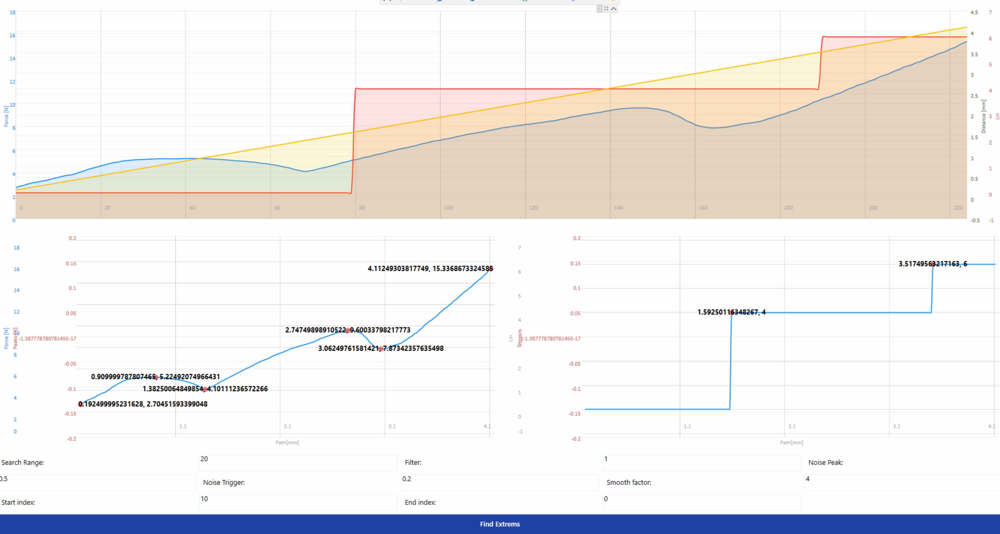
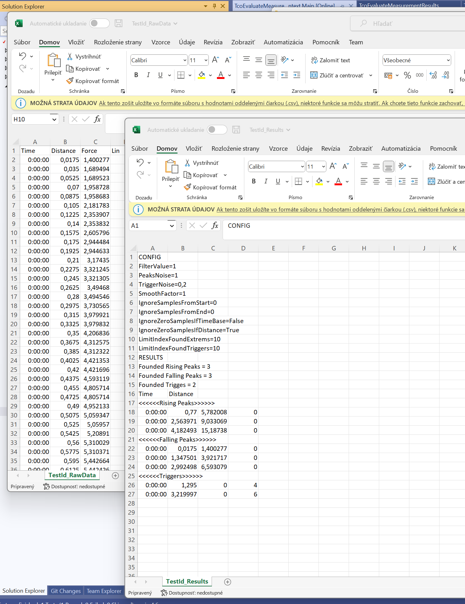

# TcoUtilities

**TcoUtilities** library provides a set of generic  functions (functions blocks) such as conversions,recalculating or other utils

## TcoBlinker
Provides periodic on/off switcher.
## TcoEvaluvateMeasurement

`TcoEvaluateMeasurementTask` is a function block witch is extending `TcoCore.TcoRemoteTask`.  Tis function block contains measured data. This data are collected from measurement and can be assigned by a public property `DataSource`

```csharp

PROPERTY DataSource : ARRAY [0..1000] OF TcoEvaluateMeasurementDataItem
```

**DataSource** are array of `TcoEvaluateMeasurementDataItem` and this struct is defined  below

```csharp
 TYPE
    TcoEvaluateMeasurementDataItem :
    STRUCT
        TimeBase : TIME; 
        Distance : REAL;
        ProcessValue : REAL; 
        DiscreteValue : REAL;

    END_STRUCT
END_TYPE
```

### TimeBase 

-sample time(first is zero, last non zero sample is time span of measurement)

### Distance

-distance is a reference line(x axis) for measurement  

### Process value

- this is main measured value(force, pressure) linked to distance. This value is dedicated for finding extremes during the evaluation (rising peaks,falling peaks..)

### Discrete value

- discrete value can be used as additional value linked to Process value and Distance . By this value we can collect data from optional devices (Lin/Can signal,digital state from sensor ...) By this value we are able to find triggers(changes) during the evaluation. 


#NOTE  data must have same length as on definition above


**Config**

Config provide us sets for evaluating curves data.

```csharp
TYPE TcoEvaluateMeasurementConfig :
STRUCT

	{attribute wpf [Container(Layout.Stack, "FILTER")]}
	FilterValue:INT;     //default 1 - take every sample, if 2 evaluating take every second sample  - RELATED TO PROCESS VALUE ROW
	{attribute wpf [Container(Layout.Stack, "SEARCH RANGE")]}
	SearchRange:INT;    // range used to search extremes(rising falling), define no of sample where is finding peaks - RELATED TO PROCESS VALUE ROW
	{attribute wpf [Container(Layout.Stack, "PEAK NOISE")]}
	PeaksNoise:REAL;    //under this value searching is excluded - RELATED TO PROCESS VALUE ROW 
	{attribute wpf [Container(Layout.Stack, "TRIGGER NOISE")]}
	TriggerNoise:REAL;  //under this value searching of triggers is excluded - RELATED TO DISCRETE VALUE ROW
	{attribute wpf [Container(Layout.Stack, "SMOOTH FACTOR")]}
	SmoothFactor:REAL;  //used to smooth samples, basically it is a moving average - RELATED TO PROCESS VALUE ROW
	{attribute wpf [Container(Layout.Stack, "NUMBER OF SAMPLES TO IGNORE - START")]}
	IgnoreSamplesFromStart:INT; //cutting samples from beginning
	{attribute wpf [Container(Layout.Stack, "NUMBER OF SAMPLES TO IGNORE - END")]}
	IgnoreSamplesFromEnd:INT;   //cutting samples from beginning
	{attribute wpf [Container(Layout.Stack, "IGNORE ZERO VALUES - TIME BASE")]}
	IgnoreZeroSamplesIfTimeBase : BOOL; //if true we ignore all samples with zero time span
	{attribute wpf [Container(Layout.Stack, "IGNORE ZERO VALUES - DISTANCE")]}  
	IgnoreZeroSamplesIfDistance : BOOL; //if true we ignore all samples with zero distance
	{attribute wpf [Container(Layout.Stack, "MAX FOUND LIMIT EXTREMES (MAX 100)(PROCESS DATA ROW)")]} 
	LimitIndexFoundExtrems : INT;      // limit for founded peaks (results sent to PLC)
	{attribute wpf [Container(Layout.Stack, "MAX FOUND LIMIT TRIGGERS (MAX 100) (DISCRETE DATA ROW)")]}
	LimitIndexFoundTriggers : INT;     // limit for founded triggers (results sent to PLC)
	{attribute wpf [Container(Layout.Stack, "PROCESS VALUE ROW NAME")]}     
	ProcessValueRowName : STRING;   //naming for process value (FORCE,TORQUE...)
	{attribute wpf [Container(Layout.Stack, "DISCRETE VALUE ROW NAME")]}
	DiscreteValueRowName : STRING; //naming for discrete value (LIN,RS232,sensor state...)
	{attribute wpf [Container(Layout.Stack, "EXPORT RAW DATA LOCATION")]}       
	ExportRawLocation : STRING(255); //directory path to export raw data(whole measurement) -  export not performed if empty
	{attribute wpf [Container(Layout.Stack, "EXPORT RESULTS LOCATION")]}
	ExportResultsLocation : STRING(255);   //directory path to export results  - export not performed if empty
	
END_STRUCT
END_TYPE

```

### Definition ###

```csharp
{attribute wpf [Container(Layout.Stack)]}
{attribute addProperty Name "<#ForceMeasurement Evaluator#>"}
MeasureEvaluator:TcoUtilities.TcoEvaluateMeasurementTask(TECH_MAIN._app);
```
### Implementation ###

```csharp
// initialise remote task
mainPlc.TECH_MAIN._app._tech.Cu10.Components.MeasureEvaluator.InitializeTask();

// invoke task
MeasureEvaluator.Run(inEntityId:=Concat(ProcessData.Data._EntityId,Description),inConfig:=EvaluatorConfig,inData:=Components.MeasurementControl.Data).Done
```


### RESULTS ###
```csharp
//  results are available here
MeasureEvaluator.Results
.
.
.
.

TYPE TcoEvaluateMeasurementResults :
STRUCT

	RisingPeaks: ARRAY [0..100] OF TcoEvaluateMeasurementDataItem;	
	RisingPeaksFound:INT;
	FallingPeaks: ARRAY [0..100] OF TcoEvaluateMeasurementDataItem;	
	FallingPeaksFound:INT;
	Triggers: ARRAY [0..100] OF TcoEvaluateMeasurementDataItem;	
	TriggersFound :	INT;
END_STRUCT
END_TYPE
```
### Results in plots ###



### Exports ###


