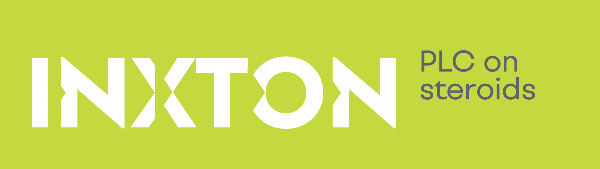
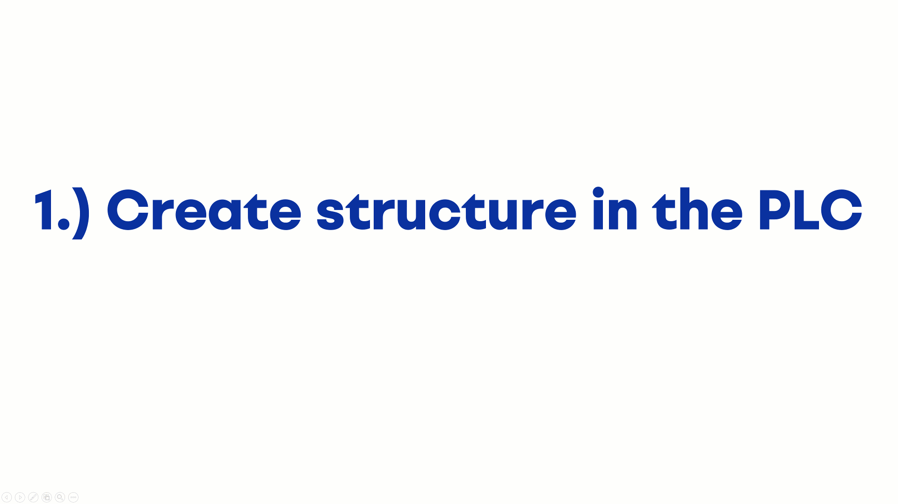

# LibraryTemplate readme

## Introduction

The **LibraryTemplate** is: **`ENTER short library description here`**

## General TcOpen Prerequisites

**Check general requisits for TcOpen [here](https://github.com/TcOpenGroup/TcOpen#prerequisites).**

## Paraghraph 1

- ### Paragraph 1.1
  ***
  #### **_Preconditions:_** **`ENTER some precondition here if neccessary`**.
  ***
  - #### Implementation steps.
    #### 1. **`Discribe implementation steps here.`**
    **_PLC code block example:_**
    ```Smalltalk
    FUNCTION_BLOCK myFunctionBlock EXTENDS anotherFunctionBlock
    VAR
        {attribute addProperty Name "<#Test instance example!!!#>"}
        myInstance : myLibrary.myLibraryFunctionBlock();
    END_VAR
    ```
    **_WPF code block example:_**
    ```XML
    <Window.DataContext>
        <local:MainWindowViewModel />
    </Window.DataContext>
    <StackPanel DataContext="{Binding myPlcEntryPoint.MAIN}">
        <vortex:RenderableContentControl DataContext="{Binding myFunctionBlockInstance.myInstance}" PresentationType="Service"/>
    </StackPanel>
    ```
    **_Picture example:_**
    
    **_GIF example:_**
    
    **_External links examples:_**
    - [youtube video](https://www.youtube.com/watch?v=nGOhhVooxiU)
    - [github repository](https://github.com/TcOpenGroup/TcOpen)
